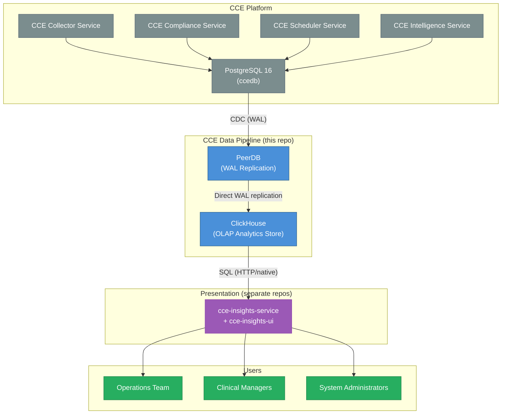
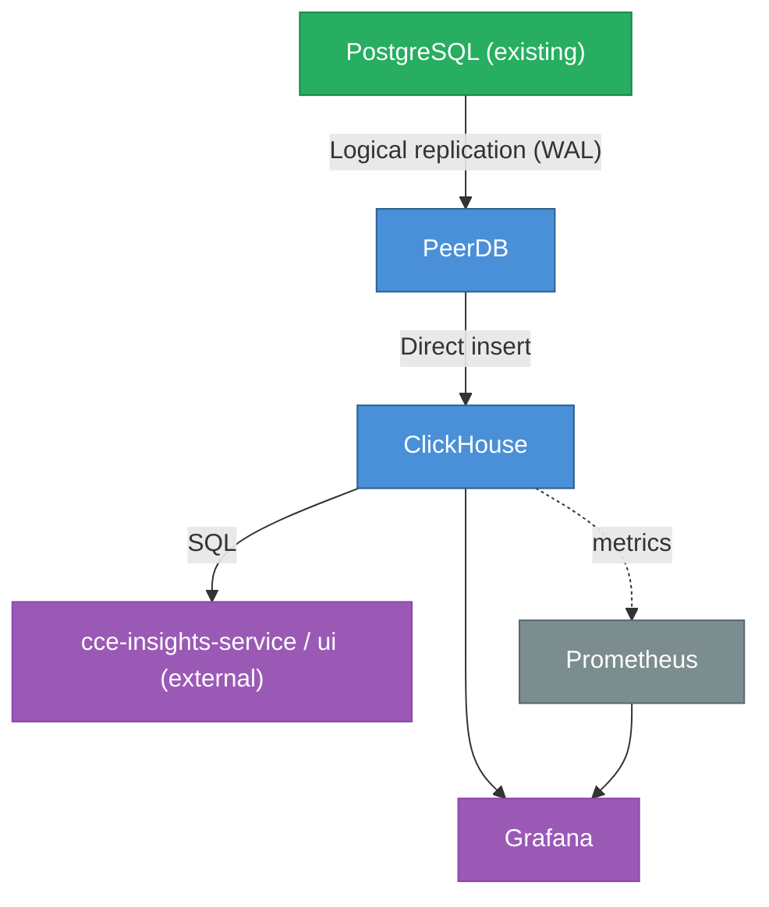

# CCE Data Pipeline — Architecture Overview

## 1. System Context

**This pipeline does NOT handle:** event ingestion, protocol matching, step completion, deviation detection, intelligence routing, dashboards/UI, or any write operations to CCE operational databases. The presentation layer (`cce-insights-service` / `cce-insights-ui`) is a separate deployment that reads ClickHouse.

---

## 2. Architecture Principles

| # | Principle | Rationale |
|---|-----------|-----------|
| 1 | **Open-source only** | No vendor lock-in; community support; cost-effective |
| 2 | **CDC-only (committed data)** | Analytics based solely on data committed to PostgreSQL — eliminates discrepancies from in-flight transactions that may be rolled back |
| 3 | **No custom stream processing** | ClickHouse MATERIALIZED columns + Materialized Views replace Flink — fewer moving parts, less operational burden |
| 4 | **Schema-on-read flexibility** | ClickHouse's JSON functions handle evolving FHIR payloads without migrations; `raw_payload` preserved for future extraction |
| 5 | **Immutable append-only** | All analytics data captured via CDC; ReplacingMergeTree handles updates idempotently |
| 6 | **Separation of pipeline & presentation** | This repo owns CDC → ClickHouse; `cce-insights-service`/`ui` own dashboards and query ClickHouse independently |
| 7 | **Graceful degradation** | Pipeline failures do not impact CCE operational services |

---

## 3. Technology Stack

### 3.1 Component Summary

| Layer | Technology | Version | License | Purpose |
|-------|-----------|---------|---------|---------|
| Change Data Capture | PeerDB | stable-v0.36.26 | Apache 2.0 | Direct WAL replication from PostgreSQL to ClickHouse (full OSS stack in docker-compose.yml) |
| Analytics Database | ClickHouse | 24.8 LTS | Apache 2.0 | Columnar OLAP with MATERIALIZED columns + MVs; serving layer for insights-service |
| Operational Monitoring | Grafana | 11.x | AGPL 3.0 | Infrastructure & pipeline health monitoring |
| Metrics | Prometheus | 2.53 | Apache 2.0 | Metrics collection from services |

> **No stream processing layer.** ClickHouse MATERIALIZED columns handle field extraction at insert time. Materialized Views pre-aggregate. Zero custom application code in the pipeline.
>
> **Presentation is out of scope for this repo.** Dashboards and UI are served by `cce-insights-service` / `cce-insights-ui` (separate repos) querying ClickHouse directly.

### 3.2 Version Compatibility Matrix

| Component | Minimum Version | Tested Version | Notes |
|-----------|----------------|----------------|-------|
| PeerDB | stable-v0.36.26 | stable-v0.36.26 | OSS self-hosted; pinned in docker-compose.yml + infra/peerdb/ |
| ClickHouse | 23.2 | 24.8 LTS | 23.2+ required for `clean_deleted_rows = 'Always'` |
| Grafana | 10.0 | 11.2 | With ClickHouse plugin |
| PostgreSQL (source) | 14 | 16 | Existing CCE database (`ccedb`) |
| Prometheus | 2.45 | 2.53 | Metrics collection |

### 3.3 Technology Decisions

#### Why ClickHouse?

| Alternative | Why Not |
|-------------|---------|
| TimescaleDB | PostgreSQL-based (same technology as source); row-store overhead for wide analytical queries |
| PostgreSQL (materialized views) | Adding query load to operational DB; limited compression; slower aggregations |
| Apache Druid | More complex to operate (ZooKeeper dependency) |
| Apache Pinot | More complex; limited community adoption |
| **ClickHouse** | ✅ Simple deployment; fastest analytical queries; excellent compression; SQL-compatible; MATERIALIZED columns; MVs with -State/-Merge combinators |

#### Why a separate presentation layer (cce-insights-service / cce-insights-ui)?

The existing CCE insights apps deliver bespoke clinical views — patient-detail pages,
service-workflow compliance timelines, source-comparison, pipeline-loss detection — that
are hand-built React components with no faithful equivalent in a generic BI tool (Superset,
Metabase, Grafana). Rather than approximate them, the insights apps are repointed at
ClickHouse as their data source. This repo owns only the pipeline (CDC → ClickHouse);
the apps own presentation and query ClickHouse via the `cce_pipeline` user.

#### Why PeerDB (not Debezium + Kafka or ClickHouse MaterializedPostgreSQL)?

| Alternative | Why Not |
|-------------|--------|
| **ClickHouse MaterializedPostgreSQL** | Experimental; TOAST values not replicated (our JSONB columns are 5-100 KB); no schema control (no custom ORDER BY, MATERIALIZED columns, CODEC); DDL changes require full re-snapshot; not supported in ClickHouse Cloud |
| **Debezium + Kafka + ClickHouse Sink** | 3 components to operate (Debezium, Kafka, Sink Connector); requires Kafka cluster; higher operational complexity; slower initial snapshots (single-threaded) |
| **PeerDB** | ✅ Single binary; native TOAST support; ~10 sec latency; parallelized initial load; schema evolution via replication messages; MATERIALIZED columns added post-creation via ALTER TABLE; simpler operations (no Kafka cluster) |

**Trade-offs accepted with PeerDB:**
- No Kafka buffer — PeerDB stalling means WAL growth on PostgreSQL (mitigated by `max_slot_wal_keep_size=10GB` and WAL monitoring alerts)
- No DLQ — replication errors require investigation at the PeerDB level
- No multi-consumer CDC topics — other services cannot tap into a Kafka topic (acceptable: no downstream consumers needed)
- Table ORDER BY determined by PostgreSQL primary keys — mitigated by projections for common access patterns

---

## 4. Component Architecture

### 4.1 CDC Layer (PeerDB)

**PeerDB** connects directly to PostgreSQL's logical replication stream and writes to ClickHouse using an intermediary S3/MinIO stage for performance. All 11 ClickHouse tables are **pre-created** via `schema/01-create-tables.sql` with `ReplacingMergeTree(_peerdb_version, _peerdb_is_deleted)` and `SETTINGS clean_deleted_rows = 'Always'` before the PeerDB mirror is started. PeerDB writes into existing tables and does not recreate them. MATERIALIZED columns for JSON extraction are defined inline in the table DDL.

All 11 CDC tables reside in the shared `ccedb` PostgreSQL database. A single PeerDB mirror replicates all tables. For the full table listing, mirror config, and schema details, see [Data Flow & Schema Design](data-flow.md).

**PeerDB metadata columns** (added automatically to all tables):
- `_peerdb_synced_at` — timestamp of sync to ClickHouse
- `_peerdb_is_deleted` — soft-delete marker (true = row deleted in PostgreSQL)
- `_peerdb_version` — version for ReplacingMergeTree deduplication

### 4.2 Analytics Storage Layer (ClickHouse)

**Key features leveraged:**
- **ReplacingMergeTree (two-parameter)** — `ReplacingMergeTree(_peerdb_version, _peerdb_is_deleted)` with `clean_deleted_rows = 'Always'`: deduplicates by version, physically removes soft-deleted rows on merge
- **MATERIALIZED columns** — Extract JSON fields from `raw_payload` at insert time (zero query cost), defined inline in table DDL
- **Materialized Views** — Real-time pre-aggregation triggered on INSERT (14 MVs on append-only sources); mutable entities queried via `FINAL` on base tables
- **AggregatingMergeTree** — Correct incremental aggregation with `-State`/`-Merge` combinators (event logs, deviations — append-only sources only)
- **SummingMergeTree** — Simple additive rollups (counts per hour/day)
- **Dictionaries** — Fast key-value lookups replacing JOINs (3 dictionaries, all using `QUERY...FINAL` sources)
- **Projections** — Alternative sort orders for common access patterns (7 projections)
- **Bloom filter indexes** — 15 secondary indexes for fast point lookups on non-ORDER-BY columns
- **CODEC compression** — LZ4/ZSTD for 10-40x compression on event data
- **TTL** — 90-day hot retention on 4 high-volume log tables (inbound_event_logs, intelligence_event_logs, intelligence_deliveries, compliance_event_logs)
- **User profiles** — `analytics` (readonly, `final=1` auto-applied) for `cce-insights-service`; `peerdb_writer` (write access, no FINAL overhead) for PeerDB CDC writes

For full schema DDL, MV catalog, Entity × Behavior coverage matrix, and query patterns, see [Data Flow & Schema Design](data-flow.md).

### 4.3 Presentation Layer (external — cce-insights-service / cce-insights-ui)

Dashboards and UI are **not** part of this repo. The `cce-insights-service` backend queries
ClickHouse (HTTP 8123 or native 9000, user `cce_pipeline`) and `cce-insights-ui` renders the
clinical views. Responsibilities that live in those apps:

- **ClickHouse access** — via the `cce_pipeline` read-only user (`final=1` applied automatically)
- **AuthN/AuthZ** — handled by the insights apps (e.g. Keycloak), not by this pipeline
- **Facility/role scoping** — enforced in the service layer
- **Bespoke clinical views** — patient detail, workflow timelines, source comparison, etc.

Per-domain ClickHouse SQL the service can reuse is in [Query Reference](query-reference/).

### 4.4 Operational Monitoring (Grafana + Prometheus)

**Grafana** monitors the health of the data pipeline itself (not clinical analytics):
- PeerDB mirror health (throughput, errors, replication lag)
- ClickHouse insert rate and query performance (p95, p99)
- End-to-end latency (PostgreSQL commit → ClickHouse insert)
- PostgreSQL WAL replication slot lag

**Prometheus** scrapes metrics from ClickHouse (port 9363). PeerDB (stable-v0.36.26) exports
telemetry via OpenTelemetry rather than a built-in Prometheus endpoint — wire an OTel collector
to scrape it (the `peerdb` scrape job in `infra/prometheus/prometheus.yml` is left disabled).

---

## 5. Integration Points

---

## 6. Data Domains

| Domain | Key Metrics | Source → MV |
|--------|-------------|-------------|
| **Event Volume** | Events by resource type, facility, source, practitioner | `inbound_event_logs` → `mv_event_volume_hourly/daily` |
| **Facility Ranking** | Event volume, unique patients, unique practitioners per facility | `inbound_event_logs` → `mv_facility_summary` |
| **Practitioner Activity** | Events per practitioner, patient coverage, resource types | `inbound_event_logs` → `mv_practitioner_summary` |
| **Compliance** | Adherence rate, on-track/at-risk/non-compliant counts | `protocol_instances` → `mv_compliance_summary`, `mv_compliance_by_patient` |
| **Deviations** | Overdue/missed counts, trends, by protocol/patient | `deviations` → `mv_deviation_trends`, `mv_deviation_by_protocol`, `mv_deviation_by_patient` |
| **Ingestion Quality** | Acceptance rate, rejection reasons, source quality | `inbound_event_logs` → `mv_ingestion_quality` |
| **Intelligence & Triggers** | Trigger volume by action type, destination, reason | `intelligence_event_logs` → `mv_intelligence_summary`, `mv_intelligence_by_patient/protocol` |
| **Delivery Performance** | Success rate, latency, errors per adaptor/protocol | `intelligence_deliveries FINAL` (base table, ReplacingMergeTree) |
| **Step/Scheduler** | Step states, completions, protocol progress | `step_instances FINAL` (base table, ReplacingMergeTree) |
| **Pipeline Health** | CDC lag, mirror status | PeerDB metrics + Grafana |

---

## 7. Capacity Planning

### 7.1 Event Volume Estimates

| Metric | Value | Notes |
|--------|-------|-------|
| Daily events (inbound) | 600,000 | Minimum requirement |
| Average event rate | ~7 events/second | Sustained |
| Peak event rate | ~50 events/second | 10-minute bursts |
| Average event size | ~2 KB | CloudEvents + FHIR payload |
| Daily data volume (raw) | ~1.2 GB | Before compression |
| Monthly data volume (raw) | ~36 GB | Before compression |
| ClickHouse compressed | ~3.6 GB/month | 10x columnar compression typical |
| Retention period | 2 years | Configurable |
| Total storage (2yr) | ~86 GB compressed | Well within single-node capacity |

### 7.2 Query Performance Targets

| Query Type | Target Latency | Example |
|------------|---------------|---------|
| Pre-aggregated dashboards | < 500ms | Compliance summary, event volume |
| Ad-hoc drill-downs | < 2s | Patient timeline, deviation details |
| Full-scan analytics | < 10s | Year-over-year comparisons |
| Export (CSV) | < 30s | Full compliance report |

### 7.3 Resource Requirements

#### Development / Staging

| Component | Containers | CPU | RAM | Storage |
|-----------|-----------|-----|-----|---------|
| PeerDB (full stack: catalog, temporal, flow-api, 2 workers, nexus, ui) | 8 | 2 cores | 3 GB | 5 GB |
| MinIO | 1 | 0.5 core | 512 MB | 20 GB |
| ClickHouse | 1 | 4 cores | 16 GB | 100 GB SSD |
| Prometheus | 1 | 0.5 core | 1 GB | 10 GB |
| Grafana | 1 | 0.5 core | 512 MB | — |
| **Total** | **12** | **~7 cores** | **21 GB** | **135 GB** |

> Presentation (`cce-insights-service` / `cce-insights-ui`) is sized and deployed separately.

#### Production (600k events/day)

| Component | Containers | CPU | RAM | Storage |
|-----------|-----------|-----|-----|---------|
| PeerDB (full stack) | 8 | 3 cores | 6 GB | 20 GB |
| MinIO | 1 | 1 core | 1 GB | 100 GB |
| ClickHouse | 1 | 8 cores | 32 GB | 500 GB SSD |
| Prometheus | 1 | 2 cores | 4 GB | 50 GB |
| Grafana | 1 | 1 core | 1 GB | — |
| **Total** | **12** | **~15 cores** | **44 GB** | **670 GB** |

> Presentation (`cce-insights-service` / `cce-insights-ui`) is sized and deployed separately.
>
> **Scale-out path:** ClickHouse supports sharding + replication for horizontal scaling. At 600k events/day, a single node is more than sufficient. Scale to a cluster when daily volume exceeds 10M events.

---

## 8. Security

| Concern | Mechanism |
|---------|-----------|
| **Network isolation** | Data pipeline in dedicated network segment; PeerDB access via internal network only |
| **Authentication** | ClickHouse: native user/password (`cce_pipeline` read-only); PeerDB nexus: `PEERDB_PASSWORD`; end-user auth handled by `cce-insights-service` (e.g. Keycloak) |
| **Authorization** | ClickHouse readonly profile for the serving user; facility/program/role scoping enforced in `cce-insights-service` |
| **Data in transit** | TLS for all inter-component communication (ClickHouse TLS, PeerDB TLS) |
| **Data at rest** | ClickHouse disk encryption; sensitive fields accessible only to authorized roles |
| **Audit** | ClickHouse query log; PeerDB mirror status and sync history |
| **PII handling** | Patient UPIDs are pseudonymized identifiers (not names); FHIR resources stored for operational analytics only |

---

## 9. Failure Modes & Recovery

| Failure | Impact | Recovery |
|---------|--------|----------|
| ClickHouse down | insights-service queries fail; PeerDB buffers pending rows | PeerDB retries on recovery; WAL retained by replication slot |
| PeerDB failure | CDC tables go stale; WAL grows on PostgreSQL | PeerDB auto-resumes from replication slot; `max_slot_wal_keep_size=10GB` prevents unbounded growth |
| insights-service/ui down | Dashboards unavailable (external app) | No pipeline/data impact; handled in that deployment |
| PostgreSQL replication slot dropped | Full re-snapshot required | Recreate mirror via `connectors/peerdb-mirror.sql`; PeerDB performs parallelized initial load |

**Key invariant:** The data pipeline is a **read-only observer**. Its failure never impacts CCE operational services.

### Backup & Recovery

| Component | Strategy | RPO | RTO |
|-----------|----------|-----|-----|
| ClickHouse | Daily backup to object storage (`clickhouse-backup`) | 24 hours | 1 hour |
| PeerDB | Catalog DB (`pgdata`) backed up; WAL slot preserves replay position | 0 (resume from slot) | 5 min |

### Upgrades

- **ClickHouse:** Rolling restart for minor versions; backup before major versions
- **PeerDB:** Bump image tags (all `:stable-vX`) and re-sync `infra/peerdb/`; mirror resumes from the replication slot automatically

---

## 10. Migration Strategy

| Phase | Duration | Activities |
|-------|----------|------------|
| **Phase 1: Foundation** | 2 weeks | Deploy ClickHouse, PeerDB, create mirror, CDC tables |
| **Phase 2: Materialized Views** | 1 week | Configure MVs for all analytics domains |
| **Phase 3: Insights repoint** | 2 weeks | Repoint `cce-insights-service` queries from the old backend to ClickHouse |
| **Phase 4: Validation** | 1 week | Run parallel with the existing backend; validate data accuracy |
| **Phase 5: Cutover** | 1 week | Switch `cce-insights-service` fully to ClickHouse; decommission the old insights backend |

**Total estimated timeline:** 7 weeks

---

## 11. Schema Evolution Strategy

The pipeline is designed for forward-compatible evolution without downtime:

| Change | Impact | Action Required |
|--------|--------|-----------------|
| New FHIR field needed in analytics | None (raw_payload preserved) | `ALTER TABLE ADD COLUMN ... MATERIALIZED` on `inbound_event_logs` |
| New FHIR resource type | Auto-captured (LowCardinality String) | Update `cce-insights-service` filters |
| PostgreSQL table gains a column | PeerDB auto-captures via replication messages | `ALTER TABLE ADD COLUMN` on ClickHouse side |
| PostgreSQL table dropped/renamed | PeerDB mirror errors on missing table | Update mirror `TABLE MAPPING` in `connectors/peerdb-mirror.sql` |
| New PostgreSQL table needed | Add CDC capture | Add table to mirror mapping + create ClickHouse table + optional MV |

**Key invariant:** The `raw_payload` column in `inbound_event_logs` stores the full CloudEvent (including FHIR resource) as-is. Any new field extraction is a non-breaking addition — historical data can always be backfilled from `raw_payload` using ClickHouse's JSON functions.
