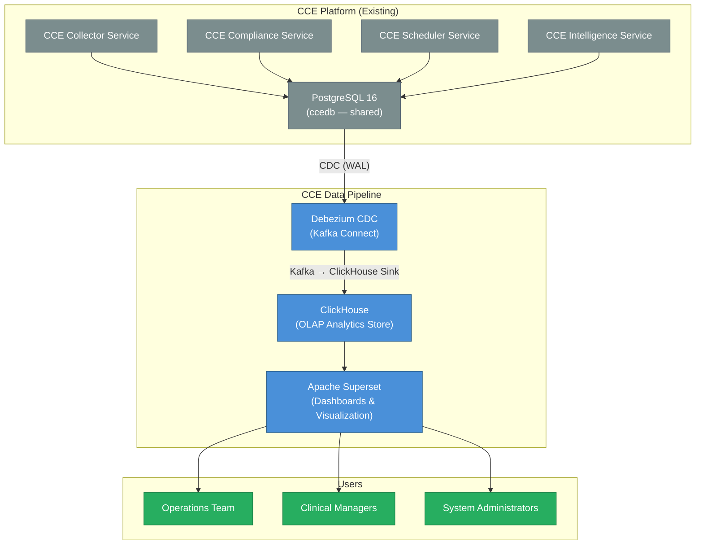
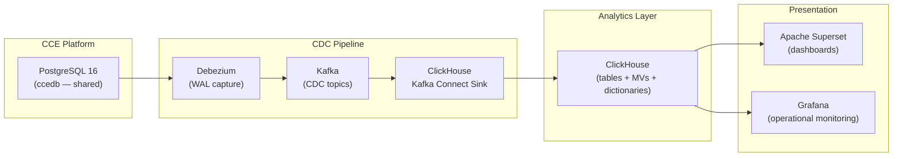

# CCE Data Pipeline — Architecture Overview

## 1. Purpose

The **CCE Data Pipeline** replaces the custom `cce-insights-service` and `cce-insights-ui` with an open-source analytics stack. It captures committed data from CCE PostgreSQL databases via Change Data Capture (CDC), materializes analytics views in a columnar OLAP database, and exposes interactive dashboards via open-source visualization tools.

**Design goals:**
- Eliminate custom analytics code — leverage battle-tested open-source components
- Handle **600k+ events/day** (≈7 events/second average, burst peaks up to 50 eps)
- Provide near-real-time insights (< 60-second latency from DB commit to dashboard)
- Analytics based exclusively on **committed data** — no in-flight Kafka consumption that could reflect rejected/failed events
- Enable self-service exploration by operations teams without engineering involvement
- Maintain separation of concerns — the pipeline is read-only and never writes back to CCE operational databases

---

## 2. System Context

**This pipeline does NOT handle:** event ingestion, protocol matching, step completion, deviation detection, intelligence routing, or any write operations to CCE operational databases.

---

## 3. Architecture Principles

| # | Principle | Rationale |
|---|-----------|-----------|
| 1 | **Open-source only** | No vendor lock-in; community support; cost-effective |
| 2 | **CDC-only (committed data)** | Analytics based solely on data committed to PostgreSQL — eliminates discrepancies from in-flight Kafka events that may be rejected or reprocessed |
| 3 | **No custom stream processing** | ClickHouse MATERIALIZED columns + Materialized Views replace Flink — fewer moving parts, less operational burden |
| 4 | **Schema-on-read flexibility** | ClickHouse's JSON functions handle evolving FHIR payloads without migrations; `raw_payload` preserved for future extraction |
| 5 | **Immutable append-only** | All analytics data captured via CDC; ReplacingMergeTree handles updates idempotently |
| 6 | **Self-service analytics** | Operations teams build their own dashboards; no engineering dependency |
| 7 | **Graceful degradation** | Pipeline failures do not impact CCE operational services |

---

## 4. Component Overview

### 4.1 CDC Layer (Debezium + ClickHouse Kafka Connect Sink)

**Debezium 2.6.1** captures PostgreSQL WAL changes and publishes them to Kafka topics. **ClickHouse Kafka Connect Sink 0.14.0** consumes those topics and writes directly to ClickHouse tables using `ReplacingMergeTree` for idempotent upserts.

| Table Owner | Source Table | ClickHouse Table | Purpose |
|-------------|--------------|------------------|---------|
| Collector Service | `inbound_event_log` | `inbound_event_logs` | Full CloudEvent audit trail (raw_payload contains FHIR) |
| Compliance Service | `protocol_definition` | `protocol_definitions` | Protocol metadata (FHIR PlanDefinition) |
| Compliance Service | `protocol_instance` | `protocol_instances` | Patient enrollments, compliance status |
| Compliance Service | `step_instance` | `step_instances` | Step states, due dates, completion |
| Compliance Service | `deviation` | `deviations` | OVERDUE, MISSED, ORDER_VIOLATION records |
| Compliance Service | `intelligence_event_log` | `intelligence_event_logs` | Intelligence trigger audit trail |
| Compliance Service | `action_definition` | `action_definitions` | Notification/escalation action templates |
| Compliance Service | `compliance_event_log` | `compliance_event_logs` | Compliance processing outcomes |
| Intelligence Service | `receiver_adaptor` | `receiver_adaptors` | FHIR endpoint adaptor registry |
| Intelligence Service | `destination_adaptor_mapping` | `destination_adaptor_mappings` | Destination-to-adaptor routing |
| Intelligence Service | `intelligence_delivery` | `intelligence_deliveries` | Intelligence action delivery outcomes |

> All tables reside in the shared `ccedb` PostgreSQL database. One Debezium source connector captures all 11 tables.

### 4.2 Analytics Storage Layer

**ClickHouse 24.8** — columnar OLAP database:

- **MATERIALIZED columns** on `inbound_event_logs` extract fields from `raw_payload` at insert time (`facility_id`, `event_type`, `patient_id`, `practitioner_ref`, `resource_type`) — replaces Flink enrichment
- **Materialized Views** pre-aggregate metrics (event volume, practitioner activity, facility summary, compliance, intelligence) — replaces Flink tumbling windows
- Sub-second query response on 100M+ rows
- TTL-based data lifecycle management
- Low storage footprint via columnar compression (10-40x vs row stores)

### 4.3 Visualization Layer

**Apache Superset** — open-source BI and dashboard platform:

- Interactive SQL-based dashboards
- Role-based access control (RBAC)
- Scheduled report delivery (email/Slack)
- Embeddable charts and dashboards
- Alert rules based on metric thresholds

---

## 5. Data Domains

| Domain | Key Metrics | Data Source |
|--------|-------------|-------------|
| **Event Volume** | Events by resource type, facility, source, practitioner | `inbound_event_logs` → `mv_event_volume_hourly/daily` |
| **Facility Ranking** | Event volume, unique patients, unique practitioners per facility | `inbound_event_logs` → `mv_facility_summary` |
| **Practitioner Activity** | Events per practitioner, patient coverage, resource types | `inbound_event_logs` → `mv_practitioner_summary` |
| **Compliance Summary** | Adherence rate, on-track/at-risk/non-compliant counts | `protocol_instances` → `mv_compliance_summary` |
| **Deviation Analytics** | Overdue/missed counts, trends, by protocol | `deviations` → `mv_deviation_trends`, `mv_deviation_by_protocol` |
| **Ingestion Quality** | Acceptance rate, rejection reasons, source quality | `inbound_event_logs` → `mv_ingestion_quality` |
| **Intelligence & Triggers** | Trigger volume by action type, destination, reason | `intelligence_event_logs` → `mv_intelligence_summary` |
| **Delivery Performance** | Success rate, latency, errors per adaptor | `intelligence_deliveries` → `mv_delivery_performance_hourly` |
| **Step/Scheduler** | Step states, completions, protocol progress | `step_instances` → `mv_step_states_daily` |
| **Event Correlation** | End-to-end tracing via correlation_id | JOIN across tables on `correlation_id` |
| **Pipeline Health** | CDC lag, connector status | Kafka Connect metrics + Grafana |

---

## 6. High-Level Data Flow

---

## 7. Capacity Planning

### 7.1 Event Volume Estimates

| Metric | Value | Notes |
|--------|-------|-------|
| Daily events (inbound) | 600,000 | Minimum requirement |
| Average event rate | ~7 events/second | Sustained |
| Peak event rate | ~50 events/second | 10-minute bursts |
| Average event size | ~2 KB | CloudEvents + FHIR payload |
| Daily data volume (raw) | ~1.2 GB | Before compression |
| Monthly data volume (raw) | ~36 GB | Before compression |
| ClickHouse compressed | ~3.6 GB/month | 10x columnar compression typical |
| Retention period | 2 years | Configurable |
| Total storage (2yr) | ~86 GB compressed | Well within single-node capacity |

### 7.2 Query Performance Targets

| Query Type | Target Latency | Example |
|------------|---------------|---------|
| Pre-aggregated dashboards | < 500ms | Compliance summary, event volume |
| Ad-hoc drill-downs | < 2s | Patient timeline, deviation details |
| Full-scan analytics | < 10s | Year-over-year comparisons |
| Export (CSV) | < 30s | Full compliance report |

### 7.3 Infrastructure Sizing (Initial)

| Component | Instances | CPU | RAM | Storage |
|-----------|-----------|-----|-----|---------|
| ClickHouse | 1 (single node) | 8 cores | 32 GB | 500 GB SSD |
| Kafka Connect (Debezium + Sink) | 2 (distributed) | 2 cores | 4 GB | — |
| Apache Superset | 2 (HA) | 4 cores | 8 GB | — |

> **Scale-out path:** ClickHouse supports sharding + replication for horizontal scaling. At 600k events/day, a single node is more than sufficient. Scale to a cluster when daily volume exceeds 10M events.

---

## 8. Comparison: Previous vs. New Architecture

| Aspect | Previous (insights-service + UI) | New (Data Pipeline) |
|--------|----------------------------------|---------------------|
| **Custom code** | ~77 Java files, 12 packages, full Spring Boot app | Zero custom application code |
| **Query layer** | Custom JPA repositories, hand-tuned SQL | ClickHouse materialized views + Superset SQL |
| **Caching** | Custom 3-tier Caffeine cache | ClickHouse native query cache + materialized views |
| **Dashboard** | Custom React application | Apache Superset (no-code dashboard builder) |
| **Stream processing** | N/A | None needed — ClickHouse MATERIALIZED columns + MVs |
| **Deployment** | 2 additional microservices (JVM) | Infrastructure components only (ClickHouse, Kafka Connect, Superset) |
| **Maintenance** | Application code maintenance, dependency upgrades | Infrastructure operations only |
| **Data consistency** | Direct DB queries (consistent) | CDC from committed data only (consistent) |
| **Flexibility** | Developer-dependent for new metrics | Self-service (operations team builds dashboards) |
| **Latency** | Real-time (direct DB query + 15-60min cache) | Near-real-time (< 60s DB commit-to-dashboard) |
| **Scale ceiling** | PostgreSQL query load on operational DB | Dedicated OLAP engine; no operational DB impact |

---

## 9. Security

| Concern | Mechanism |
|---------|-----------|
| **Network isolation** | Data pipeline components in dedicated network segment; Kafka access via internal network only |
| **Authentication** | Superset: OAuth2/OIDC (Keycloak integration); ClickHouse: native user/password |
| **Authorization** | Superset RBAC: roles mapped to facility/program access; Row-level security for multi-tenant |
| **Data in transit** | TLS for all inter-component communication (Kafka SSL, ClickHouse native TLS, HTTPS for Superset) |
| **Data at rest** | ClickHouse disk encryption; sensitive fields (patient identifiers) accessible only to authorized roles |
| **Audit** | Superset audit log; ClickHouse query log; Kafka Connect connector status |
| **PII handling** | Patient UPIDs are pseudonymized identifiers (not names); FHIR resources stored only for operational analytics |

---

## 10. Failure Modes & Recovery

| Failure | Impact | Recovery |
|---------|--------|----------|
| ClickHouse down | Dashboards unavailable; CDC buffered in Kafka | Kafka retains CDC events (retention = 7 days); replay on recovery |
| Kafka Connect (Debezium) failure | CDC tables go stale | Connector auto-restart; snapshot recovery on extended outage |
| Kafka Connect (Sink) failure | New data not landing in ClickHouse | Auto-restart; replay from Kafka offsets |
| Superset down | Dashboards unavailable | No data impact; restart and reconnect |
| Kafka cluster down | All CCE services affected (existing risk) | CDC pauses; resumes on recovery |

**Key invariant:** The data pipeline is a **read-only observer**. Its failure never impacts CCE operational services (Collector, Compliance, Scheduler, Intelligence).

---

## 11. Migration Strategy

| Phase | Duration | Activities |
|-------|----------|------------|
| **Phase 1: Foundation** | 2 weeks | Deploy ClickHouse, Kafka Connect (Debezium + Sink), CDC tables |
| **Phase 2: Materialized Views** | 1 week | Configure MVs for all analytics domains (volume, facility, practitioner, compliance) |
| **Phase 3: Dashboards** | 2 weeks | Configure Superset, build core dashboards |
| **Phase 4: Validation** | 1 week | Run parallel with existing insights-service; validate data accuracy |
| **Phase 5: Cutover** | 1 week | Route users to Superset; decommission insights-service and insights-ui |

**Total estimated timeline:** 7 weeks

---

## 12. Schema Evolution Strategy

The pipeline is designed for forward-compatible evolution without downtime:

| Change | Impact | Action Required |
|--------|--------|-----------------|
| New FHIR field needed in analytics | None (raw_payload preserved) | `ALTER TABLE ADD COLUMN ... MATERIALIZED` on `inbound_event_logs` |
| New FHIR resource type | Auto-captured (LowCardinality String) | Update dashboard filters |
| PostgreSQL table gains a column | Debezium auto-captures | `ALTER TABLE ADD COLUMN` on ClickHouse side |
| PostgreSQL table dropped/renamed | Debezium connector errors | Reconfigure connector `table.include.list` |
| New PostgreSQL table needed | Add CDC capture | Add to Debezium config + create ClickHouse table + optional MV |

**Key invariant:** The `raw_payload` column in `inbound_event_logs` stores the full CloudEvent (including FHIR resource) as-is. Any new field extraction is a non-breaking addition — historical data can always be backfilled from `raw_payload` using ClickHouse's JSON functions.

---

## 13. Future Enhancements

| Enhancement | Trigger | Approach |
|-------------|---------|----------|
| **Predictive analytics** | Clinical program request | Python/ML models reading from ClickHouse via external service |
| **Alerting** | Operational need | Superset alerts or Grafana alerting rules on ClickHouse metrics |
| **Multi-cluster** | Geographic expansion | ClickHouse distributed tables across regions |
| **Data lake** | Long-term archival | ClickHouse S3 table function for cold storage in Parquet |
| **API layer** | External integrations need programmatic access | Lightweight read-only API over ClickHouse (e.g., Cube.js or custom thin service) |
| **Additional MATERIALIZED columns** | New analytics dimension needed | `ALTER TABLE ADD COLUMN ... MATERIALIZED JSONExtract(...)` — no pipeline changes |
