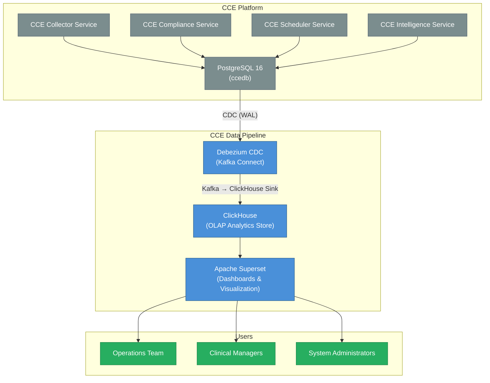
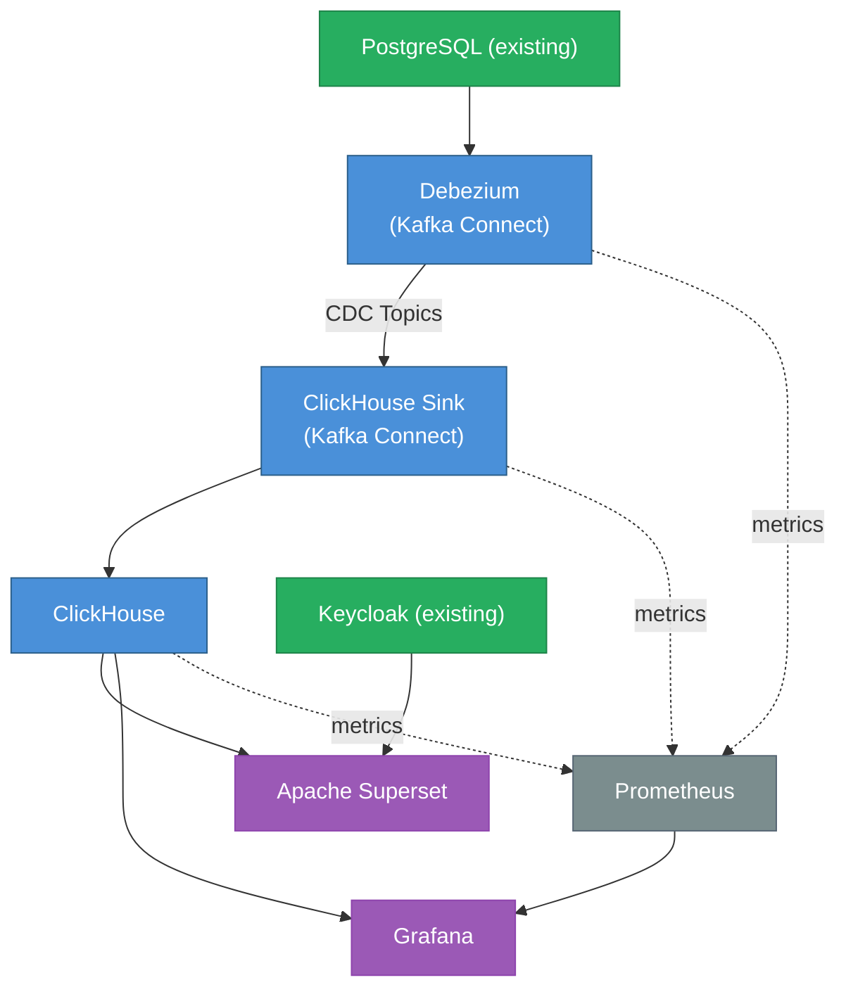

# CCE Data Pipeline — Architecture Overview

## 1. System Context

**This pipeline does NOT handle:** event ingestion, protocol matching, step completion, deviation detection, intelligence routing, or any write operations to CCE operational databases.

---

## 2. Architecture Principles

| # | Principle | Rationale |
|---|-----------|-----------|
| 1 | **Open-source only** | No vendor lock-in; community support; cost-effective |
| 2 | **CDC-only (committed data)** | Analytics based solely on data committed to PostgreSQL — eliminates discrepancies from in-flight Kafka events that may be rejected or reprocessed |
| 3 | **No custom stream processing** | ClickHouse MATERIALIZED columns + Materialized Views replace Flink — fewer moving parts, less operational burden |
| 4 | **Schema-on-read flexibility** | ClickHouse's JSON functions handle evolving FHIR payloads without migrations; `raw_payload` preserved for future extraction |
| 5 | **Immutable append-only** | All analytics data captured via CDC; ReplacingMergeTree handles updates idempotently |
| 6 | **Self-service analytics** | Operations teams build their own dashboards; no engineering dependency |
| 7 | **Graceful degradation** | Pipeline failures do not impact CCE operational services |

---

## 3. Technology Stack

### 3.1 Component Summary

| Layer | Technology | Version | License | Purpose |
|-------|-----------|---------|---------|---------|
| Change Data Capture | Debezium (PostgreSQL) | 2.6.1 | Apache 2.0 | WAL-based CDC from PostgreSQL |
| CDC Transport | Kafka Connect | 3.7+ | Apache 2.0 | Connector runtime for Debezium + ClickHouse sink |
| CDC Sink | ClickHouse Kafka Connect | 0.14.0 | Apache 2.0 | Write CDC records to ClickHouse |
| Analytics Database | ClickHouse | 24.8 LTS | Apache 2.0 | Columnar OLAP with MATERIALIZED columns + MVs |
| Visualization | Apache Superset | 4.0.2 | Apache 2.0 | Interactive dashboards & scheduled reports |
| Operational Monitoring | Grafana | 11.x | AGPL 3.0 | Infrastructure & pipeline health monitoring |
| Metrics | Prometheus | 2.53 | Apache 2.0 | Metrics collection from services |
| Caching | Redis | 7.x | BSD | Superset result caching |

> **No stream processing layer.** ClickHouse MATERIALIZED columns handle field extraction at insert time. Materialized Views pre-aggregate. Zero custom application code.

### 3.2 Version Compatibility Matrix

| Component | Minimum Version | Tested Version | Notes |
|-----------|----------------|----------------|-------|
| Debezium | 2.4 | 2.6.1 | PostgreSQL connector |
| Kafka Connect | 3.5 | 3.7.1 | Bundled with Kafka |
| ClickHouse Sink Connector | 0.12 | 0.14.0 | `clickhouse-kafka-connect` |
| ClickHouse | 23.8 LTS | 24.8 LTS | LTS release recommended |
| Apache Superset | 3.0 | 4.0.2 | With ClickHouse driver |
| Grafana | 10.0 | 11.2 | With ClickHouse plugin |
| PostgreSQL (source) | 14 | 16 | Existing CCE database |
| Redis | 6.0 | 7.x | Superset cache |
| Prometheus | 2.45 | 2.53 | Metrics collection |

### 3.3 Technology Decisions

#### Why ClickHouse?

| Alternative | Why Not |
|-------------|---------|
| TimescaleDB | PostgreSQL-based (same technology as source); row-store overhead for wide analytical queries |
| PostgreSQL (materialized views) | Adding query load to operational DB; limited compression; slower aggregations |
| Apache Druid | More complex to operate (ZooKeeper dependency) |
| Apache Pinot | More complex; limited community adoption |
| **ClickHouse** | ✅ Simple deployment; fastest analytical queries; excellent compression; SQL-compatible; MATERIALIZED columns; MVs with -State/-Merge combinators |

#### Why Superset?

| Alternative | Why Not |
|-------------|---------|
| Grafana | Primarily operational/metrics; limited BI features |
| Metabase | Simpler but less powerful; limited SQL Lab; no row-level security |
| Custom React app | Defeats purpose of open-source stack |
| **Apache Superset** | ✅ Full BI platform; SQL Lab; RBAC; scheduled reports; ClickHouse native connector; embeddable |

---

## 4. Component Architecture

### 4.1 CDC Layer (Debezium + ClickHouse Kafka Connect Sink)

**Debezium 2.6.1** captures PostgreSQL WAL changes and publishes them to Kafka topics. **ClickHouse Kafka Connect Sink 0.14.0** consumes those topics and writes directly to ClickHouse tables using `ReplacingMergeTree` for idempotent upserts.

All 11 CDC tables reside in the shared `ccedb` PostgreSQL database. One Debezium source connector captures all tables. For the full table listing, CDC topics, and schema details, see [Data Flow & Schema Design](data-flow.md).

### 4.2 Analytics Storage Layer (ClickHouse)

**Key features leveraged:**
- **ReplacingMergeTree** — CDC-compatible engine with `_version` for idempotent upserts
- **MATERIALIZED columns** — Extract JSON fields from `raw_payload` at insert time (zero query cost)
- **Materialized Views** — Real-time pre-aggregation triggered on INSERT (19 MVs total)
- **AggregatingMergeTree** — Correct incremental aggregation with `-State`/`-Merge` combinators
- **SummingMergeTree** — Simple additive rollups (counts per hour/day)
- **Dictionaries** — Fast key-value lookups replacing JOINs (3 dictionaries)
- **Projections** — Alternative sort orders for common access patterns
- **CODEC compression** — LZ4/ZSTD for 10-40x compression on event data
- **TTL** — Automatic data lifecycle management

For full schema DDL, MV catalog, Entity × Behavior coverage matrix, and query patterns, see [Data Flow & Schema Design](data-flow.md).

### 4.3 Visualization Layer (Superset)

- **ClickHouse connector** — native SQLAlchemy driver (`clickhouse-connect`)
- **Row-level security** — facility-based access control
- **Alerts & reports** — scheduled email/Slack delivery
- **SQL Lab** — ad-hoc exploration for power users
- **Dashboard templates** — importable JSON dashboards
- **Authentication:** OAuth2/OIDC with existing Keycloak instance

For dashboard wireframes and SQL queries, see [Dashboard Design](dashboard-design.md).

### 4.4 Operational Monitoring (Grafana + Prometheus)

**Grafana** monitors the health of the data pipeline itself (not clinical analytics):
- CDC sink connector health (throughput, errors, lag)
- ClickHouse insert rate and query performance (p95, p99)
- End-to-end latency (PostgreSQL commit → ClickHouse insert)
- Kafka Connect worker status

**Prometheus** scrapes metrics from Kafka Connect (JMX) and ClickHouse (port 9363).

---

## 5. Integration Points

---

## 6. Data Domains

| Domain | Key Metrics | Source → MV |
|--------|-------------|-------------|
| **Event Volume** | Events by resource type, facility, source, practitioner | `inbound_event_logs` → `mv_event_volume_hourly/daily` |
| **Facility Ranking** | Event volume, unique patients, unique practitioners per facility | `inbound_event_logs` → `mv_facility_summary` |
| **Practitioner Activity** | Events per practitioner, patient coverage, resource types | `inbound_event_logs` → `mv_practitioner_summary` |
| **Compliance** | Adherence rate, on-track/at-risk/non-compliant counts | `protocol_instances` → `mv_compliance_summary`, `mv_compliance_by_patient` |
| **Deviations** | Overdue/missed counts, trends, by protocol/patient | `deviations` → `mv_deviation_trends`, `mv_deviation_by_protocol`, `mv_deviation_by_patient` |
| **Ingestion Quality** | Acceptance rate, rejection reasons, source quality | `inbound_event_logs` → `mv_ingestion_quality` |
| **Intelligence & Triggers** | Trigger volume by action type, destination, reason | `intelligence_event_logs` → `mv_intelligence_summary`, `mv_intelligence_by_patient/protocol` |
| **Delivery Performance** | Success rate, latency, errors per adaptor/protocol | `intelligence_deliveries` → `mv_delivery_performance_hourly`, `mv_delivery_by_patient/protocol` |
| **Step/Scheduler** | Step states, completions, protocol progress | `step_instances` → `mv_step_states_daily`, `mv_step_states_by_protocol/patient` |
| **Pipeline Health** | CDC lag, connector status | Kafka Connect metrics + Grafana |

---

## 7. Capacity Planning

### 7.1 Event Volume Estimates

| Metric | Value | Notes |
|--------|-------|-------|
| Daily events (inbound) | 600,000 | Minimum requirement |
| Average event rate | ~7 events/second | Sustained |
| Peak event rate | ~50 events/second | 10-minute bursts |
| Average event size | ~2 KB | CloudEvents + FHIR payload |
| Daily data volume (raw) | ~1.2 GB | Before compression |
| Monthly data volume (raw) | ~36 GB | Before compression |
| ClickHouse compressed | ~3.6 GB/month | 10x columnar compression typical |
| Retention period | 2 years | Configurable |
| Total storage (2yr) | ~86 GB compressed | Well within single-node capacity |

### 7.2 Query Performance Targets

| Query Type | Target Latency | Example |
|------------|---------------|---------|
| Pre-aggregated dashboards | < 500ms | Compliance summary, event volume |
| Ad-hoc drill-downs | < 2s | Patient timeline, deviation details |
| Full-scan analytics | < 10s | Year-over-year comparisons |
| Export (CSV) | < 30s | Full compliance report |

### 7.3 Resource Requirements

#### Development / Staging

| Component | Containers | CPU | RAM | Storage |
|-----------|-----------|-----|-----|---------|
| Kafka Connect (Source + Sink) | 1 | 1 core | 2 GB | — |
| ClickHouse | 1 | 4 cores | 16 GB | 100 GB SSD |
| Superset (web + worker) | 1 | 2 cores | 4 GB | — |
| Redis (Superset cache) | 1 | 0.5 core | 1 GB | — |
| Prometheus | 1 | 0.5 core | 1 GB | 10 GB |
| Grafana | 1 | 0.5 core | 512 MB | — |
| **Total** | **6** | **8.5 cores** | **24.5 GB** | **110 GB** |

#### Production (600k events/day)

| Component | Containers | CPU | RAM | Storage |
|-----------|-----------|-----|-----|---------|
| Kafka Connect (Source + Sink) | 2 (HA) | 2 cores | 4 GB | — |
| ClickHouse | 1 | 8 cores | 32 GB | 500 GB SSD |
| Superset (web) | 2 (HA) | 4 cores | 8 GB | — |
| Superset (worker) | 2 | 2 cores | 4 GB | — |
| Redis (Superset) | 1 | 1 core | 2 GB | — |
| Prometheus | 1 | 2 cores | 4 GB | 50 GB |
| Grafana | 1 | 1 core | 1 GB | — |
| **Total** | **10** | **20 cores** | **55 GB** | **550 GB** |

> **Scale-out path:** ClickHouse supports sharding + replication for horizontal scaling. At 600k events/day, a single node is more than sufficient. Scale to a cluster when daily volume exceeds 10M events.

---

## 8. Security

| Concern | Mechanism |
|---------|-----------|
| **Network isolation** | Data pipeline in dedicated network segment; Kafka access via internal network only |
| **Authentication** | Superset: OAuth2/OIDC (Keycloak); ClickHouse: native user/password |
| **Authorization** | Superset RBAC: roles mapped to facility/program access; Row-level security for multi-tenant |
| **Data in transit** | TLS for all inter-component communication (Kafka SSL, ClickHouse TLS, HTTPS for Superset) |
| **Data at rest** | ClickHouse disk encryption; sensitive fields accessible only to authorized roles |
| **Audit** | Superset audit log; ClickHouse query log; Kafka Connect connector status |
| **PII handling** | Patient UPIDs are pseudonymized identifiers (not names); FHIR resources stored for operational analytics only |

---

## 9. Failure Modes & Recovery

| Failure | Impact | Recovery |
|---------|--------|----------|
| ClickHouse down | Dashboards unavailable; CDC buffered in Kafka | Kafka retains CDC events (retention = 7 days); replay on recovery |
| Kafka Connect (Debezium) failure | CDC tables go stale | Connector auto-restart; snapshot recovery on extended outage |
| Kafka Connect (Sink) failure | New data not landing in ClickHouse | Auto-restart; replay from Kafka offsets |
| Superset down | Dashboards unavailable | No data impact; restart and reconnect |
| Kafka cluster down | All CCE services affected (existing risk) | CDC pauses; resumes on recovery |

**Key invariant:** The data pipeline is a **read-only observer**. Its failure never impacts CCE operational services.

### Backup & Recovery

| Component | Strategy | RPO | RTO |
|-----------|----------|-----|-----|
| ClickHouse | Daily backup to object storage (`clickhouse-backup`) | 24 hours | 1 hour |
| Superset (metadata DB) | PostgreSQL backup (dashboards, users, permissions) | 24 hours | 30 min |
| Kafka Connect | Offsets stored in Kafka; re-snapshot on recovery | 0 (replay) | 5 min |

### Upgrades

- **ClickHouse:** Rolling restart for minor versions; backup before major versions
- **Kafka Connect / Debezium:** Rolling restart; connectors resume from stored offsets
- **Superset:** Blue-green deployment (stateless; metadata in PostgreSQL)

---

## 10. Migration Strategy

| Phase | Duration | Activities |
|-------|----------|------------|
| **Phase 1: Foundation** | 2 weeks | Deploy ClickHouse, Kafka Connect (Debezium + Sink), CDC tables |
| **Phase 2: Materialized Views** | 1 week | Configure MVs for all analytics domains |
| **Phase 3: Dashboards** | 2 weeks | Configure Superset, build core dashboards |
| **Phase 4: Validation** | 1 week | Run parallel with existing insights-service; validate data accuracy |
| **Phase 5: Cutover** | 1 week | Route users to Superset; decommission insights-service and insights-ui |

**Total estimated timeline:** 7 weeks

---

## 11. Schema Evolution Strategy

The pipeline is designed for forward-compatible evolution without downtime:

| Change | Impact | Action Required |
|--------|--------|-----------------|
| New FHIR field needed in analytics | None (raw_payload preserved) | `ALTER TABLE ADD COLUMN ... MATERIALIZED` on `inbound_event_logs` |
| New FHIR resource type | Auto-captured (LowCardinality String) | Update dashboard filters |
| PostgreSQL table gains a column | Debezium auto-captures | `ALTER TABLE ADD COLUMN` on ClickHouse side |
| PostgreSQL table dropped/renamed | Debezium connector errors | Reconfigure connector `table.include.list` |
| New PostgreSQL table needed | Add CDC capture | Add to Debezium config + create ClickHouse table + optional MV |

**Key invariant:** The `raw_payload` column in `inbound_event_logs` stores the full CloudEvent (including FHIR resource) as-is. Any new field extraction is a non-breaking addition — historical data can always be backfilled from `raw_payload` using ClickHouse's JSON functions.
