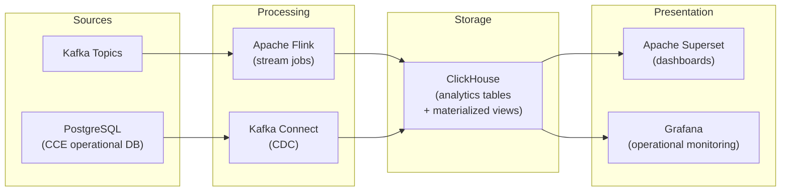

# CCE Data Pipeline — Architecture Overview

## 1. Purpose

The **CCE Data Pipeline** replaces the custom `cce-insights-service` and `cce-insights-ui` with an open-source analytics stack. It consumes events from the existing CCE Kafka topics, processes and materializes analytics views in a columnar OLAP database, and exposes interactive dashboards via open-source visualization tools.

**Design goals:**
- Eliminate custom analytics code — leverage battle-tested open-source components
- Handle **600k+ events/day** (≈7 events/second average, burst peaks up to 50 eps)
- Provide near-real-time insights (< 60-second latency from event to dashboard)
- Enable self-service exploration by operations teams without engineering involvement
- Maintain separation of concerns — the pipeline is read-only and never writes back to CCE operational databases

---

## 2. System Context

```mermaid
graph TB
    subgraph CCE Platform (Existing)
        COLLECTOR["CCE Collector Service"]
        COMPLIANCE["CCE Compliance Service"]
        SCHEDULER["CCE Scheduler Service"]
        INTELLIGENCE["CCE Intelligence Service"]
        KAFKA["Apache Kafka<br/>(existing cluster)"]
    end

    subgraph CCE Data Pipeline (New)
        CONNECT["Kafka Connect<br/>(JDBC Source Connectors)"]
        FLINK["Apache Flink<br/>(Stream Processing)"]
        CLICKHOUSE["ClickHouse<br/>(OLAP Analytics Store)"]
        SUPERSET["Apache Superset<br/>(Dashboards & Visualization)"]
    end

    subgraph Users
        OPS["Operations Team"]
        CLINICAL["Clinical Managers"]
        ADMIN["System Administrators"]
    end

    COLLECTOR -->|"cce.events.inbound"| KAFKA
    COMPLIANCE -->|"cce.intelligence.triggers"| KAFKA
    SCHEDULER -->|"cce.scheduler.triggers"| KAFKA

    KAFKA -->|"Stream events"| FLINK
    CONNECT -->|"CDC from PostgreSQL"| CLICKHOUSE
    FLINK -->|"Processed & aggregated"| CLICKHOUSE
    CLICKHOUSE --> SUPERSET

    SUPERSET --> OPS
    SUPERSET --> CLINICAL
    SUPERSET --> ADMIN

    classDef existing fill:#7B8D8E,stroke:#566573,color:white
    classDef pipeline fill:#4A90D9,stroke:#2C5F8A,color:white
    classDef users fill:#27AE60,stroke:#1E8449,color:white

    class COLLECTOR,COMPLIANCE,SCHEDULER,INTELLIGENCE,KAFKA existing
    class CONNECT,FLINK,CLICKHOUSE,SUPERSET pipeline
    class OPS,CLINICAL,ADMIN users
```

**This pipeline does NOT handle:** event ingestion, protocol matching, step completion, deviation detection, intelligence routing, or any write operations to CCE operational databases.

---

## 3. Architecture Principles

| # | Principle | Rationale |
|---|-----------|-----------|
| 1 | **Open-source only** | No vendor lock-in; community support; cost-effective |
| 2 | **Event-driven** | Leverage existing Kafka infrastructure; no polling of operational DBs for hot-path data |
| 3 | **Separation of compute and storage** | Scale processing (Flink) independently from analytics queries (ClickHouse) |
| 4 | **Schema-on-read flexibility** | ClickHouse's semi-structured support handles evolving FHIR payloads without migrations |
| 5 | **Immutable append-only** | All analytics data is append-only (event sourcing); no updates to source data |
| 6 | **Self-service analytics** | Operations teams build their own dashboards; no engineering dependency |
| 7 | **Graceful degradation** | Pipeline failures do not impact CCE operational services |

---

## 4. Component Overview

### 4.1 Event Ingestion Layer

**Apache Kafka** (existing) — the event backbone. No changes required to existing CCE services.

| Topic | Source | Content |
|-------|--------|--------|
| `cce.events.inbound` | Collector Service | All validated clinical events (CloudEvents + FHIR R4) |
| `cce.scheduler.triggers` | Scheduler Service | Step state transitions (PENDING→DUE, DUE→OVERDUE, OVERDUE→MISSED) |
| `cce.intelligence.triggers` | Compliance Service | Intelligence action triggers (deviations, completions, escalations) |

**Kafka Connect** (Debezium CDC) — log-based change data capture from PostgreSQL for dimensional data that isn't fully represented in Kafka events:

| Connector | Source Table | Purpose |
|-----------|--------------|---------|
| `cce-protocol-definitions` | `protocol_definition` | Protocol metadata (name, version, canonical URL) |
| `cce-protocol-instances` | `protocol_instance` | Patient enrollments, status, compliance tracking |
| `cce-step-instances` | `step_instance` | Step states, dates, completion status |
| `cce-deviations` | `deviation` | Deviation records with detection timestamps |
| `cce-inbound-events` | `inbound_event` | Ingestion audit (acceptance/rejection tracking) |
| `cce-intelligence-deliveries` | `intelligence_delivery` | Intelligence action delivery outcomes |
| `cce-intelligence-event-log` | `intelligence_event_log` | Intelligence trigger audit trail |
| `cce-action-definitions` | `action_definition` | Notification/escalation action templates |
| `cce-receiver-adaptors` | `receiver_adaptor` | FHIR endpoint adaptor registry |
| `cce-destination-mappings` | `destination_adaptor_mapping` | Destination-to-adaptor routing |

### 4.2 Stream Processing Layer

**Apache Flink** — stateful stream processing for real-time transformations and pre-aggregations:

- **Event enrichment** — flatten CloudEvents envelope, extract FHIR resource fields
- **Real-time counters** — event volume per facility/source/resource type (tumbling windows)
- **Compliance metrics** — adherence rate calculations, deviation detection rates
- **Late event handling** — watermarks with allowed lateness for out-of-order events

### 4.3 Analytics Storage Layer

**ClickHouse** — columnar OLAP database optimized for analytical queries:

- Sub-second query response on 100M+ rows
- Native support for time-series aggregations (`toStartOfDay`, `toStartOfWeek`)
- Materialized views for pre-computed dashboards
- TTL-based data lifecycle management
- Low storage footprint via columnar compression (10-40x vs row stores)

### 4.4 Visualization Layer

**Apache Superset** — open-source BI and dashboard platform:

- Interactive SQL-based dashboards
- Role-based access control (RBAC)
- Scheduled report delivery (email/Slack)
- Embeddable charts and dashboards
- Alert rules based on metric thresholds

---

## 5. Data Domains

The pipeline serves the same analytical domains as the previous insights-service, plus additional granular insights:

| Domain | Key Metrics | Primary Data Source |
|--------|-------------|---------------------|
| **Compliance Summary** | Adherence rate, on-track/at-risk/non-compliant counts | protocol_instance + step_instance (CDC) |
| **Deviation Analytics** | Overdue/missed counts, trends, resolution rate, time-in-deviation | deviation (CDC) + intelligence triggers (Kafka) |
| **Event Volume** | Events by resource type, facility, source, practitioner | cce.events.inbound (Kafka) |
| **Protocol Analytics** | Step completion funnel, timeliness, SLA metrics, version comparison | step_instance + protocol_instance (CDC) |
| **Facility Ranking** | Compliance rate, deviation count, event volume per facility | Composite (all sources) |
| **Patient Risk** | At-risk hotspots, repeat deviations, patient timeline | protocol_instance + deviation (CDC) |
| **Ingestion Quality** | Acceptance rate, rejection by resource type, source quality | inbound_event (CDC) |
| **Receiver-Adaptor Performance** | Success rate, latency, errors per adaptor/source | intelligence_delivery (CDC from Intelligence Service) |
| **Intelligence & Triggers** | Trigger volume by severity, action type, destination | cce.intelligence.triggers (Kafka) |
| **Practitioner Activity** | Events per practitioner, patient coverage, deviation correlation | events_fact (Flink) |
| **Event Correlation** | End-to-end event lifecycle tracing (inbound → process → deliver) | Composite (correlation_id join) |
| **Pipeline Health** | Processing latency, throughput, error rates | Kafka consumer lag + Flink metrics |

---

## 6. High-Level Data Flow



---

## 7. Capacity Planning

### 7.1 Event Volume Estimates

| Metric | Value | Notes |
|--------|-------|-------|
| Daily events (inbound) | 600,000 | Minimum requirement |
| Average event rate | ~7 events/second | Sustained |
| Peak event rate | ~50 events/second | 10-minute bursts |
| Average event size | ~2 KB | CloudEvents + FHIR payload |
| Daily data volume (raw) | ~1.2 GB | Before compression |
| Monthly data volume (raw) | ~36 GB | Before compression |
| ClickHouse compressed | ~3.6 GB/month | 10x columnar compression typical |
| Retention period | 2 years | Configurable |
| Total storage (2yr) | ~86 GB compressed | Well within single-node capacity |

### 7.2 Query Performance Targets

| Query Type | Target Latency | Example |
|------------|---------------|---------|
| Pre-aggregated dashboards | < 500ms | Compliance summary, event volume |
| Ad-hoc drill-downs | < 2s | Patient timeline, deviation details |
| Full-scan analytics | < 10s | Year-over-year comparisons |
| Export (CSV) | < 30s | Full compliance report |

### 7.3 Infrastructure Sizing (Initial)

| Component | Instances | CPU | RAM | Storage |
|-----------|-----------|-----|-----|---------|
| Apache Flink (JobManager) | 1 | 2 cores | 4 GB | — |
| Apache Flink (TaskManager) | 2 | 4 cores | 8 GB | — |
| ClickHouse | 1 (single node) | 8 cores | 32 GB | 500 GB SSD |
| Apache Superset | 2 (HA) | 4 cores | 8 GB | — |
| Kafka Connect | 2 (distributed) | 2 cores | 4 GB | — |

> **Scale-out path:** ClickHouse supports sharding + replication for horizontal scaling. At 600k events/day, a single node is more than sufficient. Scale to a cluster when daily volume exceeds 10M events.

---

## 8. Comparison: Previous vs. New Architecture

| Aspect | Previous (insights-service + UI) | New (Data Pipeline) |
|--------|----------------------------------|---------------------|
| **Custom code** | ~77 Java files, 12 packages, full Spring Boot app | Zero custom application code |
| **Query layer** | Custom JPA repositories, hand-tuned SQL | ClickHouse materialized views + Superset SQL |
| **Caching** | Custom 3-tier Caffeine cache | ClickHouse native query cache + materialized views |
| **Dashboard** | Custom React application | Apache Superset (no-code dashboard builder) |
| **Deployment** | 2 additional microservices (JVM) | Infrastructure components (Flink, ClickHouse, Superset) |
| **Maintenance** | Application code maintenance, dependency upgrades | Infrastructure operations only |
| **Flexibility** | Developer-dependent for new metrics | Self-service (operations team builds dashboards) |
| **Latency** | Real-time (direct DB query + 15-60min cache) | Near-real-time (< 60s event-to-dashboard) |
| **Scale ceiling** | PostgreSQL query load on operational DB | Dedicated OLAP engine; no operational DB impact |

---

## 9. Security

| Concern | Mechanism |
|---------|-----------|
| **Network isolation** | Data pipeline components in dedicated network segment; Kafka access via internal network only |
| **Authentication** | Superset: OAuth2/OIDC (Keycloak integration); ClickHouse: native user/password |
| **Authorization** | Superset RBAC: roles mapped to facility/program access; Row-level security for multi-tenant |
| **Data in transit** | TLS for all inter-component communication (Kafka SSL, ClickHouse native TLS, HTTPS for Superset) |
| **Data at rest** | ClickHouse disk encryption; sensitive fields (patient identifiers) accessible only to authorized roles |
| **Audit** | Superset audit log; ClickHouse query log; Kafka Connect connector status |
| **PII handling** | Patient UPIDs are pseudonymized identifiers (not names); FHIR resources stored only for operational analytics |

---

## 10. Failure Modes & Recovery

| Failure | Impact | Recovery |
|---------|--------|----------|
| Flink job crash | Event processing paused; dashboards show stale data | Auto-restart from last Kafka checkpoint; no data loss |
| ClickHouse down | Dashboards unavailable | Flink buffers in Kafka (retention = 7 days); replay on recovery |
| Kafka Connect failure | CDC tables go stale | Connector auto-restart; snapshot recovery on extended outage |
| Superset down | Dashboards unavailable | No data impact; restart and reconnect |
| Kafka cluster down | All CCE services affected (existing risk) | Flink pauses; resumes on recovery |

**Key invariant:** The data pipeline is a **read-only observer**. Its failure never impacts CCE operational services (Collector, Compliance, Scheduler, Intelligence).

---

## 11. Migration Strategy

| Phase | Duration | Activities |
|-------|----------|------------|
| **Phase 1: Foundation** | 2 weeks | Deploy ClickHouse, Kafka Connect CDC, basic tables |
| **Phase 2: Stream Processing** | 2 weeks | Deploy Flink jobs for event enrichment and aggregation |
| **Phase 3: Dashboards** | 2 weeks | Configure Superset, build core dashboards (compliance, deviations, events) |
| **Phase 4: Validation** | 1 week | Run parallel with existing insights-service; validate data accuracy |
| **Phase 5: Cutover** | 1 week | Route users to Superset; decommission insights-service and insights-ui |

**Total estimated timeline:** 8 weeks

---

## 12. Schema Evolution Strategy

The pipeline is designed for forward-compatible evolution without downtime:

| Change | Impact | Action Required |
|--------|--------|-----------------|
| New FHIR field needed in analytics | None (raw_payload preserved) | `ALTER TABLE ADD COLUMN` + update Flink extraction |
| New FHIR resource type | Auto-captured (LowCardinality String) | Update dashboard filters |
| PostgreSQL table gains a column | Debezium auto-captures | `ALTER TABLE ADD COLUMN` on ClickHouse side |
| PostgreSQL table dropped/renamed | Debezium connector errors | Reconfigure connector `table.include.list` |
| New Kafka topic | New data stream | Add Flink job + ClickHouse table |

**Key invariant:** The `raw_payload` column in `events_fact` stores the full FHIR resource as-is. Any new field extraction is a non-breaking addition — historical data can always be backfilled from `raw_payload` using ClickHouse's JSON functions.

---

## 13. Future Enhancements

| Enhancement | Trigger | Approach |
|-------------|---------|----------|
| **Predictive analytics** | Clinical program request | Add Python/ML models in Flink or external service reading from ClickHouse |
| **Alerting** | Operational need | Superset alerts or Grafana alerting rules on ClickHouse metrics |
| **Multi-cluster** | Geographic expansion | ClickHouse distributed tables across regions |
| **Data lake** | Long-term archival | Flink sink to object storage (S3/MinIO) in Parquet format |
| **API layer** | External integrations need programmatic access | Lightweight read-only API over ClickHouse (e.g., Cube.js or custom thin service) |
