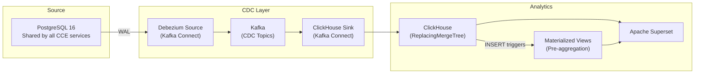

# CCE Data Pipeline — Data Flow & Schema Design

## 1. Architecture Overview

The CCE Data Pipeline uses a **CDC-only** architecture. All data flows from committed PostgreSQL records via Change Data Capture — no Kafka topic consumption or custom stream processing.



**Core principle:** Analytics should be purely on committed data in the database. This ensures:
- No discrepancies from in-flight events that may be rejected
- No data that bypasses validation/compliance checks
- Exact consistency with what the operational services store

---

## 2. CDC Pipeline

### 2.1 Source → Debezium → Kafka

Debezium reads the PostgreSQL Write-Ahead Log (WAL) and produces change events to Kafka topics.

**Configuration:**
- Plugin: `pgoutput` (native PostgreSQL logical decoding)
- Slot: `cce_analytics_slot`
- Publication: `cce_analytics_pub`
- Transform: `ExtractNewRecordState` (unwrap envelope to flat record)
- Additional fields: `op`, `table`, `lsn`, `source.ts_ms`

**Topic naming convention:**
```
cce.cdc.public.<table_name>
```

**CDC Topics (all from shared `ccedb` database, topic prefix `cce.cdc`):**

| Table Owner | Source Table | Kafka Topic |
|-------------|-------------|-------------|
| Collector Service | `inbound_event_log` | `cce.cdc.public.inbound_event_log` |
| Compliance Service | `protocol_definition` | `cce.cdc.public.protocol_definition` |
| Compliance Service | `protocol_instance` | `cce.cdc.public.protocol_instance` |
| Compliance Service | `step_instance` | `cce.cdc.public.step_instance` |
| Compliance Service | `deviation` | `cce.cdc.public.deviation` |
| Compliance Service | `intelligence_event_log` | `cce.cdc.public.intelligence_event_log` |
| Compliance Service | `action_definition` | `cce.cdc.public.action_definition` |
| Compliance Service | `compliance_event_log` | `cce.cdc.public.compliance_event_log` |
| Intelligence Service | `intelligence_delivery` | `cce.cdc.public.intelligence_delivery` |
| Intelligence Service | `receiver_adaptor` | `cce.cdc.public.receiver_adaptor` |
| Intelligence Service | `destination_adaptor_mapping` | `cce.cdc.public.destination_adaptor_mapping` |

> **Note:** All CCE services share a single PostgreSQL database (`ccedb`). Debezium uses `topic.prefix=cce.cdc` and captures the `public` schema — topic pattern: `cce.cdc.public.<table>`.

### 2.2 Kafka → ClickHouse Sink

The ClickHouse Kafka Connect Sink connector consumes CDC topics and writes to ClickHouse tables using `ReplacingMergeTree` with a `_version` column for idempotent upserts.

**Sink configuration:**
- `exactlyOnce=true`
- `batch.size=10000`
- `retry.count=3`
- Topic-to-table mapping configured per topic

**Debezium `_version` handling:**
- `_version` is derived from the source LSN (Log Sequence Number)
- `ReplacingMergeTree(_version)` deduplicates on the ORDER BY key, keeping the highest `_version`
- Queries use `FINAL` or subqueries with `argMax()` when exact deduplication is needed

---

## 3. ClickHouse Schema Design

### 3.1 Table Categories

| Category | Tables | Engine | Purpose |
|----------|--------|--------|---------|
| Event logs | `inbound_event_logs`, `compliance_event_logs` | ReplacingMergeTree | Raw event audit trail |
| Domain entities | `protocol_instances`, `step_instances`, `deviations` | ReplacingMergeTree | Protocol lifecycle |
| Intelligence | `intelligence_event_logs`, `intelligence_deliveries` | ReplacingMergeTree | Trigger & delivery audit |
| Reference data | `protocol_definitions`, `action_definitions`, `receiver_adaptors`, `destination_adaptor_mappings` | ReplacingMergeTree | Lookup/dimension tables |

### 3.2 MATERIALIZED Columns (Field Extraction)

The `inbound_event_logs` table stores raw CloudEvents JSON in `raw_payload`. MATERIALIZED columns extract key fields **at insert time** — zero query cost, no separate processing.

```sql
-- Extracted automatically when rows are inserted
subject          String MATERIALIZED JSONExtractString(raw_payload, 'subject'),
event_type       String MATERIALIZED JSONExtractString(raw_payload, 'type'),
facility_id      String MATERIALIZED JSONExtractString(raw_payload, 'facilityid'),
event_time       Nullable(DateTime64(3)) MATERIALIZED
    toDateTime64OrNull(JSONExtractString(raw_payload, 'time'), 3),
resource_type    String MATERIALIZED
    JSONExtractString(JSONExtractRaw(raw_payload, 'data'), 'resourceType'),
patient_id       String ALIAS subject,
practitioner_ref String MATERIALIZED
    JSONExtractString(JSONExtractRaw(raw_payload, 'data'), 'practitionerRef'),
practitioner_display String MATERIALIZED
    JSONExtractString(JSONExtractRaw(raw_payload, 'data'), 'practitionerDisplay')
```

### 3.3 Table DDL Summary

#### `inbound_event_logs` (primary analytics table)

| Column | Type | Notes |
|--------|------|-------|
| `id` | UUID | Primary key |
| `cloudevents_id` | String | CloudEvents envelope ID |
| `source` | LowCardinality(String) | Event source system |
| `correlation_id` | Nullable(String) | Cross-service tracing |
| `raw_payload` | String CODEC(ZSTD(3)) | Full CloudEvents JSON |
| `status` | LowCardinality(String) | Processing status |
| `rejection_reason` | LowCardinality(Nullable(String)) | If rejected |
| `received_at` | DateTime64(3) | Ingestion timestamp |
| `_version` | UInt64 | CDC version (LSN) |
| `subject` | String (MATERIALIZED) | Patient identifier |
| `event_type` | String (MATERIALIZED) | CloudEvents type |
| `facility_id` | String (MATERIALIZED) | Facility identifier |
| `event_time` | Nullable(DateTime64(3)) (MATERIALIZED) | Event timestamp |
| `resource_type` | String (MATERIALIZED) | FHIR resource type |
| `patient_id` | String (ALIAS) | Alias for subject |
| `practitioner_ref` | String (MATERIALIZED) | Practitioner reference |
| `practitioner_display` | String (MATERIALIZED) | Practitioner name |

**Engine:** `ReplacingMergeTree(_version)`  
**Partition:** `toYYYYMM(received_at)`  
**Order By:** `(source, received_at, id)`

#### `protocol_instances`

| Column | Type |
|--------|------|
| `id` | UUID |
| `patient_id` | String |
| `protocol_definition_id` | UUID |
| `protocol_canonical` | String |
| `status` | LowCardinality(String) |
| `enrolled_at` | DateTime64(3) |
| `created_at` | DateTime64(3) |
| `updated_at` | DateTime64(3) |
| `_version` | UInt64 |

**Engine:** `ReplacingMergeTree(_version)` | **Order By:** `(id)`

#### `step_instances`

| Column | Type |
|--------|------|
| `id` | UUID |
| `protocol_instance_id` | UUID |
| `action_id` | String |
| `repeat_index` | UInt16 |
| `state` | LowCardinality(String) |
| `completion_status` | LowCardinality(Nullable(String)) |
| `required_behavior` | LowCardinality(Nullable(String)) |
| `due_date` | Nullable(DateTime64(3)) |
| `overdue_date` | Nullable(DateTime64(3)) |
| `missed_date` | Nullable(DateTime64(3)) |
| `completed_at` | Nullable(DateTime64(3)) |
| `completed_by_source` | Nullable(String) |
| `completed_by_event_id` | Nullable(UUID) |
| `created_at` | DateTime64(3) |
| `updated_at` | DateTime64(3) |
| `_version` | UInt64 |

**Engine:** `ReplacingMergeTree(_version)` | **Order By:** `(id)`

#### `deviations`

| Column | Type |
|--------|------|
| `id` | UUID |
| `protocol_instance_id` | UUID |
| `step_instance_id` | UUID |
| `deviation_type` | LowCardinality(String) |
| `detected_at` | DateTime64(3) |
| `intelligence_event_id` | Nullable(UUID) |
| `metadata` | Nullable(String) |
| `_version` | UInt64 |

**Engine:** `ReplacingMergeTree(_version)`  
**Partition:** `toYYYYMM(detected_at)`  
**Order By:** `(deviation_type, detected_at, id)`

---

## 4. Materialized Views (Pre-Aggregation)

Materialized Views in ClickHouse are triggered on INSERT — they read from the source table and write pre-aggregated results to a target table.

### 4.1 Engine Selection

| Engine | Use Case | Columns Must Be |
|--------|----------|-----------------|
| `SummingMergeTree` | Simple additive counts | Summable (UInt64, Int64) |
| `AggregatingMergeTree` | Non-summable aggregates (uniq, quantile, any) | `-State` combinators |

**Rule:** If a view uses `uniq()`, `quantile()`, `any()`, or `avg()` → use `AggregatingMergeTree` with `-State`/`-Merge` combinators. If only `count()` → `SummingMergeTree` works.

### 4.2 MV Catalog

| MV | Source | Target Engine | Key Metrics |
|----|--------|---------------|-------------|
| `mv_event_volume_hourly` | `inbound_event_logs` | SummingMergeTree | `event_count` per hour/facility/source/type |
| `mv_event_volume_daily` | `inbound_event_logs` | SummingMergeTree | `event_count` per day/facility/source/type |
| `mv_facility_summary` | `inbound_event_logs` | AggregatingMergeTree | `uniqState(subject)`, `countState()` per facility/day |
| `mv_practitioner_summary` | `inbound_event_logs` | AggregatingMergeTree | `uniqState(subject)`, `countState()` per practitioner/day |
| `mv_compliance_summary` | `protocol_instances` | AggregatingMergeTree | `countIfState(status='COMPLETED')` per protocol/day |
| `mv_deviation_trends` | `deviations` | SummingMergeTree | `deviation_count` per type/day |
| `mv_deviation_by_protocol` | `deviations` | SummingMergeTree | `deviation_count` per protocol_instance_id/type |
| `mv_ingestion_quality` | `inbound_event_logs` | SummingMergeTree | `total_count`, `rejected_count` per source/day |
| `mv_intelligence_summary` | `intelligence_event_logs` | AggregatingMergeTree | `countState()`, `uniqState(subject)` per action_type/day |
| `mv_delivery_performance_hourly` | `intelligence_deliveries` | AggregatingMergeTree | `avgState(latency_ms)`, `countIfState(status='DELIVERED')` per destination/hour |
| `mv_step_states_daily` | `step_instances` | AggregatingMergeTree | `countIfState(state='DUE')`, etc. per protocol_instance_id/day |
| `mv_compliance_by_patient` | `protocol_instances` | AggregatingMergeTree | `countState()`, `countIfState(status)` per patient/protocol |
| `mv_deviation_by_patient` | `deviations` JOIN `protocol_instances` | AggregatingMergeTree | `countState()` per patient/deviation_type/day |
| `mv_intelligence_by_patient` | `intelligence_event_logs` | AggregatingMergeTree | `countState()` per subject/action_type/day |
| `mv_delivery_by_patient` | `intelligence_deliveries` | AggregatingMergeTree | `countIfState(status)` per subject/destination/day |
| `mv_step_states_by_protocol` | `step_instances` | AggregatingMergeTree | `countState()` per protocol_instance_id/state/day |
| `mv_step_states_by_patient` | `step_instances` JOIN `protocol_instances` | AggregatingMergeTree | `countState()` per patient/state/day |
| `mv_intelligence_by_protocol` | `intelligence_event_logs` | AggregatingMergeTree | `countState()` per protocol_instance_id/action_type/day |
| `mv_delivery_by_protocol` | `intelligence_deliveries` | AggregatingMergeTree | `countIfState(status)` per protocol_canonical/destination/day |

### 4.3 Entity × Behavior Coverage Matrix

Every meaningful Entity × Behavior combination is pre-aggregated or resolvable via dictionary at query time.

| Behavior ↓ / Entity → | Patient | Facility | Practitioner | Protocol | Resource Type | Source |
|---|---|---|---|---|---|---|
| **Event Ingestion** | `mv_facility_summary` (uniq) | `mv_event_volume_hourly/daily` | `mv_practitioner_summary` | — | `mv_event_volume_hourly/daily` | `mv_event_volume_hourly/daily` |
| **Ingestion Quality** | — | — | — | — | — | `mv_ingestion_quality` |
| **Compliance** | `mv_compliance_by_patient` | via `dict_patient_facility` | n/a | `mv_compliance_summary` | — | — |
| **Deviations** | `mv_deviation_by_patient` | via `dict_patient_facility` | n/a | `mv_deviation_by_protocol` | — | — |
| **Intelligence Triggers** | `mv_intelligence_by_patient` | via `dict_patient_facility` | n/a | `mv_intelligence_by_protocol` | — | — |
| **Delivery** | `mv_delivery_by_patient` | via `dict_patient_facility` | n/a | `mv_delivery_by_protocol` | — | — |
| **Step States** | `mv_step_states_by_patient` | via `dict_patient_facility` | n/a | `mv_step_states_by_protocol` | — | — |
| **Facility Summary** | `mv_facility_summary` (uniq) | `mv_facility_summary` | `mv_facility_summary` (uniq) | — | `mv_facility_summary` | — |
| **Practitioner Activity** | `mv_practitioner_summary` (uniq) | `mv_practitioner_summary` | `mv_practitioner_summary` | — | `mv_practitioner_summary` | — |

**Legend:**
- **n/a** — not applicable (practitioners don't own compliance/deviations/intelligence in the data model; they originate from inbound FHIR events only)
- **via `dict_patient_facility`** — resolve at query time with `dictGet('dict_patient_facility', 'facility_id', patient_id)`
- **—** — not a meaningful dimension for this behavior

### 4.4 Query Patterns

**SummingMergeTree queries** — use `sum()`:
```sql
SELECT
    hour,
    facility_id,
    sum(event_count) AS total_events
FROM mv_event_volume_hourly
WHERE hour >= now() - INTERVAL 24 HOUR
GROUP BY hour, facility_id
ORDER BY hour;
```

**AggregatingMergeTree queries** — use `-Merge` combinators:
```sql
SELECT
    facility_id,
    report_date,
    uniqMerge(unique_patients) AS unique_patients,
    countMerge(total_events) AS total_events
FROM mv_facility_summary
WHERE report_date >= today() - 7
GROUP BY facility_id, report_date
ORDER BY total_events DESC;
```

---

## 5. Indexes & Projections

### 5.1 Secondary Indexes

| Table | Index | Type | Column |
|-------|-------|------|--------|
| `inbound_event_logs` | `idx_facility` | `bloom_filter` | `facility_id` |
| `inbound_event_logs` | `idx_resource_type` | `bloom_filter` | `resource_type` |
| `intelligence_event_logs` | `idx_subject` | `bloom_filter` | `subject` |
| `intelligence_deliveries` | `idx_intelligence_event` | `bloom_filter` | `intelligence_event_id` |
| `step_instances` | `idx_protocol_instance` | `bloom_filter` | `protocol_instance_id` |

### 5.2 Projections

Projections provide alternative sort orders without separate tables:

| Table | Projection | Order By | Use Case |
|-------|-----------|----------|----------|
| `inbound_event_logs` | `prj_patient_timeline` | `(subject, event_time)` | Patient event history |
| `protocol_instances` | `prj_patient_protocols` | `(patient_id, enrolled_at)` | Patient's protocol list |
| `deviations` | `prj_protocol_deviations` | `(protocol_instance_id, detected_at)` | Protocol drill-down |

---

## 6. Dictionary

### `dict_protocol_definitions`

ClickHouse dictionary for fast JOINs against protocol metadata:

```sql
CREATE DICTIONARY dict_protocol_definitions (
    id UUID,
    name String,
    canonical String,
    version String,
    status String
)
PRIMARY KEY id
SOURCE(CLICKHOUSE(
    TABLE 'protocol_definitions'
    DB 'cce_analytics'
))
LIFETIME(MIN 300 MAX 600)
LAYOUT(HASHED());
```

Used with `dictGet()` for efficient protocol name lookups without JOIN.

### `dict_patient_facility`

Maps patient → most recent facility (refreshed every 5–10 min):

```sql
CREATE DICTIONARY dict_patient_facility (
    patient_id String,
    facility_id String,
    last_seen DateTime64(3)
)
PRIMARY KEY patient_id
SOURCE(CLICKHOUSE(
    QUERY 'SELECT subject AS patient_id,
           argMax(facility_id, received_at) AS facility_id,
           max(received_at) AS last_seen
    FROM cce_analytics.inbound_event_logs
    WHERE subject != '''' AND facility_id != ''''
    GROUP BY subject'
))
LIFETIME(MIN 300 MAX 600)
LAYOUT(COMPLEX_KEY_HASHED());
```

Enables facility-level slicing of patient-centric MVs at query time via `dictGet('dict_patient_facility', 'facility_id', patient_id)`.

### `dict_action_definitions`

Action definition metadata for enriching intelligence/delivery views:

```sql
CREATE DICTIONARY dict_action_definitions (
    id UUID,
    canonical_url String,
    name String,
    title String,
    action_type String,
    status String
)
PRIMARY KEY id
SOURCE(CLICKHOUSE(
    TABLE 'action_definitions'
    DB 'cce_analytics'
))
LIFETIME(MIN 60 MAX 300)
LAYOUT(HASHED());
```

---

## 7. Data Lineage

```mermaid
flowchart TD
    subgraph PostgreSQL
        IEL["inbound_event_log"]
        PI["protocol_instance"]
        SI["step_instance"]
        DEV["deviation"]
        IEG["intelligence_event_log"]
        ID["intelligence_delivery"]
        AD["action_definition"]
        PD["protocol_definition"]
        CEL["compliance_event_log"]
        RA["receiver_adaptor"]
        DAM["destination_adaptor_mapping"]
    end

    subgraph ClickHouse Tables
        CH_IEL["inbound_event_logs"]
        CH_PI["protocol_instances"]
        CH_SI["step_instances"]
        CH_DEV["deviations"]
        CH_IEG["intelligence_event_logs"]
        CH_ID["intelligence_deliveries"]
        CH_AD["action_definitions"]
        CH_PD["protocol_definitions"]
        CH_CEL["compliance_event_logs"]
        CH_RA["receiver_adaptors"]
        CH_DAM["destination_adaptor_mappings"]
    end

    subgraph Materialized Views
        MV1["mv_event_volume_hourly"]
        MV2["mv_event_volume_daily"]
        MV3["mv_facility_summary"]
        MV4["mv_practitioner_summary"]
        MV5["mv_compliance_summary"]
        MV6["mv_deviation_trends"]
        MV7["mv_deviation_by_protocol"]
        MV8["mv_ingestion_quality"]
        MV9["mv_intelligence_summary"]
        MV10["mv_delivery_performance_hourly"]
        MV11["mv_step_states_daily"]
    end

    IEL -->|CDC| CH_IEL
    PI -->|CDC| CH_PI
    SI -->|CDC| CH_SI
    DEV -->|CDC| CH_DEV
    IEG -->|CDC| CH_IEG
    ID -->|CDC| CH_ID
    AD -->|CDC| CH_AD
    PD -->|CDC| CH_PD
    CEL -->|CDC| CH_CEL
    RA -->|CDC| CH_RA
    DAM -->|CDC| CH_DAM

    CH_IEL --> MV1
    CH_IEL --> MV2
    CH_IEL --> MV3
    CH_IEL --> MV4
    CH_IEL --> MV8
    CH_PI --> MV5
    CH_DEV --> MV6
    CH_DEV --> MV7
    CH_IEG --> MV9
    CH_ID --> MV10
    CH_SI --> MV11
```



---

## 8. TTL & Data Lifecycle

| Table | TTL | Rationale |
|-------|-----|-----------|
| `inbound_event_logs` | (partition managed) | Full audit trail |
| `intelligence_deliveries` | 1 year | Delivery records age out |
| `deviations` | (none) | Clinical compliance record |
| `protocol_instances` | (none) | Active patient data |
| `step_instances` | (none) | Active workflow data |

Partitioning by `toYYYYMM()` enables efficient partition-level drops for aged data.

---

## 9. Query Examples

### Patient Timeline
```sql
SELECT
    event_time,
    event_type,
    resource_type,
    facility_id
FROM inbound_event_logs FINAL
WHERE patient_id = 'patient-uuid'
ORDER BY event_time DESC
LIMIT 100;
```

### Facility Dashboard (using MV)
```sql
SELECT
    facility_id,
    uniqMerge(unique_patients) AS patients,
    countMerge(total_events) AS events
FROM mv_facility_summary
WHERE report_date >= today() - 30
GROUP BY facility_id
ORDER BY events DESC
LIMIT 20;
```

### Compliance Overview
```sql
SELECT
    protocol_canonical,
    countMerge(total_enrollments) AS total,
    countIfMerge(completed_count) AS completed,
    round(countIfMerge(completed_count) / countMerge(total_enrollments) * 100, 1) AS pct
FROM mv_compliance_summary
WHERE report_date >= today() - 30
GROUP BY protocol_canonical
ORDER BY total DESC;
```

### Deviation Trends
```sql
SELECT
    report_date,
    deviation_type,
    sum(deviation_count) AS count
FROM mv_deviation_trends
WHERE report_date >= today() - 90
GROUP BY report_date, deviation_type
ORDER BY report_date;
```
