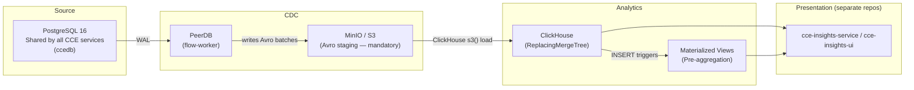

# CCE Data Pipeline — Data Flow & Schema Design

## 1. Architecture Overview

The CCE Data Pipeline uses a **CDC-only** architecture. All data flows from committed PostgreSQL records via Change Data Capture — no Kafka, no custom stream processing.



> **MinIO is required, not optional.** PeerDB's ClickHouse connector does not stream rows
> directly — `flow-worker` stages each CDC batch as Avro files in an S3-compatible bucket,
> then ClickHouse pulls them via the `s3()` table function. MinIO provides that bucket
> (swappable for AWS S3). See [§2.3 S3/MinIO Staging](#23-s3minio-staging).

**Core principle:** Analytics should be purely on committed data in the database. This ensures:
- No discrepancies from in-flight events that may be rejected
- No data that bypasses validation/compliance checks
- Exact consistency with what the operational services store

---

## 2. CDC Pipeline

### 2.1 PeerDB Mirror (PostgreSQL → ClickHouse)

PeerDB reads the PostgreSQL Write-Ahead Log (WAL) via logical replication and loads ClickHouse through a mandatory **S3/MinIO Avro staging** step (see §2.3).

**Configuration** (see `connectors/peerdb-mirror.sql`):
- Replication slot: `cce_analytics_slot`
- Publication: `cce_analytics_pub`
- Sync interval: 10 seconds
- Soft delete: enabled (`_peerdb_is_deleted` column)
- Initial snapshot: parallelized (4 tables, 8 workers)

**Source Tables (all from shared `ccedb` database):**

| Table Owner | Source Table | ClickHouse Table |
|-------------|-------------|-----------------|
| Collector Service | `inbound_event_log` | `inbound_event_logs` |
| Compliance Service | `protocol_definition` | `protocol_definitions` |
| Compliance Service | `protocol_instance` | `protocol_instances` |
| Compliance Service | `step_instance` | `step_instances` |
| Compliance Service | `deviation` | `deviations` |
| Compliance Service | `intelligence_event_log` | `intelligence_event_logs` |
| Compliance Service | `action_definition` | `action_definitions` |
| Compliance Service | `compliance_event_log` | `compliance_event_logs` |
| Intelligence Service | `intelligence_delivery` | `intelligence_deliveries` |
| Intelligence Service | `receiver_adaptor` | `receiver_adaptors` |
| Intelligence Service | `destination_adaptor_mapping` | `destination_adaptor_mappings` |

> **Note:** All CCE services share a single PostgreSQL database (`ccedb`). `REPLICA IDENTITY FULL` is set on all tables to ensure TOAST'd JSONB columns are fully replicated during UPDATEs.

### 2.2 Deduplication & Delete Handling

All 11 ClickHouse tables are **pre-created** via `schema/01-create-tables.sql` before the PeerDB mirror starts. PeerDB writes into the existing tables without recreating them.

**Engine:** `ReplacingMergeTree(_peerdb_version, _peerdb_is_deleted)` with `SETTINGS clean_deleted_rows = 'Always'` (requires ClickHouse 23.2+).

**Deduplication strategy:**
- `_peerdb_version` increases monotonically per row
- The two-parameter form deduplicates on the ORDER BY key, keeping the highest version row. If the winning row has `_peerdb_is_deleted=1`, it is physically removed during background merges.
- Background merges collapse duplicates asynchronously
- **Queries MUST use `FINAL`** or subqueries with `argMax()` when exact deduplication is needed before merges complete

**Delete handling:**
- PeerDB sets `_peerdb_is_deleted=1` (soft-delete flag) for PostgreSQL DELETEs (`soft_delete=true` in mirror config)
- `clean_deleted_rows = 'Always'` physically removes deleted rows during background merges — no `WHERE _peerdb_is_deleted = false` filter needed in queries
- The `cce_pipeline` user profile has `final=1` so all reads from `cce-insights-service` (and ad-hoc queries) automatically apply FINAL

### 2.3 S3/MinIO Staging

PeerDB's ClickHouse destination is **not** a direct row stream — it is a stage-and-load
pipeline that **requires** an S3-compatible object store:

1. `flow-worker` serializes each CDC batch (and the initial snapshot) to **Avro** files.
2. It uploads those files to the staging bucket (`peerdbbucket`).
3. ClickHouse reads them back with the `s3()` table function and inserts into the target table.

Implications:
- **The object store is mandatory** for this pipeline; without it the mirror cannot load ClickHouse.
- The endpoint (`http://minio:9000` in compose) must be reachable by **both** `flow-worker`
  (writes) **and** ClickHouse (reads). On the shared Docker network both use the `minio` service name.
- Configured via `PEERDB_CLICKHOUSE_AWS_CREDENTIALS_AWS_*` on the flow services
  (endpoint, access key, secret, region, bucket).
- **MinIO ↔ AWS S3 is an env swap**, not a topology change: point those vars at AWS, set
  `AWS_*`, drop the `minio` service. See [Deployment Guide § MinIO vs S3](deployment-guide.md#minio-vs-s3).

---

## 3. ClickHouse Schema Design

### 3.1 Table Categories

| Category | Tables | Engine | Purpose |
|----------|--------|--------|---------|
| Event logs | `inbound_event_logs`, `compliance_event_logs` | ReplacingMergeTree | Raw event audit trail |
| Domain entities | `protocol_instances`, `step_instances`, `deviations` | ReplacingMergeTree | Protocol lifecycle |
| Intelligence | `intelligence_event_logs`, `intelligence_deliveries` | ReplacingMergeTree | Trigger & delivery audit |
| Reference data | `protocol_definitions`, `action_definitions`, `receiver_adaptors`, `destination_adaptor_mappings` | ReplacingMergeTree | Lookup/dimension tables |

### 3.2 MATERIALIZED Columns (Field Extraction)

The `inbound_event_logs` table stores raw CloudEvents JSON in `raw_payload`. MATERIALIZED columns extract key fields **at insert time** — zero query cost, no separate processing.

```sql
-- Extracted automatically when rows are inserted
subject          String MATERIALIZED JSONExtractString(raw_payload, 'subject'),
event_type       String MATERIALIZED JSONExtractString(raw_payload, 'type'),
facility_id      String MATERIALIZED JSONExtractString(raw_payload, 'facilityid'),
event_time       Nullable(DateTime64(3)) MATERIALIZED
    toDateTime64OrNull(JSONExtractString(raw_payload, 'time'), 3),
resource_type    String MATERIALIZED
    JSONExtractString(JSONExtractRaw(raw_payload, 'data'), 'resourceType'),
patient_id       String ALIAS subject,
practitioner_ref String MATERIALIZED
    JSONExtractString(JSONExtractRaw(raw_payload, 'data'), 'practitionerRef'),
practitioner_display String MATERIALIZED
    JSONExtractString(JSONExtractRaw(raw_payload, 'data'), 'practitionerDisplay')
```

### 3.3 Table DDL Summary

#### `inbound_event_logs` (primary analytics table)

| Column | Type | Notes |
|--------|------|-------|
| `id` | UUID | Primary key |
| `cloudevents_id` | String | CloudEvents envelope ID |
| `source` | LowCardinality(String) | Event source system |
| `correlation_id` | Nullable(String) | Cross-service tracing |
| `raw_payload` | String CODEC(ZSTD(3)) | Full CloudEvents JSON |
| `status` | LowCardinality(String) | Processing status |
| `rejection_reason` | LowCardinality(Nullable(String)) | If rejected |
| `received_at` | DateTime64(3) | Ingestion timestamp |
| `updated_at` | DateTime64(3) | Last modification timestamp |
| `_peerdb_version` | Int64 | CDC version for ReplacingMergeTree deduplication |
| `_peerdb_is_deleted` | UInt8 | Soft-delete flag (1 = deleted in PostgreSQL) |
| `subject` | String (MATERIALIZED) | Patient identifier |
| `event_type` | String (MATERIALIZED) | CloudEvents type |
| `facility_id` | String (MATERIALIZED) | Facility identifier |
| `event_time` | Nullable(DateTime64(3)) (MATERIALIZED) | Event timestamp |
| `resource_type` | String (MATERIALIZED) | FHIR resource type |
| `patient_id` | String (ALIAS) | Alias for subject |
| `practitioner_ref` | String (MATERIALIZED) | Practitioner reference |
| `practitioner_display` | String (MATERIALIZED) | Practitioner name |

**Engine:** `ReplacingMergeTree(_peerdb_version, _peerdb_is_deleted) SETTINGS clean_deleted_rows = 'Always'`  
**Partition:** `toYYYYMM(received_at)`  
**Order By:** `(id)`

#### `protocol_instances`

| Column | Type |
|--------|------|
| `id` | UUID |
| `patient_id` | String |
| `protocol_definition_id` | UUID |
| `protocol_canonical` | String |
| `status` | LowCardinality(String) |
| `enrolled_at` | DateTime64(3) |
| `created_at` | DateTime64(3) |
| `updated_at` | DateTime64(3) |
| `_version` | UInt64 |

**Engine:** `ReplacingMergeTree(_peerdb_version, _peerdb_is_deleted) SETTINGS clean_deleted_rows = 'Always'` | **Order By:** `(id)`

#### `step_instances`

| Column | Type |
|--------|------|
| `id` | UUID |
| `protocol_instance_id` | UUID |
| `action_id` | String |
| `repeat_index` | UInt16 |
| `state` | LowCardinality(String) |
| `completion_status` | LowCardinality(Nullable(String)) |
| `required_behavior` | LowCardinality(Nullable(String)) |
| `due_date` | Nullable(DateTime64(3)) |
| `overdue_date` | Nullable(DateTime64(3)) |
| `missed_date` | Nullable(DateTime64(3)) |
| `completed_at` | Nullable(DateTime64(3)) |
| `completed_by_source` | Nullable(String) |
| `completed_by_event_id` | Nullable(UUID) |
| `created_at` | DateTime64(3) |
| `updated_at` | DateTime64(3) |
| `_version` | UInt64 |

**Engine:** `ReplacingMergeTree(_peerdb_version, _peerdb_is_deleted) SETTINGS clean_deleted_rows = 'Always'` | **Order By:** `(id)`

#### `deviations`

| Column | Type |
|--------|------|
| `id` | UUID |
| `protocol_instance_id` | UUID |
| `step_instance_id` | UUID |
| `deviation_type` | LowCardinality(String) |
| `detected_at` | DateTime64(3) |
| `intelligence_event_id` | Nullable(UUID) |
| `metadata` | Nullable(String) |
| `updated_at` | DateTime64(3) |
| `_peerdb_version` | Int64 |
| `_peerdb_is_deleted` | UInt8 |

**Engine:** `ReplacingMergeTree(_peerdb_version, _peerdb_is_deleted) SETTINGS clean_deleted_rows = 'Always'`  
**Partition:** `toYYYYMM(detected_at)`  
**Order By:** `(id)`

---

## 4. Materialized Views (Pre-Aggregation)

Materialized Views in ClickHouse are triggered on INSERT — they read from the source table and write pre-aggregated results to a target table.

### 4.1 Engine Selection

| Engine | Use Case | Columns Must Be |
|--------|----------|-----------------|
| `SummingMergeTree` | Simple additive counts | Summable (UInt64, Int64) |
| `AggregatingMergeTree` | Non-summable aggregates (uniq, quantile, any) | `-State` combinators |

**Rule:** If a view uses `uniq()`, `quantile()`, `any()`, or `avg()` → use `AggregatingMergeTree` with `-State`/`-Merge` combinators. If only `count()` → `SummingMergeTree` works.

### 4.2 MV Catalog

| MV | Source | Target Engine | Key Metrics |
|----|--------|---------------|-------------|
| `mv_event_volume_hourly` | `inbound_event_logs` | SummingMergeTree | `event_count` per hour/facility/source/type; daily totals derived via `toDate(hour)` at query time |
| `mv_facility_summary` | `inbound_event_logs` | AggregatingMergeTree | `uniqState(subject)`, `countState()` per facility/day |
| `mv_practitioner_summary` | `inbound_event_logs` | AggregatingMergeTree | `uniqState(subject)`, `countState()` per practitioner/day |
| `mv_compliance_summary` | `protocol_instances` | AggregatingMergeTree | `countIfState(status='COMPLETED')` per protocol/day |
| `mv_deviation_trends` | `deviations` | SummingMergeTree | `deviation_count` per type/day |
| `mv_deviation_by_protocol` | `deviations` | SummingMergeTree | `deviation_count` per protocol_instance_id/type |
| `mv_ingestion_quality` | `inbound_event_logs` | SummingMergeTree | `total_count`, `rejected_count` per source/day |
| `mv_intelligence_summary` | `intelligence_event_logs` | AggregatingMergeTree | `countState()`, `uniqState(subject)` per action_type/day |
| `mv_compliance_by_patient` | `protocol_instances` | AggregatingMergeTree | `minState(enrolled_at)`, `maxState(updated_at)` per patient/protocol |
| `mv_deviation_by_patient` | `deviations` JOIN `protocol_instances` | AggregatingMergeTree | `countState()` per patient/deviation_type/day |
| `mv_intelligence_by_patient` | `intelligence_event_logs` | AggregatingMergeTree | `countState()` per subject/action_type/day |
| `mv_intelligence_by_protocol` | `intelligence_event_logs` | AggregatingMergeTree | `countState()` per protocol_instance_id/action_type/day |
| `mv_patient_facility_latest` | `inbound_event_logs` | ReplacingMergeTree(last_seen) | Latest facility per patient (dictionary source) |
| `step_instances FINAL` | `step_instances` | ReplacingMergeTree(_peerdb_version) | Current state per step; query with FINAL for exact counts |
| `intelligence_deliveries FINAL` | `intelligence_deliveries` | ReplacingMergeTree(_peerdb_version) | Current state per delivery; query with FINAL for exact counts |

### 4.3 Entity × Behavior Coverage Matrix

Every meaningful Entity × Behavior combination is pre-aggregated or resolvable via dictionary at query time.

| Behavior ↓ / Entity → | Patient | Facility | Practitioner | Protocol | Resource Type | Source |
|---|---|---|---|---|---|---|
| **Event Ingestion** | `mv_facility_summary` (uniq) | `mv_event_volume_hourly/daily` | `mv_practitioner_summary` | — | `mv_event_volume_hourly/daily` | `mv_event_volume_hourly/daily` |
| **Ingestion Quality** | — | — | — | — | — | `mv_ingestion_quality` |
| **Compliance** | `mv_compliance_by_patient` | via `dict_patient_facility` | n/a | `mv_compliance_summary` | — | — |
| **Deviations** | `mv_deviation_by_patient` | via `dict_patient_facility` | n/a | `mv_deviation_by_protocol` | — | — |
| **Intelligence Triggers** | `mv_intelligence_by_patient` | via `dict_patient_facility` | n/a | `mv_intelligence_by_protocol` | — | — |
| **Delivery** | `intelligence_deliveries FINAL` | via `dict_patient_facility` | n/a | `intelligence_deliveries FINAL` | — | — |
| **Step States** | `step_instances FINAL` | via `dict_patient_facility` | n/a | `step_instances FINAL` | — | — |
| **Step Timeliness** | `step_instances FINAL` | via `dict_patient_facility` | n/a | `step_instances FINAL` | — | — |
| **Facility Summary** | `mv_facility_summary` (uniq) | `mv_facility_summary` | `mv_facility_summary` (uniq) | — | `mv_facility_summary` | — |
| **Practitioner Activity** | `mv_practitioner_summary` (uniq) | `mv_practitioner_summary` | `mv_practitioner_summary` | — | `mv_practitioner_summary` | — |

**Legend:**
- **n/a** — not applicable (practitioners don't own compliance/deviations/intelligence in the data model; they originate from inbound FHIR events only)
- **via `dict_patient_facility`** — resolve at query time with `dictGet('dict_patient_facility', 'facility_id', patient_id)`
- **—** — not a meaningful dimension for this behavior

### 4.4 Query Patterns

**SummingMergeTree queries** — use `sum()`:
```sql
SELECT
    hour,
    facility_id,
    sum(event_count) AS total_events
FROM mv_event_volume_hourly
WHERE hour >= now() - INTERVAL 24 HOUR
GROUP BY hour, facility_id
ORDER BY hour;
```

**AggregatingMergeTree queries** — use `-Merge` combinators:
```sql
SELECT
    facility_id,
    report_date,
    uniqMerge(unique_patients) AS unique_patients,
    countMerge(total_events) AS total_events
FROM mv_facility_summary
WHERE report_date >= today() - 7
GROUP BY facility_id, report_date
ORDER BY total_events DESC;
```

---

## 5. Indexes

### 5.1 Secondary Indexes

17 bloom filter indexes for fast point lookups on non-ORDER-BY columns. All indexes are materialized via `MATERIALIZE INDEX` to cover existing snapshot data. **Skip indexes prune granules even under `FINAL`**, so they remain effective for the `cce_pipeline` profile (which sets `final=1`).

| Table | Index | Column |
|-------|-------|--------|
| `inbound_event_logs` | `idx_cloudevents_id` | `cloudevents_id` |
| `inbound_event_logs` | `idx_correlation` | `correlation_id` |
| `inbound_event_logs` | `idx_source` | `source` |
| `inbound_event_logs` | `idx_subject` | `subject` (patient event history) |
| `inbound_event_logs` | `idx_facility` | `facility_id` (facility-scoped browse) |
| `protocol_instances` | `idx_patient_id` | `patient_id` |
| `protocol_instances` | `idx_protocol_definition` | `protocol_definition_id` |
| `step_instances` | `idx_protocol_instance` | `protocol_instance_id` |
| `step_instances` | `idx_state` | `state` |
| `step_instances` | `idx_action_id` | `action_id` |
| `deviations` | `idx_protocol_instance` | `protocol_instance_id` |
| `deviations` | `idx_step_instance` | `step_instance_id` |
| `intelligence_event_logs` | `idx_subject` | `subject` |
| `intelligence_event_logs` | `idx_protocol_instance` | `protocol_instance_id` |
| `intelligence_deliveries` | `idx_intelligence_event` | `intelligence_event_id` |
| `intelligence_deliveries` | `idx_status` | `status` |
| `intelligence_deliveries` | `idx_subject` | `subject` |

### 5.2 Why no projections

This pipeline uses **no projections**. ClickHouse skips projections whenever a query uses
`FINAL`, and the `cce_pipeline` analytics profile sets `final=1` — so projections would never
be used by `cce-insights-service`, while each `SELECT *` projection costs a full extra sorted
copy of the table (prohibitive on `inbound_event_logs`, which stores the large `raw_payload`
blob). The access patterns a projection would serve are instead covered by the skip indexes
above (which work under `FINAL`), and per-enrollment compliance rollups by the optional
refreshable table in `schema/05` (see [Deployment Guide § Step 4](deployment-guide.md#step-4-optional--refreshable-compliance-rollup)).

> If you later run heavy **non-FINAL** analytical scans under a different profile, projections
> could help there — but they are intentionally omitted for the current `final=1` access path.

---

## 6. Dictionary

### `dict_protocol_definitions`

ClickHouse dictionary for fast JOINs against protocol metadata. Uses `QUERY...FINAL` — reading via `TABLE` without FINAL can return duplicate rows from unmerged ReplacingMergeTree parts, corrupting dict lookups.

```sql
CREATE DICTIONARY dict_protocol_definitions (
    id UUID,
    name String,
    version String,
    url String,
    canonical String,
    status String
)
PRIMARY KEY id
SOURCE(CLICKHOUSE(
    QUERY 'SELECT id, name, version, url, url AS canonical, status FROM cce_analytics.protocol_definitions FINAL'
    DB 'cce_analytics'
))
LIFETIME(MIN 60 MAX 300)
LAYOUT(HASHED());
```

Used with `dictGet()` for efficient protocol name lookups without JOIN.

### `dict_patient_facility`

Maps patient → most recent facility (refreshed every 5–10 min). Sources from `mv_patient_facility_latest` (a `ReplacingMergeTree(last_seen)` MV) using `argMax` to force deduplication at load time:

```sql
CREATE DICTIONARY dict_patient_facility (
    patient_id String,
    facility_id String,
    last_seen DateTime64(3)
)
PRIMARY KEY patient_id
SOURCE(CLICKHOUSE(
    QUERY 'SELECT patient_id, argMax(facility_id, last_seen) AS facility_id, max(last_seen) AS last_seen FROM cce_analytics.mv_patient_facility_latest GROUP BY patient_id'
    DB 'cce_analytics'
))
LIFETIME(MIN 300 MAX 600)
LAYOUT(COMPLEX_KEY_HASHED());
```

Enables facility-level slicing of patient-centric MVs at query time via `dictGet('dict_patient_facility', 'facility_id', patient_id)`.

### `dict_action_definitions`

Action definition metadata for enriching intelligence/delivery views. Uses `QUERY...FINAL` for same reason as `dict_protocol_definitions`.

```sql
CREATE DICTIONARY dict_action_definitions (
    id UUID,
    canonical_url String,
    name String DEFAULT '',
    action_type String,
    status String
)
PRIMARY KEY id
SOURCE(CLICKHOUSE(
    QUERY 'SELECT id, url AS canonical_url, name, kind AS action_type, status FROM cce_analytics.action_definitions FINAL'
    DB 'cce_analytics'
))
LIFETIME(MIN 60 MAX 300)
LAYOUT(HASHED());
```

---

## 7. Data Lineage

```mermaid
flowchart TD
    subgraph PostgreSQL
        IEL["inbound_event_log"]
        PI["protocol_instance"]
        SI["step_instance"]
        DEV["deviation"]
        IEG["intelligence_event_log"]
        ID["intelligence_delivery"]
        AD["action_definition"]
        PD["protocol_definition"]
        CEL["compliance_event_log"]
        RA["receiver_adaptor"]
        DAM["destination_adaptor_mapping"]
    end

    subgraph ClickHouse Tables
        CH_IEL["inbound_event_logs"]
        CH_PI["protocol_instances"]
        CH_SI["step_instances"]
        CH_DEV["deviations"]
        CH_IEG["intelligence_event_logs"]
        CH_ID["intelligence_deliveries"]
        CH_AD["action_definitions"]
        CH_PD["protocol_definitions"]
        CH_CEL["compliance_event_logs"]
        CH_RA["receiver_adaptors"]
        CH_DAM["destination_adaptor_mappings"]
    end

    subgraph Materialized Views
        MV1["mv_event_volume_hourly"]
        MV2["mv_facility_summary"]
        MV3["mv_practitioner_summary"]
        MV4["mv_compliance_summary"]
        MV5["mv_compliance_by_patient"]
        MV6["mv_deviation_trends"]
        MV7["mv_deviation_by_protocol"]
        MV8["mv_deviation_by_patient"]
        MV9["mv_ingestion_quality"]
        MV10["mv_patient_facility_latest"]
        MV11["mv_intelligence_summary"]
        MV12["mv_intelligence_by_patient"]
        MV13["mv_intelligence_by_protocol"]
    end

    subgraph Direct Queries
        BT1["step_instances FINAL"]
        BT2["intelligence_deliveries FINAL"]
    end

    IEL -->|CDC| CH_IEL
    PI -->|CDC| CH_PI
    SI -->|CDC| CH_SI
    DEV -->|CDC| CH_DEV
    IEG -->|CDC| CH_IEG
    ID -->|CDC| CH_ID
    AD -->|CDC| CH_AD
    PD -->|CDC| CH_PD
    CEL -->|CDC| CH_CEL
    RA -->|CDC| CH_RA
    DAM -->|CDC| CH_DAM

    CH_IEL --> MV1
    CH_IEL --> MV2
    CH_IEL --> MV3
    CH_IEL --> MV9
    CH_IEL --> MV10
    CH_PI --> MV4
    CH_PI --> MV5
    CH_DEV --> MV6
    CH_DEV --> MV7
    CH_DEV --> MV8
    CH_IEG --> MV11
    CH_IEG --> MV12
    CH_IEG --> MV13
    CH_SI --> BT1
    CH_ID --> BT2
```



---

## 8. TTL & Data Lifecycle

| Table | TTL | Rationale |
|-------|-----|-----------|
| `inbound_event_logs` | 90 days | High-volume log; set in schema/03 |
| `intelligence_event_logs` | 90 days | High-volume trigger log; set in schema/03 |
| `intelligence_deliveries` | 90 days | High-volume delivery log; set in schema/03 |
| `compliance_event_logs` | 90 days | High-volume compliance log; set in schema/03 |
| `deviations` | (none) | Clinical compliance record — retained indefinitely |
| `protocol_instances` | (none) | Active patient data |
| `step_instances` | (none) | Active workflow data |

> Healthcare regulations (e.g., HIPAA) typically require 7-year retention. The 90-day TTL applies to the ClickHouse hot tier. Configure cold-tier archival to object storage with a separate 7-year TTL to meet compliance requirements.

Partitioning by `toYYYYMM()` on date columns enables efficient partition-level drops for aged data.

---

## 9. Query Examples

### Patient Timeline
```sql
SELECT
    event_time,
    event_type,
    resource_type,
    facility_id
FROM inbound_event_logs FINAL
WHERE patient_id = 'patient-uuid'
ORDER BY event_time DESC
LIMIT 100;
```

### Facility Dashboard (using MV)
```sql
SELECT
    facility_id,
    uniqMerge(unique_patients) AS patients,
    countMerge(total_events) AS events
FROM mv_facility_summary
WHERE report_date >= today() - 30
GROUP BY facility_id
ORDER BY events DESC
LIMIT 20;
```

### Compliance Overview
```sql
-- Query protocol_instances FINAL for live status counts.
-- mv_compliance_summary only stores first_enrolled / last_updated because
-- countIfState(status='X') double-counts rows that were ever updated via CDC.
-- For per-enrollment step compliance (completed/total), prefer the optional
-- pre-aggregated rollup `rollup_protocol_instance_compliance` (schema/05) instead of
-- scanning step_instances FINAL on every request — see deployment-guide.md § Step 4.
SELECT
    pi.protocol_canonical,
    count()                                                                AS total,
    countIf(pi.status = 'COMPLETED')                                       AS completed,
    round(countIf(pi.status = 'COMPLETED') / nullIf(count(), 0) * 100, 1) AS pct
FROM protocol_instances pi FINAL
GROUP BY pi.protocol_canonical
ORDER BY total DESC;
```

### Deviation Trends
```sql
SELECT
    report_date,
    deviation_type,
    sum(deviation_count) AS count
FROM mv_deviation_trends
WHERE report_date >= today() - 90
GROUP BY report_date, deviation_type
ORDER BY report_date;
```
