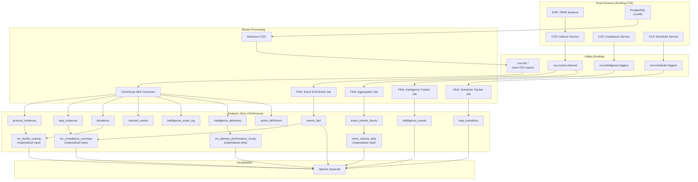
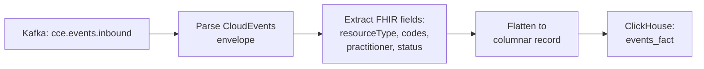
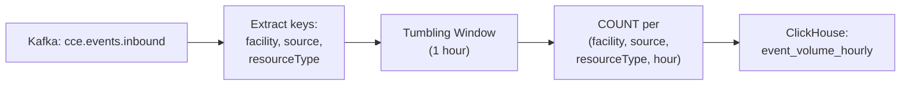
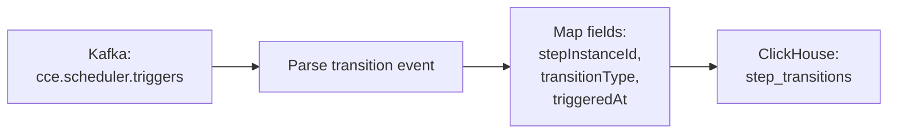
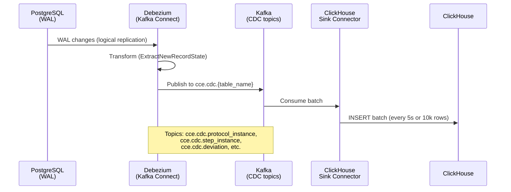
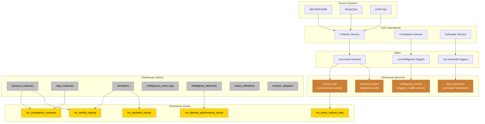

# CCE Data Pipeline — Data Flow & Schema Design

## 1. End-to-End Data Flow



---

## 2. Stream Processing Pipelines

### 2.1 Event Enrichment Pipeline

**Input:** `cce.events.inbound` (CloudEvents JSON)
**Output:** `events_fact` table in ClickHouse



**Field extraction mapping:**

| Source Path | Target Column | Type |
|-------------|--------------|------|
| `id` | `event_id` | String |
| `source` | `source` | LowCardinality(String) |
| `type` | `event_type` | LowCardinality(String) |
| `subject` | `patient_id` | String |
| `time` | `event_time` | DateTime64(3) |
| `facilityid` | `facility_id` | LowCardinality(String) |
| `correlationid` | `correlation_id` | String |
| `datacontenttype` | `content_type` | LowCardinality(String) |
| `data.resourceType` | `resource_type` | LowCardinality(String) |
| `data.status` | `resource_status` | LowCardinality(String) |
| `data.code.coding[0].system` | `primary_code_system` | String |
| `data.code.coding[0].code` | `primary_code` | String |
| `data.code.coding[0].display` | `primary_code_display` | String |
| Practitioner ref (COALESCE) | `practitioner_ref` | Nullable(String) |
| — | `processed_at` | DateTime64(3) (pipeline insert time) |
| `data` (full) | `raw_payload` | String (compressed) |

**Practitioner extraction logic (mirroring insights-service):**
```
COALESCE(
  data.participant[0].individual.reference,
  data.performer[0].reference,
  data.asserter.reference,
  data.requester.reference,
  data.performer[0].actor.reference
)
```

---

### 2.2 Event Volume Aggregation Pipeline

**Input:** `cce.events.inbound`
**Output:** `event_volume_hourly` in ClickHouse

Pre-aggregates event counts in 1-hour tumbling windows to avoid full-scan queries on dashboards.



**Output schema:**
```sql
CREATE TABLE event_volume_hourly (
    hour           DateTime,
    facility_id    LowCardinality(String),
    source         LowCardinality(String),
    resource_type  LowCardinality(String),
    event_count    UInt64
) ENGINE = SummingMergeTree()
PARTITION BY toYYYYMM(hour)
ORDER BY (facility_id, source, resource_type, hour);
```

---

### 2.3 Intelligence Event Tracker Pipeline

**Input:** `cce.intelligence.triggers`
**Output:** `intelligence_events` in ClickHouse


---

### 2.4 Scheduler Transition Tracker Pipeline

**Input:** `cce.scheduler.triggers`
**Output:** `step_transitions` in ClickHouse

Captures step state transitions triggered by the Scheduler Service's time-based evaluation (e.g., marking a step as DUE when its due_date arrives, or OVERDUE/MISSED when deadlines pass).



**Event schema (from Kafka):**
```json
{
  "stepInstanceId": "UUID",
  "transitionType": "PENDING_TO_DUE | DUE_TO_OVERDUE | OVERDUE_TO_MISSED",
  "triggeredAt": 1778224037.910005746,
  "correlationId": "sched-PENDING_TO_DUE-{stepInstanceId}-{timestamp}"
}
```

**ClickHouse target table:**
```sql
CREATE TABLE step_transitions (
    step_instance_id    UUID,
    transition_type     LowCardinality(String),  -- PENDING_TO_DUE, DUE_TO_OVERDUE, OVERDUE_TO_MISSED
    triggered_at        DateTime64(3),
    correlation_id      String,
    processed_at        DateTime64(3) DEFAULT now64(3)
)
ENGINE = MergeTree()
PARTITION BY toYYYYMM(triggered_at)
ORDER BY (transition_type, triggered_at, step_instance_id)
TTL triggered_at + INTERVAL 2 YEAR;

-- Secondary index for JOIN from step_instances
ALTER TABLE step_transitions ADD INDEX idx_step_instance step_instance_id TYPE bloom_filter GRANULARITY 4;
```

---

## 3. ClickHouse Schema Design

### 3.1 Fact Tables (Event-Sourced)

#### `events_fact` — All clinical events (primary analytics table)

```sql
CREATE TABLE events_fact (
    event_id           String,
    source             LowCardinality(String),
    event_type         LowCardinality(String),
    patient_id         String,
    event_time         DateTime64(3),
    facility_id        LowCardinality(String),
    correlation_id     String,
    content_type       LowCardinality(String),
    resource_type      LowCardinality(String),
    resource_status    LowCardinality(String),
    primary_code_system String,
    primary_code       String,
    primary_code_display String,
    practitioner_ref   Nullable(String),
    processed_at       DateTime64(3) DEFAULT now64(3),
    raw_payload        String CODEC(ZSTD(3))
)
ENGINE = MergeTree()
PARTITION BY toYYYYMM(event_time)
ORDER BY (facility_id, resource_type, event_time, patient_id)
TTL event_time + INTERVAL 2 YEAR
SETTINGS index_granularity = 8192;

-- Secondary indices for granular drill-downs
ALTER TABLE events_fact ADD INDEX idx_patient patient_id TYPE bloom_filter GRANULARITY 4;
ALTER TABLE events_fact ADD INDEX idx_practitioner practitioner_ref TYPE bloom_filter GRANULARITY 4;
ALTER TABLE events_fact ADD INDEX idx_correlation correlation_id TYPE bloom_filter GRANULARITY 4;
```

#### `intelligence_events` — Intelligence triggers (from Kafka `cce.intelligence.triggers`)

```sql
CREATE TABLE intelligence_events (
    id                      UUID,
    subject                 String,
    intelligence_event_id   UUID,
    action_definition_id    UUID,
    protocol_definition_id  UUID,
    action_type             LowCardinality(String),  -- CommunicationRequest, Task, ServiceRequest
    severity                LowCardinality(String),  -- LOW, MEDIUM, HIGH, CRITICAL
    intelligence_destination LowCardinality(String),
    step_state              LowCardinality(String),  -- due, overdue, missed, completed
    action_id               String,
    protocol_canonical      String,
    detected_at             DateTime64(3),
    processed_at            DateTime64(3) DEFAULT now64(3)
)
ENGINE = MergeTree()
PARTITION BY toYYYYMM(detected_at)
ORDER BY (severity, step_state, detected_at)
TTL detected_at + INTERVAL 2 YEAR;

-- Secondary index for patient drill-downs
ALTER TABLE intelligence_events ADD INDEX idx_subject subject TYPE bloom_filter GRANULARITY 4;
``` — Ingestion audit trail (from CDC)

```sql
CREATE TABLE inbound_events (
    id               UUID,
    cloudevents_id   String,
    source           LowCardinality(String),
    event_type       LowCardinality(String),
    subject          Nullable(String),
    facility_id      LowCardinality(Nullable(String)),
    correlation_id   Nullable(String),
    source_event_id  Nullable(String),
    status           LowCardinality(String),  -- RECEIVED, ACCEPTED, REJECTED
    rejection_reason LowCardinality(Nullable(String)),
    error_details    Nullable(String),
    received_at      DateTime64(3),
    _version         UInt64  -- Debezium LSN for deduplication
)
ENGINE = ReplacingMergeTree(_version)
PARTITION BY toYYYYMM(received_at)
ORDER BY (source, received_at, id);
```

#### `intelligence_deliveries` — Intelligence action delivery outcomes (from CDC of `intelligence_delivery`)

```sql
CREATE TABLE intelligence_deliveries (
    id                          UUID,
    intelligence_event_id       UUID,
    action_definition_id        UUID,
    destination_adaptor_mapping_id Nullable(UUID),
    adaptor_name                LowCardinality(String),   -- denormalized from receiver_adaptor.name via Flink enrichment
    endpoint_url                LowCardinality(String),   -- denormalized from receiver_adaptor.definition->>'address'
    destination                 LowCardinality(String),   -- routing destination (e.g., "supervisor", "lab-coordinator")
    action_type                 LowCardinality(String),   -- CommunicationRequest, Task, ServiceRequest
    severity                    LowCardinality(String),   -- LOW, MEDIUM, HIGH, CRITICAL
    status                      LowCardinality(String),   -- PENDING, EXECUTING, DELIVERED, FAILED, CANCELLED
    subject                     String,                   -- patient UPID
    protocol_canonical          String,
    action_id                   String,
    http_status_code            Nullable(UInt16),         -- extracted from delivery_result JSONB
    error_message               Nullable(String),         -- extracted from delivery_result JSONB
    attempt_count               UInt8,
    created_at                  DateTime64(3),
    delivered_at                Nullable(DateTime64(3)),
    latency_ms                  Nullable(UInt32),         -- computed: dateDiff('millisecond', created_at, delivered_at) via Flink enrichment
    _version                    UInt64
)
ENGINE = ReplacingMergeTree(_version)
PARTITION BY toYYYYMM(created_at)
ORDER BY (destination, adaptor_name, created_at, id)
TTL created_at + INTERVAL 1 YEAR;
```

> **Enrichment note:** `adaptor_name` and `endpoint_url` are denormalized at CDC time via Flink by joining `intelligence_delivery.destination_adaptor_mapping_id` → `destination_adaptor_mapping.receiver_adaptor_id` → `receiver_adaptor.name` / `receiver_adaptor.definition->>'address'`. Fields `http_status_code`, `error_message`, and `latency_ms` are extracted/computed in the Flink CDC enrichment job from the `delivery_result` JSONB column and timestamp fields.

#### `receiver_adaptors` — Adaptor registry dimension (from CDC of `receiver_adaptor`)

```sql
CREATE TABLE receiver_adaptors (
    id           UUID,
    name         String,
    endpoint_url String,        -- extracted from definition->>'address'
    status       LowCardinality(String),  -- ACTIVE, INACTIVE
    _version     UInt64
)
ENGINE = ReplacingMergeTree(_version)
ORDER BY (id);
```

#### `destination_adaptor_mappings` — Destination routing dimension (from CDC of `destination_adaptor_mapping`)

```sql
CREATE TABLE destination_adaptor_mappings (
    id                  UUID,
    destination         String,
    receiver_adaptor_id UUID,
    status              LowCardinality(String),  -- ACTIVE, INACTIVE
    _version            UInt64
)
ENGINE = ReplacingMergeTree(_version)
ORDER BY (id);
```

#### `intelligence_event_logs` — Intelligence trigger audit trail (from CDC of `intelligence_event_log`)

```sql
CREATE TABLE intelligence_event_logs (
    id                       UUID,
    action_definition_id     UUID,
    protocol_instance_id     UUID,
    step_instance_id         Nullable(UUID),
    deviation_id             Nullable(UUID),
    subject                  String,
    action_type              LowCardinality(String),  -- CommunicationRequest, Task, ServiceRequest
    intelligence_destination LowCardinality(String),
    step_state               LowCardinality(String),  -- due, overdue, missed, completed
    trigger_reason           LowCardinality(String),  -- completion, overdue, missed
    step_action_id           Nullable(String),
    published                UInt8,                   -- 0/1
    published_at             Nullable(DateTime64(3)),
    error_message            Nullable(String),
    created_at               DateTime64(3),
    _version                 UInt64
)
ENGINE = ReplacingMergeTree(_version)
PARTITION BY toYYYYMM(created_at)
ORDER BY (action_type, intelligence_destination, created_at, id);
```

> **Note:** `intelligence_event_logs` (CDC) provides richer trigger context (protocol_instance, step_instance, deviation linkage, trigger_reason) than `intelligence_events` (Kafka stream). Use `intelligence_event_logs` for drill-down queries and `intelligence_events` for real-time alerting.

#### `action_definitions` — Intelligence action template dimension (from CDC of `action_definition`)

```sql
CREATE TABLE action_definitions (
    id            UUID,
    canonical_url String,
    version       String,
    name          Nullable(String),
    title         Nullable(String),
    status        LowCardinality(String),  -- ACTIVE, RETIRED
    action_type   LowCardinality(String),  -- CommunicationRequest, Task, ServiceRequest
    _version      UInt64
)
ENGINE = ReplacingMergeTree(_version)
ORDER BY (id);
```

#### `mv_delivery_performance_hourly` — Pre-aggregated delivery metrics

```sql
CREATE MATERIALIZED VIEW mv_delivery_performance_hourly
ENGINE = SummingMergeTree()
PARTITION BY toYYYYMM(hour)
ORDER BY (adaptor_name, destination, action_type, hour)
AS SELECT
    toStartOfHour(created_at)         AS hour,
    adaptor_name,
    endpoint_url,
    destination,
    action_type,
    severity,
    count()                           AS total_deliveries,
    countIf(status = 'DELIVERED')     AS delivered,
    countIf(status = 'FAILED')        AS failed,
    countIf(status = 'CANCELLED')     AS cancelled,
    avg(latency_ms)                   AS avg_latency_ms,
    quantile(0.95)(latency_ms)        AS p95_latency_ms,
    quantile(0.99)(latency_ms)        AS p99_latency_ms,
    max(latency_ms)                   AS max_latency_ms
FROM intelligence_deliveries
WHERE status IN ('DELIVERED', 'FAILED', 'CANCELLED')
GROUP BY hour, adaptor_name, endpoint_url, destination, action_type, severity;
```

---

### 3.2 Dimension Tables (from CDC)

#### `protocol_instances` — Patient enrollments

```sql
CREATE TABLE protocol_instances (
    id                      UUID,
    patient_id              String,
    protocol_definition_id  UUID,
    protocol_canonical      String,
    status                  LowCardinality(String),  -- ACTIVE, COMPLETED, WITHDRAWN, EXPIRED
    enrolled_at             DateTime64(3),
    completed_at            Nullable(DateTime64(3)),  -- derived: updated_at when status=COMPLETED
    facility_id             LowCardinality(Nullable(String)),  -- derived: from event_log enrollment event via Flink
    created_at              DateTime64(3),
    updated_at              DateTime64(3),
    _version                UInt64
)
ENGINE = ReplacingMergeTree(_version)
ORDER BY (id);
```

#### `step_instances` — Protocol steps

```sql
CREATE TABLE step_instances (
    id                      UUID,
    protocol_instance_id    UUID,
    action_id               String,
    repeat_index            UInt16,
    state                   LowCardinality(String),  -- PENDING, DUE, OVERDUE, MISSED, COMPLETED, SKIPPED
    completion_status       LowCardinality(Nullable(String)),  -- EARLY, ON_TIME, LATE
    required_behavior       LowCardinality(Nullable(String)),  -- must, could, must-unless-documented
    due_date                Nullable(DateTime64(3)),
    overdue_date            Nullable(DateTime64(3)),
    missed_date             Nullable(DateTime64(3)),
    completed_at            Nullable(DateTime64(3)),
    completed_by_source     Nullable(String),
    matched_event_id        Nullable(UUID),
    created_at              DateTime64(3),
    updated_at              DateTime64(3),
    _version                UInt64
)
ENGINE = ReplacingMergeTree(_version)
ORDER BY (id);
```

#### `deviations` — Compliance deviations

```sql
CREATE TABLE deviations (
    id                      UUID,
    protocol_instance_id    UUID,
    step_instance_id        UUID,
    patient_id              String,
    facility_id             LowCardinality(Nullable(String)),
    protocol_definition_id  UUID,
    action_id               Nullable(String),
    deviation_type          LowCardinality(String),  -- OVERDUE, MISSED, ORDER_VIOLATION
    detected_at             DateTime64(3),
    intelligence_event_id   Nullable(UUID),
    _version                UInt64
)
ENGINE = ReplacingMergeTree(_version)
PARTITION BY toYYYYMM(detected_at)
ORDER BY (facility_id, deviation_type, detected_at, id);
```

#### `protocol_definitions` — Protocol metadata

```sql
CREATE TABLE protocol_definitions (
    id        UUID,
    name      String,
    version   String,
    url       String,
    canonical String,  -- url|version
    status    LowCardinality(String),
    _version  UInt64
)
ENGINE = ReplacingMergeTree(_version)
ORDER BY (id);
```

#### `dict_protocol_definitions` — In-memory dictionary for fast JOIN replacement

```sql
CREATE DICTIONARY dict_protocol_definitions (
    id UUID,
    name String,
    version String,
    url String,
    canonical String,
    status String
)
PRIMARY KEY id
SOURCE(CLICKHOUSE(
    TABLE 'protocol_definitions'
    DB 'cce_analytics'
))
LIFETIME(MIN 60 MAX 300)
LAYOUT(HASHED());
```

> **Usage:** Replace `JOIN protocol_definitions pd FINAL ON pi.protocol_definition_id = pd.id` with `dictGet('dict_protocol_definitions', 'name', pi.protocol_definition_id)` for 5-10x faster lookups in dashboard queries.

---

### 3.3 Materialized Views (Pre-Aggregated)

#### `mv_event_volume_daily` — Daily rollup from hourly

```sql
CREATE MATERIALIZED VIEW mv_event_volume_daily
ENGINE = SummingMergeTree()
PARTITION BY toYYYYMM(day)
ORDER BY (facility_id, source, resource_type, day)
AS SELECT
    toStartOfDay(hour) AS day,
    facility_id,
    source,
    resource_type,
    sum(event_count) AS event_count
FROM event_volume_hourly
GROUP BY day, facility_id, source, resource_type;
```

#### `mv_compliance_summary` — Protocol compliance rates

```sql
CREATE MATERIALIZED VIEW mv_compliance_summary
ENGINE = AggregatingMergeTree()
ORDER BY (protocol_definition_id, facility_id)
AS SELECT
    pi.protocol_definition_id,
    pi.facility_id,
    countState() AS total_enrollments,
    countIfState(pi.status = 'COMPLETED') AS completed_count,
    countIfState(pi.status = 'ACTIVE') AS active_count
FROM protocol_instances pi
GROUP BY pi.protocol_definition_id, pi.facility_id;
```

#### `mv_deviation_trends` — Daily deviation counts

```sql
CREATE MATERIALIZED VIEW mv_deviation_trends
ENGINE = SummingMergeTree()
PARTITION BY toYYYYMM(day)
ORDER BY (deviation_type, day)
AS SELECT
    toStartOfDay(detected_at) AS day,
    deviation_type,
    count() AS deviation_count
FROM deviations
GROUP BY day, deviation_type;
```

#### `mv_ingestion_quality` — Source quality metrics

```sql
CREATE MATERIALIZED VIEW mv_ingestion_quality
ENGINE = SummingMergeTree()
PARTITION BY toYYYYMM(day)
ORDER BY (source, resource_type, status, day)
AS SELECT
    toStartOfDay(received_at) AS day,
    source,
    resource_type,
    status,
    rejection_reason,
    count() AS event_count
FROM inbound_events
GROUP BY day, source, resource_type, status, rejection_reason;
```

#### `mv_deviation_by_facility` — Facility-level deviation metrics

```sql
CREATE MATERIALIZED VIEW mv_deviation_by_facility
ENGINE = SummingMergeTree()
PARTITION BY toYYYYMM(day)
ORDER BY (facility_id, deviation_type, day)
AS SELECT
    toStartOfDay(detected_at) AS day,
    facility_id,
    deviation_type,
    protocol_definition_id,
    action_id,
    count() AS deviation_count,
    uniq(patient_id) AS affected_patients
FROM deviations
WHERE facility_id IS NOT NULL
GROUP BY day, facility_id, deviation_type, protocol_definition_id, action_id;
```

#### `mv_intelligence_summary` — Intelligence trigger aggregation

```sql
CREATE MATERIALIZED VIEW mv_intelligence_summary
ENGINE = SummingMergeTree()
PARTITION BY toYYYYMM(day)
ORDER BY (severity, action_type, intelligence_destination, day)
AS SELECT
    toStartOfDay(detected_at) AS day,
    severity,
    action_type,
    intelligence_destination,
    step_state,
    count() AS trigger_count,
    uniq(subject) AS unique_patients
FROM intelligence_events
GROUP BY day, severity, action_type, intelligence_destination, step_state;
```

#### `mv_scheduler_transitions_daily` — Daily scheduler transition aggregation

```sql
CREATE MATERIALIZED VIEW mv_scheduler_transitions_daily
ENGINE = SummingMergeTree()
PARTITION BY toYYYYMM(day)
ORDER BY (transition_type, day)
AS SELECT
    toStartOfDay(triggered_at) AS day,
    transition_type,
    count() AS transition_count,
    uniq(step_instance_id) AS unique_steps
FROM step_transitions
GROUP BY day, transition_type;
```

---

## 4. CDC Data Flow Detail

### 4.1 Debezium → Kafka → ClickHouse



### 4.2 CDC Topic Naming Convention

| Source Table | Kafka Topic | ClickHouse Table |
|--------------|-------------|------------------|
| `protocol_definition` | `cce.cdc.public.protocol_definition` | `protocol_definitions` |
| `protocol_instance` | `cce.cdc.public.protocol_instance` | `protocol_instances` |
| `step_instance` | `cce.cdc.public.step_instance` | `step_instances` |
| `deviation` | `cce.cdc.public.deviation` | `deviations` |
| `inbound_event` | `cce.cdc.public.inbound_event` | `inbound_events` |
| `intelligence_delivery` | `cce.cdc.public.intelligence_delivery` | `intelligence_deliveries` |
| `intelligence_event_log` | `cce.cdc.public.intelligence_event_log` | `intelligence_event_logs` |
| `action_definition` | `cce.cdc.public.action_definition` | `action_definitions` |
| `receiver_adaptor` | `cce.cdc.public.receiver_adaptor` | `receiver_adaptors` |
| `destination_adaptor_mapping` | `cce.cdc.public.destination_adaptor_mapping` | `destination_adaptor_mappings` |
| `event_log` | `cce.cdc.public.event_log` | — (replaced by events_fact from Kafka stream) |

> **Note:** All tables reside in a single shared PostgreSQL database (`ccedb`) used by all CCE services. A single Debezium connector captures changes from all tables via one replication slot.

> **Note:** `event_log` CDC is optional. The `events_fact` table populated by Flink from `cce.events.inbound` provides richer data (with FHIR field extraction). CDC of `event_log` is only needed if the Compliance Service adds fields not present in the original Kafka event (e.g., `processing_status`).

---

## 5. Query Patterns (Superset SQL)

### 5.1 Compliance Summary (replaces ComplianceSummaryService)

```sql
SELECT
    pd.canonical AS protocol,
    pd.name AS protocol_name,
    count(DISTINCT pi.id) AS total_enrollments,
    countIf(pi.status = 'ACTIVE') AS active,
    countIf(pi.status = 'COMPLETED') AS completed,
    round(countIf(si.state = 'COMPLETED') / nullIf(count(si.id), 0) * 100, 1) AS adherence_rate_pct
FROM protocol_instances pi FINAL
JOIN protocol_definitions pd FINAL ON pi.protocol_definition_id = pd.id
LEFT JOIN step_instances si FINAL ON si.protocol_instance_id = pi.id
WHERE 1=1
     AND pi.facility_id = '{{ facility_id }}' 
GROUP BY pd.canonical, pd.name
ORDER BY adherence_rate_pct ASC;
```

### 5.2 Event Volume by Resource Type (replaces EventVolumeService)

```sql
SELECT
    resource_type,
    count() AS event_count,
    round(count() / sum(count()) OVER () * 100, 1) AS percentage
FROM events_fact
WHERE event_time BETWEEN '{{ start_date }}' AND '{{ end_date }}'
     AND facility_id = '{{ facility_id }}' 
GROUP BY resource_type
ORDER BY event_count DESC;
```

### 5.3 Deviation Trends (replaces DeviationAnalyticsService)

```sql
SELECT
    toStartOfDay(detected_at) AS day,
    deviation_type,
    count() AS count
FROM deviations
WHERE detected_at BETWEEN '{{ start_date }}' AND '{{ end_date }}'
GROUP BY day, deviation_type
ORDER BY day;
```

### 5.4 Facility Ranking (replaces FacilityRankingService)

```sql
SELECT
    pi.facility_id,
    count(DISTINCT pi.id) AS total_enrollments,
    round(
        countIf(si.state IN ('COMPLETED', 'SKIPPED')) / 
        nullIf(count(si.id), 0) * 100, 1
    ) AS compliance_rate_pct,
    countIf(d.id IS NOT NULL) AS active_deviations
FROM protocol_instances pi FINAL
LEFT JOIN step_instances si FINAL ON si.protocol_instance_id = pi.id
LEFT JOIN deviations d ON d.protocol_instance_id = pi.id
    AND d.detected_at > now() - INTERVAL 30 DAY
WHERE pi.facility_id IS NOT NULL
GROUP BY pi.facility_id
ORDER BY compliance_rate_pct DESC;
```

### 5.5 Ingestion Funnel (replaces IngestionAnalyticsService)

```sql
SELECT
    status,
    count() AS count,
    round(count() / sum(count()) OVER () * 100, 1) AS percentage
FROM inbound_events
WHERE received_at BETWEEN '{{ start_date }}' AND '{{ end_date }}'
     AND source = '{{ source }}' 
GROUP BY status
ORDER BY count DESC;
```

### 5.6 Receiver-Adaptor Performance

**Adaptor Delivery Summary:**
```sql
SELECT
    adaptor_name,
    endpoint_url,
    destination,
    action_type,
    sum(total_deliveries) AS total_deliveries,
    sum(delivered) AS delivered,
    sum(failed) AS failed,
    sum(cancelled) AS cancelled,
    round(sum(delivered) / nullIf(sum(total_deliveries), 0) * 100, 1) AS success_rate_pct,
    round(avg(avg_latency_ms), 0) AS avg_latency_ms,
    max(p95_latency_ms) AS p95_latency_ms
FROM mv_delivery_performance_hourly
WHERE hour BETWEEN '{{ start_date }}' AND '{{ end_date }}'
     AND adaptor_name = '{{ adaptor_name }}' 
GROUP BY adaptor_name, endpoint_url, destination, action_type
ORDER BY success_rate_pct ASC;
```

**Delivery Performance Trend (by destination):**
```sql
SELECT
    toStartOfDay(hour) AS day,
    adaptor_name,
    destination,
    sum(total_deliveries) AS total,
    sum(delivered) AS delivered,
    sum(failed) AS failed,
    round(sum(delivered) / nullIf(sum(total_deliveries), 0) * 100, 1) AS success_rate_pct
FROM mv_delivery_performance_hourly
WHERE hour BETWEEN '{{ start_date }}' AND '{{ end_date }}'
GROUP BY day, adaptor_name, destination
ORDER BY day, adaptor_name;
```

**Delivery Error Breakdown:**
```sql
SELECT
    adaptor_name,
    destination,
    status,
    http_status_code,
    error_message,
    count() AS occurrences,
    min(created_at) AS first_seen,
    max(created_at) AS last_seen
FROM intelligence_deliveries FINAL
WHERE status IN ('FAILED', 'CANCELLED')
    AND created_at BETWEEN '{{ start_date }}' AND '{{ end_date }}'
GROUP BY adaptor_name, destination, status, http_status_code, error_message
ORDER BY occurrences DESC
LIMIT 50;
```

### 5.6 Patient Risk — At-Risk Hotspots

```sql
SELECT
    pi.facility_id,
    count(DISTINCT pi.patient_id) AS total_patients,
    countDistinctIf(pi.patient_id, 
        NOT EXISTS (
            SELECT 1 FROM step_instances si FINAL 
            WHERE si.protocol_instance_id = pi.id 
            AND si.state IN ('OVERDUE', 'MISSED')
        )
    ) AS on_track,
    countDistinctIf(pi.patient_id,
        EXISTS (SELECT 1 FROM step_instances si FINAL WHERE si.protocol_instance_id = pi.id AND si.state = 'OVERDUE')
        AND NOT EXISTS (SELECT 1 FROM step_instances si FINAL WHERE si.protocol_instance_id = pi.id AND si.state = 'MISSED')
    ) AS at_risk,
    countDistinctIf(pi.patient_id,
        EXISTS (SELECT 1 FROM step_instances si FINAL WHERE si.protocol_instance_id = pi.id AND si.state = 'MISSED')
    ) AS non_compliant
FROM protocol_instances pi FINAL
WHERE pi.status = 'ACTIVE'
    AND pi.facility_id IS NOT NULL
GROUP BY pi.facility_id
ORDER BY non_compliant DESC;
```

### 5.7 Patient Timeline (single-patient drill-down)

```sql
-- Uses bloom_filter index on patient_id for fast lookup
SELECT
    event_time,
    event_type,
    resource_type,
    resource_status,
    primary_code_display,
    practitioner_ref,
    source,
    facility_id
FROM events_fact
WHERE patient_id = '{{ patient_id }}'
ORDER BY event_time DESC
LIMIT 500;
```

### 5.8 Practitioner Activity & Performance

```sql
SELECT
    practitioner_ref,
    facility_id,
    count() AS total_events,
    uniq(patient_id) AS unique_patients,
    count(DISTINCT resource_type) AS resource_types_handled,
    min(event_time) AS first_activity,
    max(event_time) AS last_activity
FROM events_fact
WHERE practitioner_ref IS NOT NULL
    AND event_time BETWEEN '{{ start_date }}' AND '{{ end_date }}'
     AND facility_id = '{{ facility_id }}' 
GROUP BY practitioner_ref, facility_id
ORDER BY total_events DESC;
```

### 5.9 Practitioner Deviation Correlation

```sql
-- Which practitioners have most patients with deviations?
SELECT
    ef.practitioner_ref,
    ef.facility_id,
    uniq(ef.patient_id) AS total_patients,
    uniqIf(ef.patient_id, d.id IS NOT NULL) AS patients_with_deviations,
    round(uniqIf(ef.patient_id, d.id IS NOT NULL) / nullIf(uniq(ef.patient_id), 0) * 100, 1) AS deviation_patient_pct
FROM events_fact ef
LEFT JOIN protocol_instances pi FINAL ON ef.patient_id = pi.patient_id
LEFT JOIN deviations d ON d.protocol_instance_id = pi.id
    AND d.detected_at >= today() - INTERVAL 30 DAY
WHERE ef.practitioner_ref IS NOT NULL
    AND ef.event_time >= today() - INTERVAL 30 DAY
GROUP BY ef.practitioner_ref, ef.facility_id
ORDER BY deviation_patient_pct DESC;
```

### 5.10 Event Correlation Chain (end-to-end tracing)

```sql
-- Trace full lifecycle of an event: inbound → processing → adaptor delivery
SELECT
    'inbound' AS stage,
    ie.received_at AS timestamp,
    ie.status AS outcome,
    ie.source AS source,
    ie.rejection_reason AS detail
FROM inbound_events ie FINAL
WHERE ie.cloudevents_id = '{{ event_id }}'

UNION ALL

SELECT
    'processed' AS stage,
    ef.processed_at AS timestamp,
    'ENRICHED' AS outcome,
    ef.source AS source,
    ef.resource_type AS detail
FROM events_fact ef
WHERE ef.event_id = '{{ event_id }}'

UNION ALL

SELECT
    'intelligence_triggered' AS stage,
    iel.created_at AS timestamp,
    iel.trigger_reason AS outcome,
    iel.intelligence_destination AS source,
    iel.action_type AS detail
FROM intelligence_event_logs iel FINAL
JOIN step_instances si FINAL ON iel.step_instance_id = si.id
WHERE si.matched_event_id = '{{ event_id }}'

UNION ALL

SELECT
    'delivered' AS stage,
    id.created_at AS timestamp,
    id.status AS outcome,
    id.adaptor_name AS source,
    coalesce(id.error_message, toString(id.http_status_code)) AS detail
FROM intelligence_deliveries id FINAL
WHERE id.intelligence_event_id IN (
    SELECT iel.id FROM intelligence_event_logs iel FINAL
    JOIN step_instances si FINAL ON iel.step_instance_id = si.id
    WHERE si.matched_event_id = '{{ event_id }}'
)

ORDER BY timestamp;
```

### 5.11 Intelligence Event Analytics

```sql
-- Intelligence trigger distribution by severity, action type, and destination
SELECT
    severity,
    action_type,
    intelligence_destination,
    step_state,
    count() AS trigger_count,
    uniq(subject) AS unique_patients
FROM intelligence_events
WHERE detected_at BETWEEN '{{ start_date }}' AND '{{ end_date }}'
GROUP BY severity, action_type, intelligence_destination, step_state
ORDER BY trigger_count DESC;
```

```sql
-- Intelligence event trends (daily, by severity)
SELECT
    toStartOfDay(detected_at) AS day,
    severity,
    count() AS triggers
FROM intelligence_events
WHERE detected_at BETWEEN '{{ start_date }}' AND '{{ end_date }}'
GROUP BY day, severity
ORDER BY day;
```

### 5.12 Protocol Version Comparison

```sql
-- Compare adherence rates across protocol versions
SELECT
    pd.name AS protocol_name,
    pd.version,
    pd.canonical,
    count(DISTINCT pi.id) AS enrollments,
    countIf(pi.status = 'COMPLETED') AS completed,
    round(
        countIf(si.state = 'COMPLETED') / nullIf(count(si.id), 0) * 100, 1
    ) AS adherence_rate_pct,
    countIf(si.state IN ('OVERDUE', 'MISSED')) AS total_deviations
FROM protocol_definitions pd FINAL
JOIN protocol_instances pi FINAL ON pi.protocol_definition_id = pd.id
LEFT JOIN step_instances si FINAL ON si.protocol_instance_id = pi.id
WHERE pd.url = '{{ protocol_url }}'  -- same protocol, different versions
GROUP BY pd.name, pd.version, pd.canonical
ORDER BY pd.version;
```

### 5.13 Step SLA & Timing Metrics

```sql
-- Time-to-complete per step (avg, P50, P95)
SELECT
    si.action_id,
    pd.name AS protocol_name,
    count() AS completed_steps,
    round(avg(dateDiff('hour', si.due_date, si.completed_at)), 1) AS avg_hours_due_to_complete,
    round(quantile(0.5)(dateDiff('hour', si.due_date, si.completed_at)), 1) AS p50_hours,
    round(quantile(0.95)(dateDiff('hour', si.due_date, si.completed_at)), 1) AS p95_hours,
    countIf(si.completed_at < si.due_date) AS early_completions,
    countIf(si.completed_at BETWEEN si.due_date AND si.overdue_date) AS on_time_completions,
    countIf(si.completed_at > si.overdue_date) AS late_completions
FROM step_instances si FINAL
JOIN protocol_instances pi FINAL ON si.protocol_instance_id = pi.id
JOIN protocol_definitions pd FINAL ON pi.protocol_definition_id = pd.id
WHERE si.state = 'COMPLETED'
    AND si.due_date IS NOT NULL
    AND si.completed_at IS NOT NULL
     AND pi.protocol_definition_id = '{{ protocol_id }}' 
GROUP BY si.action_id, pd.name
ORDER BY si.action_id;
```

```sql
-- Time spent in OVERDUE state before resolution or escalation to MISSED
SELECT
    si.action_id,
    d.deviation_type,
    count() AS total_deviations,
    round(avg(
        dateDiff('hour', d.detected_at,
            COALESCE(si.completed_at, si.missed_date, now())
        )
    ), 1) AS avg_hours_in_deviation,
    round(quantile(0.5)(
        dateDiff('hour', d.detected_at,
            COALESCE(si.completed_at, si.missed_date, now())
        )
    ), 1) AS p50_hours_in_deviation,
    round(quantile(0.95)(
        dateDiff('hour', d.detected_at,
            COALESCE(si.completed_at, si.missed_date, now())
        )
    ), 1) AS p95_hours_in_deviation
FROM deviations d
JOIN step_instances si FINAL ON d.step_instance_id = si.id
WHERE d.detected_at BETWEEN '{{ start_date }}' AND '{{ end_date }}'
GROUP BY si.action_id, d.deviation_type
ORDER BY avg_hours_in_deviation DESC;
```

---

## 6. Data Freshness & Latency

| Data Path | Source → ClickHouse Latency | Dashboard Refresh |
|-----------|----------------------------|-------------------|
| Kafka → Flink → ClickHouse (events_fact) | < 30 seconds | Real-time (auto-refresh) |
| Kafka → Flink → ClickHouse (hourly agg) | 1 hour (window close) + 30s | Hourly |
| PostgreSQL → Debezium → ClickHouse (CDC) | < 60 seconds | Near-real-time |
| Materialized views | On-insert (automatic) | Continuous |
| Superset dashboard cache | Configurable (5–30 min) | Per-dashboard setting |

---

## 7. Data Lineage



**Data tiers:**
- **Bronze** — Raw events with minimal transformation (append-only, immutable)
- **Silver** — Dimensional data from CDC (stateful, versioned via ReplacingMergeTree)
- **Gold** — Pre-aggregated materialized views (query-ready, auto-refreshed)

---

## 8. Data Retention & TTL Policy

| Table | Tier | TTL | Rationale |
|-------|------|-----|-----------|
| `events_fact` | Bronze | 2 years | Primary analytics table; regulatory retention |
| `event_volume_hourly` | Bronze | 2 years | Matches events_fact lifecycle |
| `intelligence_events` | Bronze | 2 years | Trigger history for trend analysis |
| `step_transitions` | Bronze | 2 years | Scheduler audit trail |
| `inbound_events` | Silver | 1 year | Ingestion audit; shorter retention (high volume, low query frequency) |
| `intelligence_deliveries` | Silver | 1 year | Delivery outcomes; recent data most relevant |
| `intelligence_event_logs` | Silver | 2 years | Trigger audit trail |
| `deviations` | Silver | 2 years | Compliance history |
| `protocol_instances` | Silver | None | Dimensional; small and actively queried |
| `step_instances` | Silver | None | Dimensional; actively joined |
| `protocol_definitions` | Silver | None | Dimensional; tiny table |
| `action_definitions` | Silver | None | Dimensional; tiny table |
| `receiver_adaptors` | Silver | None | Dimensional; tiny table |
| `destination_adaptor_mappings` | Silver | None | Dimensional; tiny table |
| `mv_*` (all materialized views) | Gold | Inherits from source | Auto-managed by source TTL |

**Storage projection (2-year retention at 600k events/day):**

| Table | Monthly Growth (compressed) | 2-Year Total |
|-------|---------------------------|--------------|
| `events_fact` | ~3.6 GB | ~86 GB |
| `event_volume_hourly` | ~50 MB | ~1.2 GB |
| `intelligence_events` | ~200 MB | ~4.8 GB |
| `step_transitions` | ~100 MB | ~2.4 GB |
| CDC dimension tables | ~500 MB total | ~12 GB |
| Materialized views | ~200 MB | ~4.8 GB |
| **Total** | ~4.7 GB/month | **~111 GB** |

> Well within single-node ClickHouse capacity (500 GB SSD provisioned).
