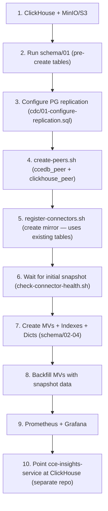

# CCE Data Pipeline — Deployment Guide

## Table of Contents

1. [Prerequisites](#1-prerequisites)
2. [Infrastructure Components](#2-infrastructure-components)
3. [Docker Compose (Development)](#3-docker-compose-development)
4. [Kubernetes (Production)](#4-kubernetes-production)
5. [Bootstrap Order](#5-bootstrap-order)
6. [PeerDB Mirror Setup](#6-peerdb-mirror-setup)
7. [Schema Deployment](#7-schema-deployment)
8. [Post-Deployment Validation](#8-post-deployment-validation)
9. [Monitoring & Observability](#9-monitoring--observability)
10. [Backfill & Replay](#10-backfill--replay)
11. [Rollback Procedures](#11-rollback-procedures)
12. [Operational Procedures](#12-operational-procedures)
13. [Troubleshooting](#13-troubleshooting)

---

## 1. Prerequisites

### Pre-deployment Checklist
- [ ] All secrets provisioned in secret store
- [ ] PostgreSQL `wal_level = logical` confirmed
- [ ] PostgreSQL `REPLICA IDENTITY FULL` set on all 11 CDC tables
- [ ] PostgreSQL replication slot created: `cce_analytics_slot`
- [ ] PostgreSQL publication created: `cce_analytics_pub`
- [ ] ClickHouse database `cce_analytics` created
- [ ] ClickHouse users `cce_pipeline` (analytics, readonly) and `cce_cdc_writer` (PeerDB write access) created with appropriate grants
- [ ] PeerDB deployed (OSS Docker or managed)
- [ ] MinIO/S3 configured for PeerDB staging
- [ ] Network connectivity verified between all services
- [ ] DNS entries configured for Grafana (and the external `cce-insights-ui`)
- [ ] Docker + Docker Compose v2 (development) or Kubernetes 1.28+ (production)

### PostgreSQL Configuration
```sql
-- Enable logical replication (requires restart)
ALTER SYSTEM SET wal_level = 'logical';
ALTER SYSTEM SET max_replication_slots = 4;
ALTER SYSTEM SET max_slot_wal_keep_size = '10GB';

-- Create CDC user with replication permissions
CREATE USER cce_cdc_user WITH REPLICATION PASSWORD '***';
GRANT SELECT ON ALL TABLES IN SCHEMA public TO cce_cdc_user;
GRANT CREATE ON DATABASE ccedb TO cce_cdc_user;  -- PeerDB needs to create publication

-- Set REPLICA IDENTITY FULL on all CDC tables (required for TOAST columns)
ALTER TABLE inbound_event_log REPLICA IDENTITY FULL;
ALTER TABLE protocol_definition REPLICA IDENTITY FULL;
ALTER TABLE protocol_instance REPLICA IDENTITY FULL;
ALTER TABLE step_instance REPLICA IDENTITY FULL;
ALTER TABLE deviation REPLICA IDENTITY FULL;
ALTER TABLE intelligence_event_log REPLICA IDENTITY FULL;
ALTER TABLE intelligence_delivery REPLICA IDENTITY FULL;
ALTER TABLE action_definition REPLICA IDENTITY FULL;
ALTER TABLE compliance_event_log REPLICA IDENTITY FULL;
ALTER TABLE receiver_adaptor REPLICA IDENTITY FULL;
ALTER TABLE destination_adaptor_mapping REPLICA IDENTITY FULL;

-- Create publication for all CDC tables
CREATE PUBLICATION cce_analytics_pub FOR TABLE
    inbound_event_log,
    protocol_definition,
    protocol_instance,
    step_instance,
    deviation,
    intelligence_event_log,
    intelligence_delivery,
    action_definition,
    compliance_event_log,
    receiver_adaptor,
    destination_adaptor_mapping;
```

### Secrets

| Secret | Purpose | Required By |
|--------|---------|-------------|
| `CLICKHOUSE_PASSWORD` | ClickHouse `cce_pipeline` user | peerdb, cce-insights-service |
| `CDC_PASSWORD` | PostgreSQL replication user | peerdb (create-peers.sh) |
| `PEERDB_PASSWORD` | PeerDB nexus auth | connector scripts |
| `MINIO_ROOT_PASSWORD` | MinIO / PeerDB S3 staging | minio, flow workers |
| `GRAFANA_PASSWORD` | Admin password | grafana |


---

## 2. Infrastructure Components

### 2.1 ClickHouse

Single-node deployment with `ReplacingMergeTree(_peerdb_version, _peerdb_is_deleted)` tables (pre-created via `schema/01-create-tables.sql` before PeerDB mirror setup).

- **Database:** `cce_analytics`
- **User:** `cce_pipeline`
- **Ports:** 8123 (HTTP), 9000 (Native), 9363 (Prometheus metrics)
- **Storage:** SSD recommended

For resource sizing (dev vs prod), see [Architecture Overview § 8.3](architecture-overview.md#83-resource-requirements).

### 2.2 PeerDB

PeerDB replicates PostgreSQL WAL to ClickHouse. The full OSS stack (pinned `stable-v0.36.26`)
runs in `docker-compose.yml`; support files are vendored under `infra/peerdb/`.

- **Services:** `catalog` (PG metadata + Temporal store), `temporal` (+ `temporal-admin-tools`, `temporal-ui`), `flow-api` (gRPC 8112 / HTTP 8113), `flow-snapshot-worker`, `flow-worker`, `peerdb` (nexus SQL), `peerdb-ui`, `minio`
- **Staging:** MinIO (mandatory — Avro stage for the ClickHouse loader). Swappable to AWS S3 via `AWS_*` env. See [§ MinIO/S3](#minio-vs-s3)
- **Interfaces:** nexus SQL **9900** (`CREATE PEER`/`CREATE MIRROR`), PeerDB UI **3000**, Temporal UI **8085**
- **Catalog port:** 9901 (PG metadata, internal)

#### MinIO vs S3

PeerDB's ClickHouse loader **requires** an S3-compatible object store: each CDC batch is
written as Avro to a bucket, then pulled into ClickHouse via `s3()`. There is no direct-insert
path — the object store is mandatory, not optional.

The stack ships **MinIO** (self-hosted, fully supported in production). The endpoint
(`http://minio:9000`) is reachable by both the flow-worker (writes) and ClickHouse (reads),
since all services share one Docker network. Set real credentials in `.env`:

```bash
MINIO_ROOT_USER=cce_minio
MINIO_ROOT_PASSWORD=<change-me>
MINIO_BUCKET=peerdbbucket
```

To use **AWS S3** instead: set `AWS_ACCESS_KEY_ID` / `AWS_SECRET_ACCESS_KEY` / `AWS_REGION`
in `.env`, point `PEERDB_CLICKHOUSE_AWS_CREDENTIALS_AWS_*` at the AWS bucket (and drop the
`...AWS_ENDPOINT_URL_S3: http://minio:9000` line in `docker-compose.yml`'s `x-peerdb-flow-env`),
and you can remove the `minio` service. No other topology changes.

> **MinIO in production:** give it a persistent volume (already wired: `minio-data`),
> non-default credentials, ideally TLS, and treat it as a stateful component (backup + monitor).

### 2.3 Presentation layer (external)

Dashboards/UI are **not** deployed by this repo. `cce-insights-service` + `cce-insights-ui`
(separate repos) connect to ClickHouse and serve the clinical views:

- **ClickHouse connection:** host `clickhouse` (in-network) or the published host, HTTP `8123`
  / native `9000`, database `cce_analytics`, user `cce_pipeline` (read-only, `final=1`)
- **AuthN/AuthZ (incl. Keycloak):** handled by `cce-insights-service`
- Reuse the queries in [`docs/query-reference/`](query-reference/)

### 2.4 Prometheus + Grafana

```yaml
scrape_configs:
  - job_name: 'clickhouse'
    static_configs:
      - targets: ['clickhouse:9363']
```

---

## 3. Docker Compose (Development)

```bash
# Start all services
docker compose up -d

# Check health
docker compose ps

# View logs
docker compose logs -f peerdb
```

**Services started:** `clickhouse`, `catalog`, `temporal`, `temporal-admin-tools`, `temporal-ui`, `flow-api`, `flow-snapshot-worker`, `flow-worker`, `peerdb` (nexus), `peerdb-ui`, `minio`, `prometheus`, `grafana`

**Volumes:** `clickhouse-data`, `prometheus-data`, `grafana-data`, `pgdata` (PeerDB catalog), `minio-data`

---

## 4. Kubernetes (Production)

### Namespace Layout
```
cce-analytics/
├── clickhouse (StatefulSet, 1 replica)
├── catalog (StatefulSet — PeerDB metadata + Temporal store)
├── temporal (+ temporal-admin-tools, temporal-ui)
├── flow-api / flow-snapshot-worker / flow-worker (Deployments)
├── peerdb (nexus, Deployment) + peerdb-ui (Deployment)
├── minio (StatefulSet, 1 replica) or external S3
├── prometheus (StatefulSet, 1 replica)
└── grafana (Deployment, 1 replica)
```

> `cce-insights-service` / `cce-insights-ui` are deployed from their own repos/charts and
> are not part of this namespace layout; they need network access to ClickHouse.

### Key K8s Resources
- **PersistentVolumeClaims:** ClickHouse data (500 GB), PeerDB catalog (`pgdata`), MinIO, Prometheus TSDB (50 GB)
- **ConfigMaps:** Prometheus config, Grafana dashboards, ClickHouse server config, PeerDB support files (`infra/peerdb/`)
- **Secrets:** All passwords, connection strings
- **Services:** ClusterIP for internal; LoadBalancer/Ingress for Grafana, PeerDB UI

---

## 5. Bootstrap Order



> **Source PostgreSQL (`ccedb`) is not part of this stack** — it is the existing CCE
> operational database. Steps 3–5 target it remotely (host/credentials from `.env`).
> In `docker-compose.yml`, the `./schema` directory is mounted into ClickHouse's
> `docker-entrypoint-initdb.d`, so schema/01–04 run automatically on first boot; the
> manual schema steps below are for production or re-runs.

---

## 6. PeerDB Mirror Setup

Peers and the mirror are managed through PeerDB's **nexus SQL interface** on **port 9900**
(`CREATE PEER` / `CREATE MIRROR`, applied with `psql`). The repo scripts wrap this and read
all connection details from `.env`. They are **not** run automatically by `docker compose up` —
run them after the stack is healthy.

```bash
set -a; source .env; set +a   # PG_*/CDC_*, CH_*, PEERDB_PASSWORD, etc.
```

### Step A — Create Peers

`create-peers.sh` registers `ccedb_peer` (PostgreSQL source) and `clickhouse_peer`
(ClickHouse destination) via the nexus:

```bash
./scripts/create-peers.sh
```

> The ClickHouse peer uses the **native** port (9000), not the HTTP port (8123). S3/MinIO
> staging creds come from the flow services' env, not the peer definition.

### Step B — Create Mirror

`register-connectors.sh` applies `connectors/peerdb-mirror.sql` (the `CREATE MIRROR`
statement) to the nexus:

```bash
./scripts/register-connectors.sh
```

This creates `cce_analytics_mirror` with `do_initial_snapshot=true`, `soft_delete=true`,
publication `cce_analytics_pub`, and slot `cce_analytics_slot`.

### Verify Mirror Running & Monitor Snapshot

```bash
./scripts/check-connector-health.sh          # container health + nexus/flow-api probes + mirror presence
```

Per-table lag and rows-synced are best viewed in the **PeerDB UI** (http://localhost:3000)
or **Temporal UI** (http://localhost:8085).

---

## 7. Schema Deployment

### Step 1 — Pre-create tables (BEFORE starting PeerDB mirror)

Tables must exist before PeerDB begins replication. PeerDB uses existing tables and does not recreate them.

```bash
CH_HOST=${CH_HOST:-localhost}
CH_USER=${CH_USER:-cce_pipeline}
CH_PASS=${CLICKHOUSE_PASSWORD:-cce_analytics_dev}

# Creates all 11 base tables with ReplacingMergeTree(_peerdb_version, _peerdb_is_deleted)
# Requires ClickHouse 23.2+ (clean_deleted_rows = 'Always')
clickhouse-client --host "$CH_HOST" --user "$CH_USER" --password "$CH_PASS" \
  --multiquery < schema/01-create-tables.sql
```

### Step 2 — Create peers, start the mirror, and wait for snapshot

See [§6 PeerDB Mirror Setup](#6-peerdb-mirror-setup) for details.

```bash
set -a; source .env; set +a
./scripts/create-peers.sh            # ccedb_peer + clickhouse_peer (nexus SQL @ :9900)
./scripts/register-connectors.sh     # cce_analytics_mirror (initial snapshot)
./scripts/check-connector-health.sh  # container health + mirror presence
```

### Step 3 — Create MVs, indexes, and dictionaries (AFTER snapshot completes)

```bash
# All scripts are idempotent
clickhouse-client --host "$CH_HOST" --user "$CH_USER" --password "$CH_PASS" \
  --database cce_analytics --multiquery < schema/02-create-materialized-views.sql

clickhouse-client --host "$CH_HOST" --user "$CH_USER" --password "$CH_PASS" \
  --database cce_analytics --multiquery < schema/03-create-indexes-projections.sql

clickhouse-client --host "$CH_HOST" --user "$CH_USER" --password "$CH_PASS" \
  --database cce_analytics --multiquery < schema/04-create-dictionary.sql
```

### Validate Schema
```bash
./scripts/validate-clickhouse.sh
```

---

## 9. Post-Deployment Validation

### Automated
```bash
./scripts/validate-clickhouse.sh
./scripts/data-quality-checks.sh
./tests/e2e/run-e2e-tests.sh
```

### Manual Checks

| Check | Command | Expected |
|-------|---------|----------|
| ClickHouse alive | `curl -s http://localhost:8123/ping` | `Ok.` |
| Tables exist | `clickhouse-client -q "SELECT count() FROM system.tables WHERE database='cce_analytics'"` | `>= 11` |
| MVs exist | `clickhouse-client -q "SELECT count() FROM system.tables WHERE database='cce_analytics' AND engine LIKE '%View%'"` | `>= 14` |
| Data flowing | `clickhouse-client -q "SELECT name, total_rows FROM system.tables WHERE database='cce_analytics' AND total_rows > 0"` | Tables with rows |
| PeerDB stack + mirror | `./scripts/check-connector-health.sh` | `STACK HEALTHY` |
| PeerDB nexus | `PGPASSWORD=$PEERDB_PASSWORD psql "host=localhost port=9900 user=peerdb dbname=peerdb" -c 'SELECT name FROM peers'` | lists `ccedb_peer`, `clickhouse_peer` |
| PeerDB UI | `curl -s http://localhost:3000/api/health` (or browse) | reachable |
| MinIO | `curl -s http://localhost:9001/minio/health/live` | `200` |
| Grafana | `curl -s http://localhost:3001/api/health` | `{"database":"ok"}` |

---

## 10. Monitoring & Observability

### Prometheus Metrics

| Metric | Source | Alert Threshold |
|--------|--------|-----------------|
| `clickhouse_insert_rows` | ClickHouse | Rate drop > 50% |
| `clickhouse_merge_tree_parts_count` | ClickHouse | `> 300` per table |
| `clickhouse_query_duration_ms` | ClickHouse | p99 > 5000ms |
| `pg_replication_slots_active` | PostgreSQL | `= 0` (slot inactive) |
| `pg_wal_lsn_diff_bytes` | PostgreSQL | `> 1 GB` |

### PostgreSQL WAL / Replication Slot Monitoring

PeerDB uses a logical replication slot (`cce_analytics_slot`) in PostgreSQL. If the slot becomes inactive or WAL accumulates beyond safe limits, CDC will stall and disk may fill.

**Key queries:**

```sql
-- Check slot is active
SELECT slot_name, active, restart_lsn, confirmed_flush_lsn
FROM pg_replication_slots WHERE slot_name = 'cce_analytics_slot';

-- WAL lag in bytes
SELECT pg_wal_lsn_diff(pg_current_wal_lsn(), confirmed_flush_lsn) AS lag_bytes
FROM pg_replication_slots WHERE slot_name = 'cce_analytics_slot';
```

**Required PostgreSQL setting:**

```
max_slot_wal_keep_size = 10GB   -- prevents unbounded WAL growth if PeerDB is down
```

> **Recovery**: If the slot is inactive and WAL exceeds the limit, PostgreSQL will invalidate the slot. PeerDB will fail to resume and requires a full re-snapshot via mirror resync. Monitor the `pg_wal_lsn_diff_bytes` metric and alert at 1 GB.

### Alerts

Configured in `infra/grafana/provisioning/alerting/alerts.yaml`:

| Alert | Condition | Severity |
|-------|-----------|----------|
| PeerDB Mirror Stalled | No new rows synced for 5min | Critical |
| CDC Source Slot Inactive | `pg_replication_slots.active = false` for 1min | Critical |
| WAL Lag Excessive | `pg_wal_lsn_diff > 1 GB` for 5min | Warning |
| ClickHouse Insert Stall | Zero inserts for 5min | Warning |
| ClickHouse Disk Usage | > 80% | Warning |

### Alerting Contacts

Configure in Grafana → Alerting → Contact Points:
- **Slack**: `#cce-pipeline-alerts` channel webhook
- **PagerDuty**: Critical alerts (mirror stalled, disk full)
- **Email**: `cce-ops@organization.com`

---

## 10. Backfill & Replay

### Full Re-snapshot

If ClickHouse data is lost or needs full refresh, use the re-snapshot helper — it drops
and recreates the mirror via the nexus SQL interface (`DROP MIRROR` → `register-connectors.sh`)
and truncates the MV backing tables first to avoid double-counting:

```bash
set -a; source .env; set +a
./scripts/replay-dlq.sh
```

The script drops `cce_analytics_mirror`, truncates the `mv_*` backing tables, then recreates
the mirror with `do_initial_snapshot=true`. Base tables (schema/01) stay in place — see
[Recreating / Backfilling an MV Safely](#recreating--backfilling-an-mv-safely).

### Partial Table Resync

PeerDB supports resyncing individual tables without dropping the entire mirror via the
PeerDB UI (http://localhost:3000 → Mirrors → cce_analytics_mirror → Resync Table → select table).

---

## 11. Rollback Procedures

### PeerDB Mirror Rollback
```bash
set -a; source .env; set +a

# Drop the mirror (via the nexus SQL interface), then recreate from the committed config
PGPASSWORD="$PEERDB_PASSWORD" psql "host=localhost port=9900 user=peerdb dbname=peerdb" \
  -c "DROP MIRROR IF EXISTS cce_analytics_mirror;"
./scripts/register-connectors.sh
```

> Pause/resume of a running mirror is available in the PeerDB UI (http://localhost:3000).

### ClickHouse Schema Rollback
```bash
# Non-destructive: ALTER TABLE for column additions
# Destructive: Restore from backup
clickhouse-client --host $CH_HOST --query \
  "RESTORE DATABASE cce_analytics FROM Disk('backups', 'latest/')"
```

### Full Rollback
```bash
docker compose down
git checkout LAST_GOOD_TAG
docker compose up -d
```

---

## 14. Operational Procedures

### ClickHouse Maintenance
```bash
# Check table sizes
clickhouse-client --query "
  SELECT table, formatReadableSize(sum(bytes_on_disk)) as size, sum(rows) as rows
  FROM system.parts
  WHERE database = 'cce_analytics' AND active
  GROUP BY table ORDER BY sum(bytes_on_disk) DESC"

# Optimize tables (merge parts)
clickhouse-client --query "OPTIMIZE TABLE cce_analytics.inbound_event_logs FINAL"

# Check merge health
clickhouse-client --query "
  SELECT table, count() as parts
  FROM system.parts WHERE database='cce_analytics' AND active
  GROUP BY table HAVING parts > 100 ORDER BY parts DESC"
```

### PeerDB Mirror Management
```bash
# Pause mirror (via PeerDB UI or SQL)
# UI: Mirrors → cce_analytics_mirror → Pause

# Resume mirror
# UI: Mirrors → cce_analytics_mirror → Resume

# Restart PeerDB server
docker compose restart peerdb
```

### Materialized View Backfill

When a new MV is created, it only captures data inserted **after** creation. To populate with historical data:

```bash
# 1. Identify the target MV and its source table
clickhouse-client --query "SHOW CREATE TABLE cce_analytics.mv_deviation_trends"

# 2. Insert historical data using the MV's SELECT query against the source table
clickhouse-client --query "
  INSERT INTO cce_analytics.mv_deviation_trends
  SELECT
      toStartOfDay(detected_at) AS day,
      deviation_type,
      count() AS deviation_count
  FROM cce_analytics.deviations
  GROUP BY day, deviation_type"
```

**General pattern:**
```sql
-- INSERT INTO <mv_target_table> SELECT <mv_select_query> FROM <source_table>
-- Copy the SELECT from the MV definition and run as an INSERT INTO the MV's target table
INSERT INTO cce_analytics.<mv_target_table>
SELECT <columns_from_mv_definition>
FROM cce_analytics.<source_table>
WHERE <source_conditions>;
```

> **Note**: For `AggregatingMergeTree` MVs using `-State` functions, the backfill SELECT must use the same `-State` aggregate functions (e.g., `countState()`, `uniqState()`) — not their plain counterparts.

### Recreating / Backfilling an MV Safely

Each MV is **two objects** (see `schema/02-create-materialized-views.sql`):

| Object | Example | Role |
|--------|---------|------|
| Backing table | `mv_event_volume_hourly` | Stores the aggregated data; queried by dashboards |
| Trigger view (`_mv` suffix) | `mv_event_volume_hourly_mv` | Fires on INSERT, writes into the backing table via `TO` |

Because the trigger uses `TO <backing_table>` (not an implicit `.inner_id.<uuid>` table), the two can be managed independently.

**Fix a trigger's SELECT logic without losing data:**

```sql
-- Drops ONLY the trigger. The backing table and all accumulated aggregates survive.
DROP VIEW cce_analytics.mv_event_volume_hourly_mv;

-- Recreate with the corrected SELECT. New inserts resume flowing into the existing backing table.
CREATE MATERIALIZED VIEW cce_analytics.mv_event_volume_hourly_mv
TO cce_analytics.mv_event_volume_hourly
AS SELECT ... ;
```

> With the old implicit-inner-table pattern, `DROP VIEW` would have destroyed the inner table and all its data. The `TO` pattern makes trigger logic safely replaceable.

**⚠️ The backfill double-count race**

An MV trigger captures rows inserted **after** it is created. A backfill `INSERT INTO <backing_table> SELECT ... FROM <base_table>` reads **everything currently in the base table**. If CDC is actively inserting while you backfill, rows that arrived *after* trigger creation are counted **twice** — once by the live trigger, once by the backfill. With `SummingMergeTree`/`AggregatingMergeTree` this inflation is silent.

Safe procedures (pick one):

| Approach | Steps | Tradeoff |
|----------|-------|----------|
| **MV-before-data** | Create the trigger *before* the base table receives rows (run schema/02 between schema/01 and the PeerDB mirror). Snapshot INSERTs populate the MV automatically — no backfill. | MV overhead (incl. `mv_deviation_by_patient` FINAL join) during the bulk snapshot load |
| **Quiet-window backfill** | 1. Pause the PeerDB mirror (UI → Pause). 2. `TRUNCATE TABLE <backing_table>` if re-backfilling. 3. Run the backfill `INSERT`. 4. Resume the mirror. | Brief CDC lag while paused |

> When re-backfilling an existing backing table, `TRUNCATE TABLE cce_analytics.<backing_table>` first — otherwise the backfill adds to the data already accumulated by the live trigger, compounding the double-count.

### Scaling Guidance

| Component | Scaling Strategy |
|-----------|-----------------|
| ClickHouse | Add replicas (ReplicatedMergeTree), shard for > 1TB/day |
| PeerDB | Increase `snapshot_max_parallel_workers`; scale `flow-worker`; dedicated catalog |
| MinIO | Scale to distributed MinIO or switch to S3 for high snapshot throughput |

---

## 13. Troubleshooting

### PeerDB Mirror Not Starting
```bash
# Check mirror status + lag
./scripts/check-connector-health.sh

# Check PeerDB logs
docker compose logs peerdb | grep -i error

# Common fixes:
# - Peers missing: re-run ./scripts/create-peers.sh (ccedb_peer / clickhouse_peer)
# - PostgreSQL: verify wal_level=logical, replication slot exists, REPLICA IDENTITY FULL
#   (./scripts/validate-cdc-config.sh <pg-host> <pg-port> <pg-user> ccedb)
# - ClickHouse: verify database/user exists, native port 9000 reachable from PeerDB
```

### Data Not Appearing in ClickHouse
```bash
# Check mirror sync stats (rows synced, lag)
./scripts/check-connector-health.sh

# Check ClickHouse insert errors
clickhouse-client -q "SELECT * FROM system.query_log WHERE type='ExceptionWhileProcessing' ORDER BY event_time DESC LIMIT 5"

# Verify table has data
clickhouse-client -q "SELECT count() FROM cce_analytics.inbound_event_logs"
```

### Materialized Views Not Populating
```bash
# MVs trigger on INSERT to source table — check source table has data
clickhouse-client -q "SELECT count() FROM cce_analytics.inbound_event_logs"

# Check MV target table
clickhouse-client -q "SELECT count() FROM cce_analytics.mv_event_volume_hourly"

# If source has data but MV doesn't, the MV may have been created AFTER data was inserted
# Solution: recreate MV or backfill manually
```

### High ClickHouse Merge Pressure
```bash
# Check parts count
clickhouse-client -q "
  SELECT table, count() as parts, sum(rows) as total_rows
  FROM system.parts WHERE database='cce_analytics' AND active
  GROUP BY table ORDER BY parts DESC"

# Force optimize if needed
clickhouse-client -q "OPTIMIZE TABLE cce_analytics.inbound_event_logs FINAL"
```
