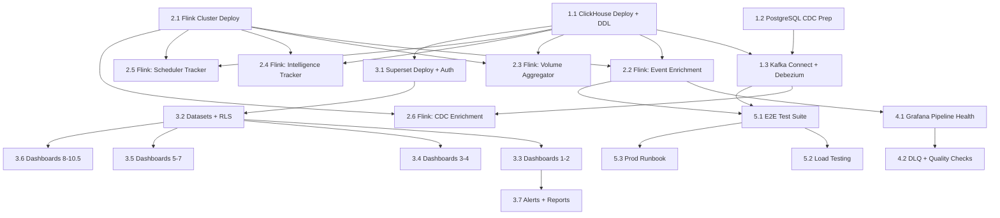

# CCE Data Pipeline — Implementation Subtasks

Each task below produces a discrete, reviewable PR. Tasks are ordered by dependency — later tasks build on earlier ones.

---

## Phase 1: Foundation (Infrastructure & Schema)

### Task 1.1 — ClickHouse Deployment & DDL

**PR scope:** Infrastructure manifests + complete schema scripts

**Deliverables:**
- K8s StatefulSet manifest for ClickHouse (or Docker Compose service for dev)
- `schema/01-create-tables.sql` — all fact + dimension tables:
  - `events_fact`, `event_volume_hourly`, `intelligence_events`, `step_transitions`
  - `protocol_instances`, `step_instances`, `deviations`, `inbound_events`
  - `intelligence_deliveries`, `intelligence_event_logs`, `action_definitions`
  - `protocol_definitions`, `receiver_adaptors`, `destination_adaptor_mappings`
- `schema/02-create-materialized-views.sql` — all MVs:
  - `mv_event_volume_daily`, `mv_compliance_summary`, `mv_deviation_trends`
  - `mv_ingestion_quality`, `mv_deviation_by_facility`, `mv_intelligence_summary`
  - `mv_delivery_performance_hourly`, `mv_scheduler_transitions_daily`
- `schema/03-create-indexes-projections.sql` — secondary indexes + projections:
  - bloom_filter indexes on `events_fact`, `intelligence_events`, `step_transitions`
  - Projections: `prj_patient_timeline`, `prj_protocol_lookup`, `prj_protocol_deviations`
- `schema/04-create-dictionary.sql` — `dict_protocol_definitions`
- ClickHouse server config (`config.d/custom.xml`)
- Health check validation script

**Reviewable output:** Reviewer can `docker compose up clickhouse`, run DDL scripts, and verify tables exist via `clickhouse-client`.

**Depends on:** Nothing (first task)

---

### Task 1.2 — PostgreSQL CDC Preparation

**PR scope:** Source database configuration for CDC

**Deliverables:**
- SQL script: `cdc/01-configure-replication.sql`
  - `ALTER SYSTEM SET wal_level = 'logical'`
  - Create `cce_cdc_user` role (SELECT + REPLICATION)
  - Create publication `cce_analytics_pub` for all 10 tables
- Documentation on required PostgreSQL restart for `wal_level` change
- Validation script to confirm replication is active

**Reviewable output:** Reviewer can run SQL against a test PostgreSQL instance and verify `SELECT * FROM pg_publication_tables` returns 10 tables.

**Depends on:** Nothing (can parallel with 1.1)

---

### Task 1.3 — Kafka Connect & Debezium Deployment

**PR scope:** Kafka Connect cluster + Debezium connector configuration

**Deliverables:**
- K8s Deployment manifest for Kafka Connect (2 replicas)
- Custom Docker image (`Dockerfile.kafka-connect`):
  - Base: `confluentinc/cp-kafka-connect:7.6.0`
  - Plugins: `debezium-connector-postgresql:2.6.1`, `clickhouse-kafka-connect:0.14.0`
- Connector registration JSON files:
  - `connectors/cce-cdc-source.json` (Debezium PostgreSQL source — all 10 tables)
  - `connectors/cce-clickhouse-sink.json` (ClickHouse sink — all CDC topics)
- Registration script (`scripts/register-connectors.sh`)
- Connector status health check script

**Reviewable output:** Reviewer can deploy Connect, register connectors, and verify initial snapshot populates ClickHouse dimension tables.

**Depends on:** Task 1.1, Task 1.2

---

## Phase 2: Stream Processing (Flink Jobs)

### Task 2.1 — Flink Cluster Deployment

**PR scope:** Flink infrastructure (no jobs yet)

**Deliverables:**
- Flink Kubernetes Operator CRD (`FlinkDeployment`) or StatefulSet manifests
- `Dockerfile.flink` (base: `flink:1.19.1-java21`, adds connector JARs)
- Flink base Docker image with required connectors:
  - `flink-connector-kafka`, `flink-connector-jdbc`, `clickhouse-jdbc`
- Gradle multi-module project skeleton (`flink-jobs/settings.gradle.kts`, shared `build.gradle.kts`)
- Shadow plugin configuration for fat JAR builds
- Flink configuration (checkpointing, RocksDB state backend, restart strategy)
- Flink UI Ingress/Service for job monitoring
- `docker-compose.yml` additions for local dev (JobManager + TaskManager)

**Reviewable output:** Reviewer can access Flink UI at `:8081`, see cluster healthy with 0 running jobs.

**Depends on:** Nothing (can parallel with Phase 1)

---

### Task 2.2 — Flink Job: Event Enrichment

**PR scope:** First Flink job — CloudEvents → `events_fact`

**Deliverables:**
- Gradle module `flink-jobs/event-enrichment/` with `build.gradle.kts`
- Flink DataStream job source code (Java 21):
  - Kafka source: `cce.events.inbound` (CloudEvents JSON)
  - Field extraction: id, source, type, subject, time, facilityid, correlationid
  - FHIR data extraction: resourceType, status, code, practitioner (COALESCE logic)
  - ClickHouse JDBC sink: `events_fact`
- Validation logic (null patient_id → DLQ, future timestamps → DLQ)
- Unit tests for field extraction and practitioner COALESCE logic
- Job submission script
- Integration test: produce sample CloudEvents → verify `events_fact` rows

**Reviewable output:** Reviewer can submit job, produce test events to Kafka, query `events_fact` in ClickHouse, verify correct field mapping.

**Depends on:** Task 1.1, Task 2.1

---

### Task 2.3 — Flink Job: Event Volume Aggregator

**PR scope:** Tumbling window aggregation job

**Deliverables:**
- Gradle module `flink-jobs/event-volume-aggregator/`
- Flink DataStream job:
  - Kafka source: `cce.events.inbound`
  - 1-hour tumbling window keyed by `(facility_id, source, resource_type)`
  - ClickHouse sink: `event_volume_hourly` (SummingMergeTree)
- Watermark strategy (5-minute allowed lateness)
- Unit tests for windowing logic
- Integration test: produce events across hours → verify aggregated counts

**Reviewable output:** Reviewer can verify hourly aggregation after producing events spanning multiple hours.

**Depends on:** Task 1.1, Task 2.1

---

### Task 2.4 — Flink Job: Intelligence Tracker

**PR scope:** Intelligence triggers → `intelligence_events`

**Deliverables:**
- Gradle module `flink-jobs/intelligence-tracker/`
- Flink job source code:
  - Kafka source: `cce.intelligence.triggers`
  - Field mapping: id, subject, intelligenceEventId, actionType, severity, destination, stepState, protocolCanonical, detectedAt
  - ClickHouse sink: `intelligence_events`
- Unit tests for field mapping
- Integration test: produce sample trigger → verify ClickHouse row

**Reviewable output:** Reviewer can produce an intelligence trigger event, query `intelligence_events`, verify all fields mapped correctly.

**Depends on:** Task 1.1, Task 2.1

---

### Task 2.5 — Flink Job: Scheduler Tracker

**PR scope:** Scheduler transitions → `step_transitions`

**Deliverables:**
- Gradle module `flink-jobs/scheduler-tracker/`
- Flink job source code:
  - Kafka source: `cce.scheduler.triggers`
  - Field mapping: stepInstanceId, transitionType, triggeredAt, correlationId
  - Timestamp conversion (epoch seconds → DateTime64)
  - ClickHouse sink: `step_transitions`
- Unit tests
- Integration test: produce scheduler trigger → verify ClickHouse row

**Reviewable output:** Reviewer can produce a scheduler trigger, query `step_transitions`, verify correct parsing.

**Depends on:** Task 1.1, Task 2.1

---

### Task 2.6 — Flink CDC Enrichment Job (Intelligence Deliveries)

**PR scope:** CDC enrichment for denormalized delivery table

**Deliverables:**
- Gradle module `flink-jobs/cdc-enrichment/`
- Flink job that joins CDC streams:
  - `intelligence_delivery` CDC events
  - Enriches with `destination_adaptor_mapping` → `receiver_adaptor` (name, endpoint_url)
  - Extracts `http_status_code`, `error_message` from `delivery_result` JSONB
  - Computes `latency_ms` = `dateDiff('millisecond', created_at, delivered_at)`
  - Sinks to ClickHouse `intelligence_deliveries`
- Lookup/join strategy (broadcast state or async lookup)
- Unit tests for JSONB extraction and latency computation
- Integration test

**Reviewable output:** Reviewer can trigger a delivery via CDC, verify `intelligence_deliveries` has enriched fields (adaptor_name, latency_ms, etc).

**Depends on:** Task 1.1, Task 1.3, Task 2.1

---

## Phase 3: Visualization (Superset)

### Task 3.1 — Superset Deployment & Auth

**PR scope:** Superset infrastructure + Keycloak OAuth2 integration

**Deliverables:**
- Helm values file (`superset-values.yaml`)
- OAuth2/OIDC configuration for Keycloak
- ClickHouse database connection config (`clickhousedb://...`)
- Init container: install `clickhouse-connect` driver
- Redis deployment for caching
- Superset metadata PostgreSQL
- Role mapping (Keycloak roles → Superset roles)
- `docker-compose.yml` additions for local dev

**Reviewable output:** Reviewer can log in via Keycloak, access SQL Lab, run a query against ClickHouse.

**Depends on:** Task 1.1 (ClickHouse must have data)

---

### Task 3.2 — Superset Datasets & Row-Level Security

**PR scope:** Register all ClickHouse tables as Superset datasets + RLS rules

**Deliverables:**
- Dataset registration script or importable JSON:
  - All 14 base tables + 8 materialized views as datasets
  - Column descriptions and metric definitions
- Row-level security rules (facility_id filtering)
- Role assignments (Gamma + RLS for clinical managers)
- Validation: verify RLS filters queries correctly

**Reviewable output:** Reviewer can see all datasets in Superset, verify that a Gamma user only sees their facility's data.

**Depends on:** Task 3.1

---

### Task 3.3 — Dashboards: Operations Overview + Compliance

**PR scope:** Dashboards 1 & 2 (highest priority for clinical managers)

**Deliverables:**
- Exportable Superset dashboard JSON for:
  - **Dashboard 1: Operations Overview** — KPI cards, event volume line chart, compliance donut, facility deviation bar, recent deviations table
  - **Dashboard 2: Compliance Monitoring** — enrollment KPIs, compliance by protocol stacked bar, adherence trend line, facility×protocol heatmap, instance details table
- All referenced charts and SQL queries
- Cross-filter configuration
- Import script (`superset import-dashboards`)

**Reviewable output:** Reviewer can import dashboards, see populated charts with real or seeded data, interact with filters.

**Depends on:** Task 3.2, Task 2.2 (events data), Task 1.3 (CDC data)

---

### Task 3.4 — Dashboards: Deviation Analytics + Event Volume

**PR scope:** Dashboards 3 & 4

**Deliverables:**
- Exportable Superset dashboard JSON for:
  - **Dashboard 3: Deviation Analytics** — deviation trends area chart, resolution rate, deviation by step, by facility, days-to-resolution box plot, details table
  - **Dashboard 4: Event Volume & Ingestion** — volume trend, resource type treemap, ingestion funnel, source quality scorecard, source comparison
- All charts and queries

**Reviewable output:** Reviewer can import and interact with deviation and ingestion dashboards.

**Depends on:** Task 3.2

---

### Task 3.5 — Dashboards: Facility + Patient Risk + Protocol

**PR scope:** Dashboards 5, 6, 7

**Deliverables:**
- Exportable Superset dashboard JSON for:
  - **Dashboard 5: Facility Performance** — facility ranking bar, scatter plot, radar chart, details table
  - **Dashboard 6: Patient Risk** — risk distribution, facility hotspots bubble chart, repeat deviators table
  - **Dashboard 7: Protocol Analytics** — completion funnel, step state grouped bar, timeliness distribution, enrollment trends
- All charts and queries

**Reviewable output:** Reviewer can import and verify facility ranking, patient risk stratification, and protocol funnel views.

**Depends on:** Task 3.2

---

### Task 3.6 — Dashboards: Adaptor Performance + Intelligence + Practitioner + Scheduler

**PR scope:** Dashboards 8, 9, 10, 10.5

**Deliverables:**
- Exportable Superset dashboard JSON for:
  - **Dashboard 8: Receiver-Adaptor Performance** — success rate trend, outcome stacked bar, adaptor×destination heatmap, P95 latency, error table, retry analysis
  - **Dashboard 9: Intelligence & Triggers** — trigger volume by severity, action type donut, destination bar, severity×state heatmap, recent triggers table
  - **Dashboard 10: Practitioner Activity** — top 20 bar, treemap, scatter plot, scorecard table
  - **Dashboard 10.5: Scheduler Timeliness** — transition volume trend, escalation rate, avg time between transitions
- All charts and queries

**Reviewable output:** Reviewer can import and verify adaptor performance SLAs, intelligence distribution, practitioner workload, and scheduler escalation rates.

**Depends on:** Task 3.2, Task 2.4, Task 2.5, Task 2.6

---

### Task 3.7 — Superset Alerts & Scheduled Reports

**PR scope:** Alert rules + automated report delivery

**Deliverables:**
- Alert rule configurations:
  - High Deviation Rate (> 50/hour)
  - Source Quality Drop (< 70% acceptance)
  - Zero Events (30-minute gap)
  - Adaptor Failure Spike (< 80% success)
  - Adaptor Down (zero deliveries in 30 min)
- Scheduled report configurations:
  - Weekly Compliance Summary (Monday 8 AM → clinical managers, PDF)
  - Daily Deviation Alert (7 AM → supervisors, email)
  - Monthly Facility Ranking (1st of month → district officers, CSV+PDF)
  - Weekly Ingestion Quality (Friday 5 PM → integration team)
- Email/Slack notification channel setup

**Reviewable output:** Reviewer can see configured alerts in Superset UI, trigger a test alert, receive a test scheduled report.

**Depends on:** Task 3.3 (dashboards must exist first)

---

## Phase 4: Monitoring & Observability

### Task 4.1 — Grafana Pipeline Health Dashboard (Dashboard 11)

**PR scope:** Grafana deployment + pipeline monitoring dashboard

**Deliverables:**
- Grafana Helm values or K8s manifests
- Prometheus scrape configs (ClickHouse, Flink, Kafka Connect)
- Grafana dashboard JSON:
  - Kafka consumer lag by topic
  - Flink checkpoint duration + throughput
  - Flink backpressure gauge
  - ClickHouse queries in flight + merge operations
  - End-to-end latency (P50/P95/P99)
  - CDC replication slot lag
  - Kafka Connect connector status panel
  - ClickHouse disk usage
- Alert rules (Flink job down, consumer lag high, E2E latency high, disk full, CDC lag)
- ClickHouse datasource configuration in Grafana
- PostgreSQL datasource for replication slot monitoring

**Reviewable output:** Reviewer can access Grafana, see all panels populated with real metrics, verify alerts fire on threshold breach.

**Depends on:** Task 2.2+ (Flink jobs must be running to emit metrics)

---

### Task 4.2 — DLQ Monitoring & Data Quality Checks

**PR scope:** Dead letter queue alerting + data quality validation

**Deliverables:**
- Prometheus alert rule for DLQ messages (`kafka_consumer_group_lag{topic=~".*\\.dlq"} > 0`)
- Grafana panel: DLQ message count by topic
- Scheduled ClickHouse queries (via Grafana or cron):
  - Cross-source consistency check (CDC count vs Kafka stream count)
  - Missing field detection (patient_id, facility_id, resource_type)
  - Late event detection (processed_at - event_time > 5min)
- DLQ reprocessing script (`scripts/replay-dlq.sh`)
- Runbook documentation for DLQ handling

**Reviewable output:** Reviewer can produce a malformed event, verify it lands in DLQ, verify alert fires, run replay script.

**Depends on:** Task 4.1, Task 2.2

---

## Phase 5: Validation & Cutover

### Task 5.1 — End-to-End Integration Test Suite

**PR scope:** Automated test suite that validates the full pipeline

**Deliverables:**
- Test harness script (`tests/e2e/run-e2e-tests.sh`):
  - Produce N sample CloudEvents to `cce.events.inbound`
  - Produce sample intelligence triggers to `cce.intelligence.triggers`
  - Produce sample scheduler triggers to `cce.scheduler.triggers`
  - Insert test rows in PostgreSQL (protocol_instance, step_instance, deviation)
  - Wait for propagation (configurable timeout)
  - Assert: `events_fact` has N rows with correct fields
  - Assert: `intelligence_events` has expected rows
  - Assert: `step_transitions` has expected rows
  - Assert: CDC tables populated in ClickHouse (protocol_instances, step_instances, etc.)
  - Assert: Materialized views have aggregated data
  - Assert: End-to-end latency < 60 seconds
- Sample data generators
- CI pipeline config (GitHub Actions / GitLab CI)
- Test cleanup script

**Reviewable output:** Reviewer can run the test suite against a dev environment and see all assertions pass.

**Depends on:** All Phase 1–3 tasks

---

### Task 5.2 — Performance Validation & Load Test

**PR scope:** Load testing to verify 600k events/day capacity

**Deliverables:**
- Load test script (`tests/load/generate-load.sh`):
  - Sustained: 7 events/second for 10 minutes
  - Burst: 50 events/second for 10 minutes
  - Verify no consumer lag accumulation
  - Verify ClickHouse query latency stays < 500ms for pre-aggregated, < 2s for ad-hoc
- ClickHouse query benchmark script (runs all dashboard queries, reports P50/P95/P99)
- Results summary template
- Capacity headroom analysis

**Reviewable output:** Reviewer can see load test results showing the pipeline handles required throughput without degradation.

**Depends on:** Task 5.1

---

### Task 5.3 — Production Deployment Runbook

**PR scope:** Production-ready deployment documentation + scripts

**Deliverables:**
- Step-by-step production deployment checklist
- Environment-specific value files (dev, staging, prod)
- Secret management setup (Kubernetes Secrets or Vault)
- Backup configuration:
  - ClickHouse daily backup cron job
  - Superset dashboard export cron
- Rollback procedures for each component
- On-call runbook:
  - Flink job failure recovery
  - CDC replication slot recovery
  - ClickHouse disk space emergency
  - Superset outage

**Reviewable output:** Reviewer can follow the runbook to deploy in a fresh environment.

**Depends on:** Task 5.1

---

## Dependency Graph

---

## Summary

| Phase | Tasks | PRs | Parallel Tracks |
|-------|-------|-----|-----------------|
| 1. Foundation | 1.1, 1.2, 1.3 | 3 | 1.1 ‖ 1.2 ‖ 2.1 |
| 2. Stream Processing | 2.1–2.6 | 6 | 2.2 ‖ 2.3 ‖ 2.4 ‖ 2.5 (after 2.1) |
| 3. Visualization | 3.1–3.7 | 7 | 3.3 ‖ 3.4 ‖ 3.5 ‖ 3.6 (after 3.2) |
| 4. Monitoring | 4.1, 4.2 | 2 | Sequential |
| 5. Validation | 5.1–5.3 | 3 | 5.2 ‖ 5.3 (after 5.1) |
| **Total** | **21 tasks** | **21 PRs** | |

**Critical path:** 1.1 → 2.1 → 2.2 → 3.1 → 3.2 → 3.3 → 5.1 → 5.2
