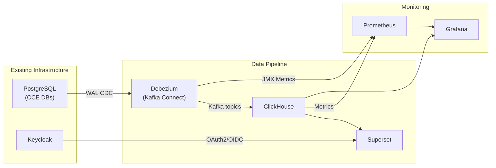
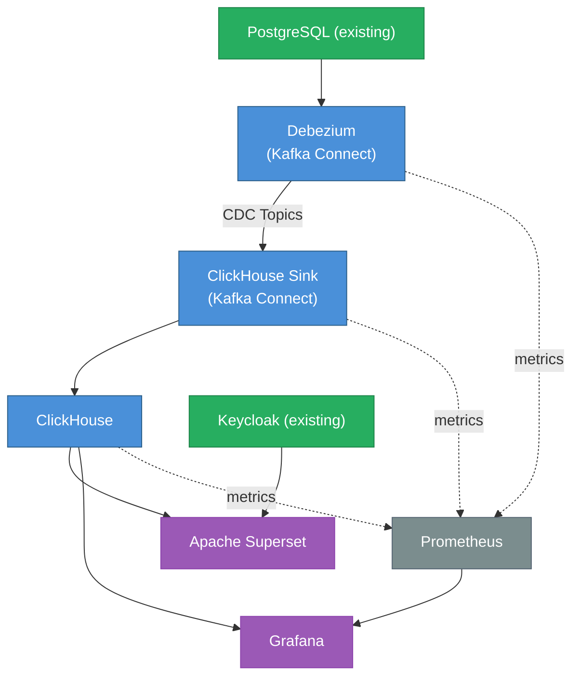

# CCE Data Pipeline — Technology Stack

## 1. Stack Summary

| Layer | Technology | Version | License | Purpose |
|-------|-----------|---------|---------|---------|
| Change Data Capture | Debezium (PostgreSQL) | 2.6.1 | Apache 2.0 | WAL-based CDC from PostgreSQL |
| CDC Transport | Kafka Connect | 3.7+ | Apache 2.0 | Connector runtime for Debezium + ClickHouse sink |
| CDC Sink | ClickHouse Kafka Connect | 0.14.0 | Apache 2.0 | Write CDC records to ClickHouse |
| Analytics Database | ClickHouse | 24.8 LTS | Apache 2.0 | Columnar OLAP with MATERIALIZED columns + MVs |
| Visualization | Apache Superset | 4.0.2 | Apache 2.0 | Interactive dashboards & scheduled reports |
| Operational Monitoring | Grafana | 11.x | AGPL 3.0 | Infrastructure & pipeline health monitoring |
| Metrics | Prometheus | 2.53 | Apache 2.0 | Metrics collection from services |
| Caching | Redis | 7.x | BSD | Superset result caching |

> **No stream processing layer.** ClickHouse MATERIALIZED columns handle field extraction at insert time. Materialized Views pre-aggregate. Zero custom application code.

---

## 2. Component Deep Dive

### 2.1 Debezium + Kafka Connect (CDC)

**Purpose:** Capture committed changes from PostgreSQL WAL and deliver to ClickHouse.

**Why Debezium over alternatives:**
- Log-based CDC (WAL) — zero impact on source database query performance
- Captures deletes and updates (not just inserts)
- Sub-second latency from commit to delivery
- Exactly-once semantics with PostgreSQL logical replication
- Mature, battle-tested (Red Hat maintained)

**Connector Configuration:**

| Connector | Type | Plugin |
|-----------|------|--------|
| `cce-cdc-source` | Source | `io.debezium.connector.postgresql.PostgresConnector` |
| `cce-clickhouse-sink` | Sink | `com.clickhouse.kafka.connect.ClickHouseSinkConnector` |

**Source tables captured (11 total from shared `ccedb` database):**

| Table Owner | Source Table | CDC Topic |
|-------------|--------------|-----------|
| Collector Service | `inbound_event_log` | `cce.cdc.public.inbound_event_log` |
| Compliance Service | `protocol_definition` | `cce.cdc.public.protocol_definition` |
| Compliance Service | `protocol_instance` | `cce.cdc.public.protocol_instance` |
| Compliance Service | `step_instance` | `cce.cdc.public.step_instance` |
| Compliance Service | `deviation` | `cce.cdc.public.deviation` |
| Compliance Service | `intelligence_event_log` | `cce.cdc.public.intelligence_event_log` |
| Compliance Service | `action_definition` | `cce.cdc.public.action_definition` |
| Compliance Service | `compliance_event_log` | `cce.cdc.public.compliance_event_log` |
| Intelligence Service | `intelligence_delivery` | `cce.cdc.public.intelligence_delivery` |
| Intelligence Service | `receiver_adaptor` | `cce.cdc.public.receiver_adaptor` |
| Intelligence Service | `destination_adaptor_mapping` | `cce.cdc.public.destination_adaptor_mapping` |

**Configuration highlights:**
```properties
# Debezium PostgreSQL Source
connector.class=io.debezium.connector.postgresql.PostgresConnector
plugin.name=pgoutput
slot.name=cce_analytics_slot
publication.name=cce_analytics_pub
transforms=unwrap
transforms.unwrap.type=io.debezium.transforms.ExtractNewRecordState
transforms.unwrap.add.fields=op,table,lsn,source.ts_ms
transforms.unwrap.delete.handling.mode=rewrite
```

**Sink connector highlights:**
```properties
# ClickHouse Kafka Connect Sink
connector.class=com.clickhouse.kafka.connect.ClickHouseSinkConnector
exactlyOnce=true
schemas.enable=false
batch.size=10000
retry.count=3
```

---

### 2.2 ClickHouse (Analytics Database)

**Purpose:** High-performance columnar OLAP database for all analytics queries.

**Why ClickHouse over alternatives:**

| Alternative | Why Not |
|-------------|---------|
| TimescaleDB | PostgreSQL-based (same technology as source); row-store overhead for wide analytical queries |
| PostgreSQL (materialized views) | Adding query load to operational DB; limited compression; slower aggregations |
| Apache Druid | More complex to operate (ZooKeeper dependency) |
| Apache Pinot | More complex; limited community adoption |
| **ClickHouse** | ✅ Simple deployment; fastest analytical queries; excellent compression; SQL-compatible; MATERIALIZED columns; MVs with -State/-Merge combinators |

**Key features leveraged:**

- **ReplacingMergeTree** — CDC-compatible engine with `_version` for idempotent upserts
- **MATERIALIZED columns** — Extract JSON fields from `raw_payload` at insert time (zero query cost)
- **Materialized Views** — Real-time pre-aggregation triggered on INSERT
- **AggregatingMergeTree** — Correct incremental aggregation with `-State`/`-Merge` combinators
- **SummingMergeTree** — Simple additive rollups (counts per hour/day)
- **Projections** — Alternative sort orders for common access patterns
- **CODEC compression** — LZ4/ZSTD for 10-40x compression on event data
- **TTL** — Automatic data lifecycle management

**MATERIALIZED column example (inbound_event_logs):**
```sql
CREATE TABLE inbound_event_logs (
    id UUID,
    raw_payload String CODEC(ZSTD(3)),
    received_at DateTime64(3),
    source LowCardinality(String),
    _version UInt64,

    -- Extracted at insert time, zero query cost
    subject String MATERIALIZED JSONExtractString(raw_payload, 'subject'),
    event_type LowCardinality(String) MATERIALIZED JSONExtractString(raw_payload, 'type'),
    facility_id LowCardinality(String) MATERIALIZED JSONExtractString(raw_payload, 'facilityid'),
    event_time DateTime64(3) MATERIALIZED parseDateTime64BestEffortOrZero(JSONExtractString(raw_payload, 'time'), 3),
    resource_type LowCardinality(String) MATERIALIZED JSONExtractString(raw_payload, 'resourceType'),
    patient_id String ALIAS subject,
    practitioner_ref Nullable(String) MATERIALIZED ...
) ENGINE = ReplacingMergeTree(_version)
ORDER BY (source, received_at, id);
```

**Storage engines by table:**

| Table | Engine | Partition | Order By |
|-------|--------|-----------|----------|
| `inbound_event_logs` | ReplacingMergeTree(_version) | `toYYYYMM(received_at)` | `(source, received_at, id)` |
| `protocol_instances` | ReplacingMergeTree(_version) | — | `(id)` |
| `step_instances` | ReplacingMergeTree(_version) | — | `(id)` |
| `deviations` | ReplacingMergeTree(_version) | `toYYYYMM(detected_at)` | `(detected_at, id)` |
| `intelligence_event_logs` | ReplacingMergeTree(_version) | `toYYYYMM(created_at)` | `(action_type, intelligence_destination, created_at, id)` |
| `intelligence_deliveries` | ReplacingMergeTree(_version) | `toYYYYMM(created_at)` | `(destination, adaptor_name, created_at, id)` |
| `compliance_event_logs` | ReplacingMergeTree(_version) | `toYYYYMM(created_at)` | `(event_type, created_at, id)` |
| `action_definitions` | ReplacingMergeTree(_version) | — | `(id)` |
| `protocol_definitions` | ReplacingMergeTree(_version) | — | `(id)` |
| `receiver_adaptors` | ReplacingMergeTree(_version) | — | `(id)` |
| `destination_adaptor_mappings` | ReplacingMergeTree(_version) | — | `(id)` |

**Materialized Views (11 total):**

| MV | Engine | Source Table | Purpose |
|----|--------|-------------|---------|
| `mv_event_volume_hourly` | SummingMergeTree | `inbound_event_logs` | Hourly counts by facility/source/type |
| `mv_event_volume_daily` | SummingMergeTree | `inbound_event_logs` | Daily rollup |
| `mv_facility_summary` | AggregatingMergeTree | `inbound_event_logs` | Facility-level metrics |
| `mv_practitioner_summary` | AggregatingMergeTree | `inbound_event_logs` | Practitioner activity |
| `mv_compliance_summary` | AggregatingMergeTree | `protocol_instances` | Protocol compliance rates |
| `mv_deviation_trends` | SummingMergeTree | `deviations` | Daily deviation counts |
| `mv_deviation_by_protocol` | SummingMergeTree | `deviations` | Deviations per protocol |
| `mv_ingestion_quality` | SummingMergeTree | `inbound_event_logs` | Source quality metrics |
| `mv_intelligence_summary` | AggregatingMergeTree | `intelligence_event_logs` | Intelligence trigger aggregation |
| `mv_delivery_performance_hourly` | AggregatingMergeTree | `intelligence_deliveries` | Delivery latency & success |
| `mv_step_states_daily` | AggregatingMergeTree | `step_instances` | Step state distribution |

---

### 2.3 Apache Superset (Visualization)

**Purpose:** Self-service analytics dashboards replacing the custom React insights-ui.

**Why Superset over alternatives:**

| Alternative | Why Not |
|-------------|---------|
| Grafana | Primarily operational/metrics; limited BI features |
| Metabase | Simpler but less powerful; limited SQL Lab; no row-level security |
| Custom React app | Defeats purpose of open-source stack |
| **Apache Superset** | ✅ Full BI platform; SQL Lab; RBAC; scheduled reports; ClickHouse native connector; embeddable |

**Key features leveraged:**
- **ClickHouse connector** — native SQLAlchemy driver (`clickhouse-connect`)
- **Row-level security** — facility-based access control
- **Alerts & reports** — scheduled email/Slack delivery
- **SQL Lab** — ad-hoc exploration for power users
- **Dashboard templates** — importable JSON dashboards

**Authentication:** OAuth2/OIDC with existing Keycloak instance.

---

### 2.4 Grafana (Operational Monitoring)

**Purpose:** Monitor the health of the data pipeline itself (not clinical analytics).

**Data sources:**
- **Prometheus** — Kafka Connect metrics, ClickHouse performance
- **ClickHouse** — pipeline throughput, CDC lag metrics

**Dashboards:**
- CDC sink connector health (throughput, errors, lag)
- ClickHouse insert rate and query performance (p95, p99)
- End-to-end latency (PostgreSQL commit → ClickHouse insert)
- Kafka Connect worker status

---

## 3. Integration Points



---

## 4. Version Compatibility Matrix

| Component | Minimum Version | Tested Version | Notes |
|-----------|----------------|----------------|-------|
| Debezium | 2.4 | 2.6.1 | PostgreSQL connector |
| Kafka Connect | 3.5 | 3.7.1 | Bundled with Kafka |
| ClickHouse Sink Connector | 0.12 | 0.14.0 | `clickhouse-kafka-connect` |
| ClickHouse | 23.8 LTS | 24.8 LTS | LTS release recommended |
| Apache Superset | 3.0 | 4.0.2 | With ClickHouse driver |
| Grafana | 10.0 | 11.2 | With ClickHouse plugin |
| PostgreSQL (source) | 14 | 16 | Existing CCE database |
| Redis | 6.0 | 7.x | Superset cache |
| Prometheus | 2.45 | 2.53 | Metrics collection |

---

## 5. Dependency Graph



---

## 6. Resource Requirements Summary

### Development / Staging

| Component | Containers | CPU | RAM | Storage |
|-----------|-----------|-----|-----|---------|
| Kafka Connect (Source + Sink) | 1 | 1 core | 2 GB | — |
| ClickHouse | 1 | 4 cores | 16 GB | 100 GB SSD |
| Superset (web + worker) | 1 | 2 cores | 4 GB | — |
| Redis (Superset cache) | 1 | 0.5 core | 1 GB | — |
| Prometheus | 1 | 0.5 core | 1 GB | 10 GB |
| Grafana | 1 | 0.5 core | 512 MB | — |
| **Total** | **6** | **8.5 cores** | **24.5 GB** | **110 GB** |

### Production (600k events/day)

| Component | Containers | CPU | RAM | Storage |
|-----------|-----------|-----|-----|---------|
| Kafka Connect (Source + Sink) | 2 (HA) | 2 cores | 4 GB | — |
| ClickHouse | 1 | 8 cores | 32 GB | 500 GB SSD |
| Superset (web) | 2 (HA) | 4 cores | 8 GB | — |
| Superset (worker) | 2 | 2 cores | 4 GB | — |
| Redis (Superset) | 1 | 1 core | 2 GB | — |
| Prometheus | 1 | 2 cores | 4 GB | 50 GB |
| Grafana | 1 | 1 core | 1 GB | — |
| **Total** | **10** | **20 cores** | **55 GB** | **550 GB** |

---

## 7. Operational Considerations

### 7.1 Backup & Recovery

| Component | Strategy | RPO | RTO |
|-----------|----------|-----|-----|
| ClickHouse | Daily backup to object storage (`clickhouse-backup`) | 24 hours | 1 hour |
| Superset (metadata DB) | PostgreSQL backup (dashboards, users, permissions) | 24 hours | 30 min |
| Kafka Connect | Offsets stored in Kafka; re-snapshot on recovery | 0 (replay) | 5 min |

### 7.2 Upgrades

- **ClickHouse:** Rolling restart for minor versions; backup before major versions
- **Kafka Connect / Debezium:** Rolling restart; connectors resume from stored offsets
- **Superset:** Blue-green deployment (stateless; metadata in PostgreSQL)

### 7.3 Why No Flink / Stream Processing

The original design included Apache Flink for event enrichment and aggregation. This was removed because:

1. **MATERIALIZED columns** in ClickHouse extract JSON fields at insert time — equivalent to Flink's enrichment job with zero operational overhead
2. **Materialized Views** pre-aggregate on INSERT — equivalent to Flink's windowed aggregations
3. **Eliminates an entire infrastructure component** — no JobManager, TaskManagers, checkpoints, state management
4. **Simpler failure modes** — if ClickHouse is up, enrichment and aggregation work. No separate process to monitor
5. **Analytics on committed data only** — CDC from PostgreSQL means analytics reflect actual database state, not potentially rejected in-flight events
