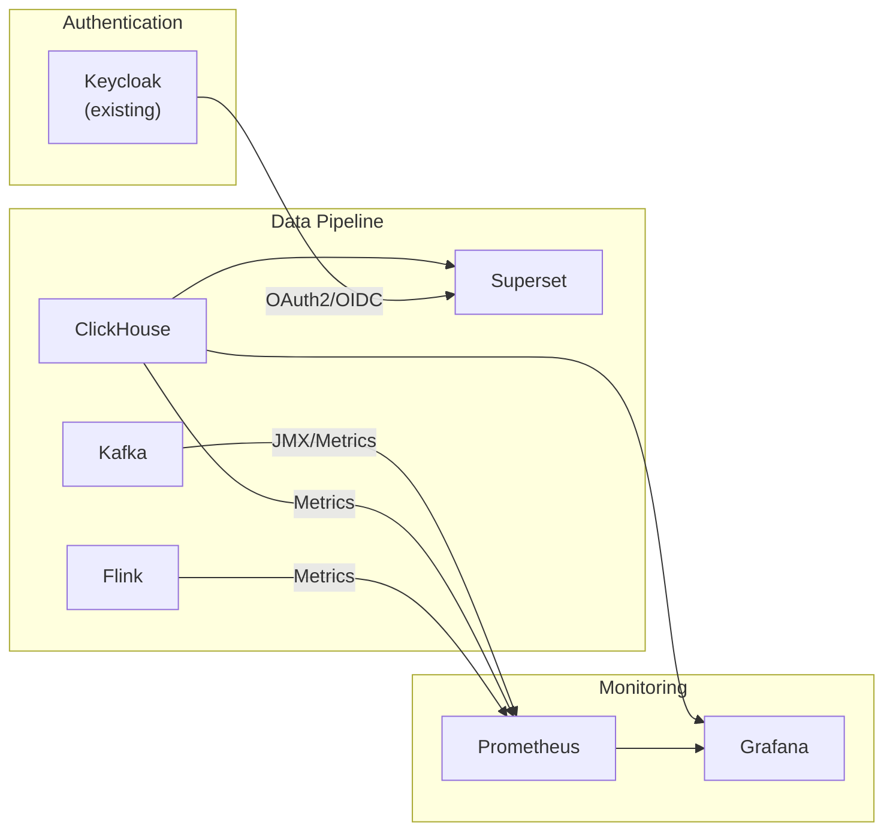
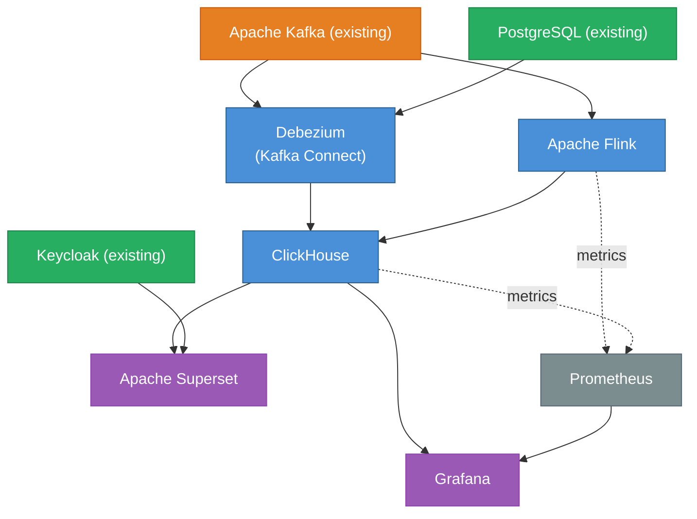

# CCE Data Pipeline — Technology Stack

## 1. Stack Summary

| Layer | Technology | Version | License | Purpose |
|-------|-----------|---------|---------|---------|
| Event Streaming | Apache Kafka | 3.7+ | Apache 2.0 | Existing event backbone (no change) |
| Change Data Capture | Kafka Connect + Debezium | 2.7+ / 2.6+ | Apache 2.0 | CDC from PostgreSQL to ClickHouse |
| Stream Processing | Apache Flink | 1.19+ | Apache 2.0 | Real-time event enrichment & aggregation |
| Analytics Database | ClickHouse | 24.x | Apache 2.0 | Columnar OLAP for sub-second analytics |
| Visualization | Apache Superset | 4.x | Apache 2.0 | Interactive dashboards & scheduled reports |
| Operational Monitoring | Grafana | 11.x | AGPL 3.0 | Infrastructure & pipeline health monitoring |
| Orchestration | — | — | — | Not needed at this scale (Flink jobs are long-running) |
| Schema Management | Apache Avro + Schema Registry | — | Apache 2.0 | Schema evolution for CDC connectors |

---

## 2. Component Deep Dive

### 2.1 Apache Kafka (Existing — No Changes)

The CCE platform already runs Apache Kafka in KRaft mode. The data pipeline **consumes** from existing topics without any modifications to producers.

**Topics consumed:**
- `cce.events.inbound` (25 partitions) — all clinical events
- `cce.scheduler.triggers` (25 partitions) — step state transitions
- `cce.intelligence.triggers` (25 partitions) — intelligence action triggers

**New consumer groups:**
- `cce-data-pipeline-flink` — Flink stream processing jobs
- `cce-data-pipeline-connect` — Kafka Connect workers (for any Kafka→ClickHouse sinks)

**Why Kafka (no change needed):**
- Already deployed and operational
- 7-day retention provides replay buffer for pipeline recovery
- Partitioning by patient UPID enables parallel processing
- CloudEvents JSON format is directly consumable

---

### 2.2 Kafka Connect + Debezium (CDC)

**Purpose:** Capture changes from PostgreSQL operational tables and replicate them into ClickHouse for dimensional data that isn't fully represented in Kafka event streams.

**Why Debezium over JDBC Source Connector:**
- Log-based CDC (WAL) — no impact on source database query performance
- Captures deletes and updates (not just inserts)
- Lower latency than polling-based JDBC connector
- Provides exactly-once semantics with PostgreSQL logical replication

**Connectors:**

| Connector Name | Source | Mode | Key |
|----------------|--------|------|-----|
| `cce-cdc-protocol-definitions` | `protocol_definition` | Snapshot + streaming | `id` |
| `cce-cdc-protocol-instances` | `protocol_instance` | Snapshot + streaming | `id` |
| `cce-cdc-step-instances` | `step_instance` | Snapshot + streaming | `id` |
| `cce-cdc-deviations` | `deviation` | Snapshot + streaming | `id` |
| `cce-cdc-inbound-events` | `inbound_event` | Snapshot + streaming | `id` |
| `cce-cdc-intelligence-deliveries` | `intelligence_delivery` | Snapshot + streaming | `id` |
| `cce-cdc-intelligence-event-log` | `intelligence_event_log` | Snapshot + streaming | `id` |
| `cce-cdc-action-definitions` | `action_definition` | Snapshot + streaming | `id` |
| `cce-cdc-receiver-adaptors` | `receiver_adaptor` | Snapshot + streaming | `id` |
| `cce-cdc-destination-mappings` | `destination_adaptor_mapping` | Snapshot + streaming | `id` |

**Sink Connector (ClickHouse):**
- `clickhouse-kafka-connect` (Altinity) or `clickhouse-sink-connector`
- Micro-batching: flush every 5 seconds or 10,000 rows
- Schema mapping: auto-create ClickHouse tables from Debezium schema

**Configuration highlights:**
```properties
# Debezium PostgreSQL Source
connector.class=io.debezium.connector.postgresql.PostgresConnector
database.hostname=${POSTGRES_HOST}
database.port=5432
database.dbname=ccedb
plugin.name=pgoutput
slot.name=cce_analytics_slot
publication.name=cce_analytics_pub
table.include.list=public.protocol_definition,public.protocol_instance,public.step_instance,public.deviation,public.inbound_event,public.intelligence_delivery,public.intelligence_event_log,public.action_definition,public.receiver_adaptor,public.destination_adaptor_mapping
transforms=unwrap
transforms.unwrap.type=io.debezium.transforms.ExtractNewRecordState
```

---

### 2.3 Apache Flink (Stream Processing)

**Purpose:** Real-time event transformation, enrichment, and pre-aggregation before writing to ClickHouse.

**Why Flink over alternatives:**

| Alternative | Why Not |
|-------------|---------|
| Kafka Streams | No cluster management but limited windowing; harder to express complex aggregations; JVM-only |
| Apache Spark Streaming | Micro-batch latency (seconds); heavier infrastructure; overkill for 600k events/day |
| ksqlDB | SQL-only; limited UDF support; vendor-coupled (Confluent) |
| **Apache Flink** | ✅ True streaming; exactly-once; rich windowing; SQL + DataStream APIs; checkpoint-based recovery |

**Flink Jobs:**

| Job | Input | Output | Description |
|-----|-------|--------|-------------|
| `event-enrichment` | `cce.events.inbound` | `clickhouse.events_fact` | Flatten CloudEvents, extract FHIR fields (resourceType, codes, practitioner, facility) |
| `event-volume-aggregator` | `cce.events.inbound` | `clickhouse.event_volume_hourly` | Hourly event counts by facility, source, resource type |
| `intelligence-tracker` | `cce.intelligence.triggers` | `clickhouse.intelligence_events` | Parse intelligence triggers, track deviations with context |
| `scheduler-tracker` | `cce.scheduler.triggers` | `clickhouse.step_transitions` | Track step state transitions (PENDING→DUE, DUE→OVERDUE, OVERDUE→MISSED) |

**Flink SQL example (event enrichment):**
```sql
CREATE TABLE kafka_inbound_events (
    `id` STRING,
    `source` STRING,
    `type` STRING,
    `subject` STRING,
    `time` TIMESTAMP(3),
    `datacontenttype` STRING,
    `correlationid` STRING,
    `facilityid` STRING,
    `data` STRING,  -- raw JSON
    WATERMARK FOR `time` AS `time` - INTERVAL '5' MINUTE
) WITH (
    'connector' = 'kafka',
    'topic' = 'cce.events.inbound',
    'properties.bootstrap.servers' = '${KAFKA_BOOTSTRAP_SERVERS}',
    'properties.group.id' = 'cce-data-pipeline-flink',
    'format' = 'json',
    'scan.startup.mode' = 'earliest-offset'
);

INSERT INTO clickhouse_events_fact
SELECT
    `id`,
    `source`,
    `type`,
    `subject` AS patient_id,
    `time` AS event_time,
    `facilityid` AS facility_id,
    `correlationid` AS correlation_id,
    JSON_VALUE(`data`, '$.resourceType') AS resource_type,
    JSON_VALUE(`data`, '$.status') AS resource_status,
    `data` AS raw_payload
FROM kafka_inbound_events;
```

**Checkpointing:**
- Checkpoint interval: 60 seconds
- State backend: RocksDB (for large state)
- Checkpoint storage: Local filesystem or S3/MinIO
- Restart strategy: Fixed-delay (3 attempts, 10s between)

**ClickHouse sink optimization:**
- Use async inserts (`async_insert=1, wait_for_async_insert=1`) for Flink JDBC sink to reduce write amplification
- Batch size: 10,000 rows or 5-second flush interval (whichever comes first)
- This avoids creating many small parts in MergeTree, reducing background merge pressure

---

### 2.4 ClickHouse (Analytics Database)

**Purpose:** High-performance columnar OLAP database for all analytics queries.

**Why ClickHouse over alternatives:**

| Alternative | Why Not |
|-------------|---------|
| Apache Druid | More complex to operate (ZooKeeper dependency); better for true real-time but overkill here |
| TimescaleDB | PostgreSQL-based (same technology as source); row-store overhead for wide analytical queries |
| PostgreSQL (materialized views) | Adding query load to operational DB; limited compression; slower aggregations |
| Apache Pinot | More complex; LinkedIn-scale; limited community adoption |
| **ClickHouse** | ✅ Simple deployment; fastest analytical queries; excellent compression; SQL-compatible; active community |

**Key features leveraged:**
- **MergeTree engine family** — optimized for time-series and event data
- **Materialized views** — real-time pre-aggregation (replaces Caffeine cache)
- **CODEC compression** — LZ4/ZSTD for 10-40x compression on event data
- **TTL** — automatic data lifecycle (archive/delete old partitions)
- **Array and JSON functions** — handle FHIR JSONB without schema changes
- **Approximate functions** — `uniqHLL12`, `quantile` for fast approximations
- **Projections** — alternative sort orders for common access patterns without extra tables

**Projections (query acceleration):**

Projections store a subset of data re-sorted by a different ORDER BY, enabling ClickHouse to serve queries that don't match the primary sort key without full scans:

```sql
-- Patient timeline queries on events_fact (primary key is facility_id, resource_type, event_time)
ALTER TABLE events_fact ADD PROJECTION prj_patient_timeline (
    SELECT * ORDER BY patient_id, event_time
);
ALTER TABLE events_fact MATERIALIZE PROJECTION prj_patient_timeline;

-- Protocol drill-down on step_instances (primary key is id)
ALTER TABLE step_instances ADD PROJECTION prj_protocol_lookup (
    SELECT * ORDER BY protocol_instance_id, action_id
);
ALTER TABLE step_instances MATERIALIZE PROJECTION prj_protocol_lookup;

-- Facility drill-down on deviations (primary key is facility_id, deviation_type, detected_at)
ALTER TABLE deviations ADD PROJECTION prj_protocol_deviations (
    SELECT * ORDER BY protocol_instance_id, detected_at
);
ALTER TABLE deviations MATERIALIZE PROJECTION prj_protocol_deviations;
```

> **Trade-off:** Projections increase storage (~1.5-2x for projected columns) but provide 2-10x query speedup for access patterns that don't align with the primary sort key.

**Storage engines by table type:**

| Table | Engine | Partition | Order By | TTL |
|-------|--------|-----------|----------|-----|
| `events_fact` | MergeTree | `toYYYYMM(event_time)` | `(facility_id, resource_type, event_time, patient_id)` | 2 years |
| `event_volume_hourly` | SummingMergeTree | `toYYYYMM(hour)` | `(facility_id, source, resource_type, hour)` | 2 years |
| `intelligence_events` | MergeTree | `toYYYYMM(detected_at)` | `(severity, step_state, detected_at)` | 2 years |
| `step_transitions` | MergeTree | `toYYYYMM(triggered_at)` | `(transition_type, triggered_at, step_instance_id)` | 2 years |
| `protocol_instances` | ReplacingMergeTree | — | `(id)` | None |
| `step_instances` | ReplacingMergeTree | — | `(id)` | None |
| `deviations` | ReplacingMergeTree | `toYYYYMM(detected_at)` | `(facility_id, deviation_type, detected_at, id)` | 2 years |
| `inbound_events` | ReplacingMergeTree | `toYYYYMM(received_at)` | `(source, received_at, id)` | 1 year |
| `intelligence_deliveries` | ReplacingMergeTree | `toYYYYMM(created_at)` | `(destination, adaptor_name, created_at, id)` | 1 year |
| `intelligence_event_logs` | ReplacingMergeTree | `toYYYYMM(created_at)` | `(action_type, intelligence_destination, created_at, id)` | 2 years |
| `action_definitions` | ReplacingMergeTree | — | `(id)` | None |
| `protocol_definitions` | ReplacingMergeTree | — | `(id)` | None |
| `receiver_adaptors` | ReplacingMergeTree | — | `(id)` | None |
| `destination_adaptor_mappings` | ReplacingMergeTree | — | `(id)` | None |

---

### 2.5 Apache Superset (Visualization)

**Purpose:** Self-service analytics dashboards replacing the custom React insights-ui.

**Why Superset over alternatives:**

| Alternative | Why Not |
|-------------|---------|
| Grafana | Primarily operational/metrics dashboards; limited BI features (no pivot tables, limited drill-downs) |
| Metabase | Simpler but less powerful; limited SQL Lab; no row-level security |
| Redash | Maintenance mode; limited features compared to Superset |
| Custom React app | Defeats the purpose of using open-source solutions |
| **Apache Superset** | ✅ Full BI platform; SQL Lab; RBAC; scheduled reports; ClickHouse native connector; embeddable |

**Key features leveraged:**
- **ClickHouse connector** — native SQLAlchemy driver (`clickhouse-connect`)
- **Dashboard templates** — importable JSON dashboards for standard CCE views
- **Row-level security** — facility-based access control
- **Alerts & reports** — scheduled email/Slack delivery of compliance summaries
- **SQL Lab** — ad-hoc exploration for power users
- **Chart types** — time-series, funnel, pivot table, map, KPI cards

**Authentication integration:**
- OAuth2/OIDC with existing Keycloak instance
- Role mapping: `dashboard:read` scope → Superset Gamma role
- Admin access: Superset Alpha/Admin roles for dashboard creators

---

### 2.6 Grafana (Operational Monitoring)

**Purpose:** Monitor the health of the data pipeline itself (not clinical analytics).

**Data sources:**
- **Prometheus** — Flink metrics, Kafka consumer lag, ClickHouse performance
- **ClickHouse** — pipeline throughput, latency metrics

**Dashboards:**
- Flink job health (checkpoint duration, backpressure, throughput)
- Kafka consumer lag per topic/partition
- ClickHouse query performance (p95, p99 latency)
- End-to-end latency (event timestamp → ClickHouse insert time)
- Kafka Connect connector status

---

## 3. Integration Points



---

## 4. Version Compatibility Matrix

| Component | Minimum Version | Tested Version | Notes |
|-----------|----------------|----------------|-------|
| Apache Kafka | 3.5 | 3.7.1 | KRaft mode; existing cluster |
| Kafka Connect | 3.5 | 3.7.1 | Bundled with Kafka |
| Debezium | 2.4 | 2.6.1 | PostgreSQL connector |
| ClickHouse Sink Connector | 0.12 | 0.14 | Altinity `clickhouse-kafka-connect` |
| Apache Flink | 1.18 | 1.19.1 | With Kafka + JDBC connectors |
| ClickHouse | 23.8 LTS | 24.8 LTS | LTS release recommended |
| Apache Superset | 3.0 | 4.0.2 | With ClickHouse driver |
| Grafana | 10.0 | 11.2 | With ClickHouse plugin |
| PostgreSQL (source) | 14 | 16 | Existing CCE database |
| Java (Flink) | 11 | 21 | Flink 1.19+ supports Java 21 |

---

## 5. Dependency Graph



---

## 6. Resource Requirements Summary

### Development / Staging

| Component | Containers | CPU | RAM | Storage |
|-----------|-----------|-----|-----|---------|
| Kafka Connect (Debezium) | 1 | 1 core | 2 GB | — |
| Flink JobManager | 1 | 1 core | 2 GB | — |
| Flink TaskManager | 1 | 2 cores | 4 GB | — |
| ClickHouse | 1 | 4 cores | 16 GB | 100 GB SSD |
| Superset (web + worker) | 1 | 2 cores | 4 GB | — |
| Redis (Superset cache) | 1 | 0.5 core | 1 GB | — |
| **Total** | **6** | **10.5 cores** | **29 GB** | **100 GB** |

### Production (600k events/day)

| Component | Containers | CPU | RAM | Storage |
|-----------|-----------|-----|-----|---------|
| Kafka Connect (Debezium) | 2 (HA) | 2 cores | 4 GB | — |
| Flink JobManager | 1 (HA with ZK) | 2 cores | 4 GB | — |
| Flink TaskManager | 2 | 4 cores | 8 GB | 50 GB (state) |
| ClickHouse | 1 | 8 cores | 32 GB | 500 GB SSD |
| Superset (web) | 2 (HA) | 4 cores | 8 GB | — |
| Superset (worker) | 2 | 2 cores | 4 GB | — |
| Redis (Superset) | 1 | 1 core | 2 GB | — |
| **Total** | **11** | **33 cores** | **84 GB** | **550 GB** |

---

## 7. Operational Considerations

### 7.1 Backup & Recovery

| Component | Strategy | RPO | RTO |
|-----------|----------|-----|-----|
| ClickHouse | Daily backup to object storage (`clickhouse-backup`) | 24 hours | 1 hour |
| Superset (metadata DB) | PostgreSQL backup (dashboards, users, permissions) | 24 hours | 30 min |
| Flink state | Checkpoints stored externally; Kafka replay for recovery | 0 (replay) | 5 min |
| Kafka Connect | Offsets stored in Kafka; snapshot on recovery | 0 (replay) | 5 min |

### 7.2 Upgrades

- **ClickHouse:** Rolling restart for minor versions; new replicas for major versions
- **Flink:** Savepoint-based upgrade (stop with savepoint → redeploy → resume)
- **Superset:** Blue-green deployment (stateless; metadata in PostgreSQL)
- **Kafka Connect:** Rolling restart of distributed workers

### 7.3 Monitoring & Alerting

| Alert | Condition | Severity |
|-------|-----------|----------|
| Flink job failure | Job status != RUNNING | Critical |
| Kafka consumer lag > 10 min | Consumer lag by time | Warning |
| ClickHouse disk > 80% | Disk usage threshold | Warning |
| CDC replication slot lag > 100MB | pg_replication_slots.confirmed_flush_lsn | Critical |
| Superset query timeout | Query duration > 30s | Warning |
| End-to-end latency > 5 min | Event time to ClickHouse insert time | Warning |
